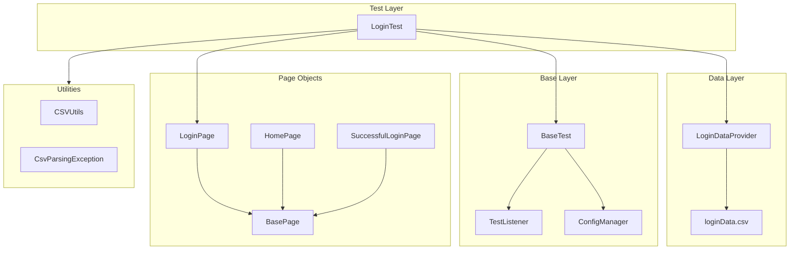
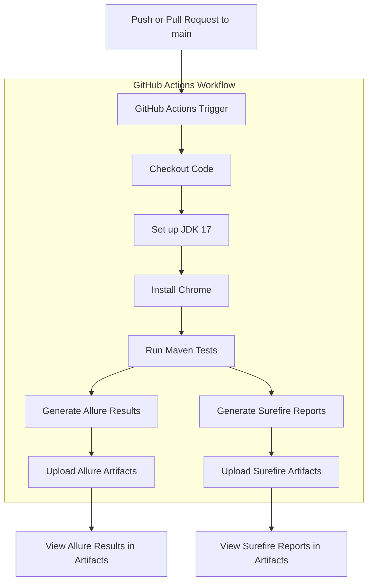
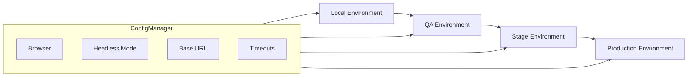
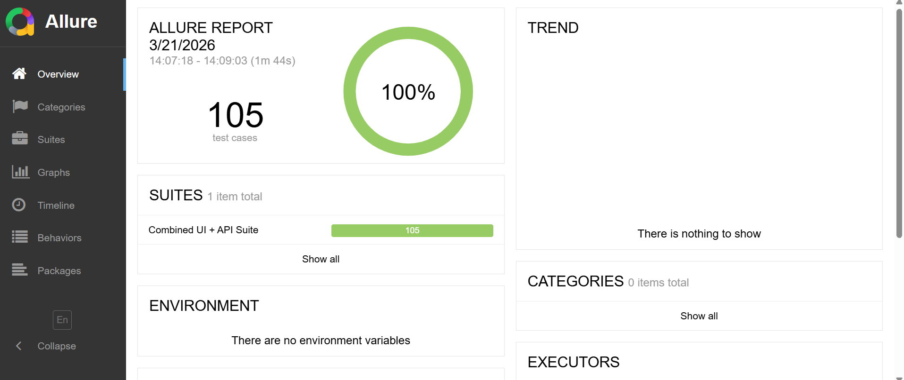

# Selenium Test Automation Framework
A clean, maintainable, and professional Selenium + TestNG automation framework built for the **Practice Test Automation** site as part of a structured 60‑day QA Automation Upskill Plan.

---

# 📛 Badges
<p align="center">

  <a href="https://github.com/brouwera/Selenium-Framework/actions">
    
  </a>

  
  
  
  
  

</p>

---

# 📚 Table of Contents
1. [Project Overview](#-project-overview)
2. [Current Scope](#-current-scope-aligned-with-the-real-ui)
3. [Features at a Glance](#-completed-features)
4. [Project Structure](#-project-structure)
5. [How to Run Locally](#-how-to-run)
6. [How to Run in CI](#-how-to-run-in-ci)
7. [Day-by-Day Progress Log](#-day-by-day-progress-log)
8. [Upcoming Enhancements](#-upcoming-enhancements-planned)
9. [Author](#-author)

---

# 🚀 Project Overview

This framework automates the login functionality of:

**https://practicetestautomation.com/practice-test-login/**

It demonstrates:

- Clean Page Object Model (POM) architecture
- Explicit waits for stability
- Thread‑safe WebDriver setup
- Data‑driven testing
- Allure reporting
- Multi‑browser execution (Chrome, Edge, Firefox)
- CI/CD readiness

All tests currently pass with **zero failures** across all supported browsers.

---

# 🧰 Tech Stack

This framework is built using a modern, industry-standard automation stack:

- **Java 17** — primary programming language
- **Selenium WebDriver 4.18.1** — browser automation
- **TestNG 7.10** — test runner + annotations
- **Maven** — build + dependency management
- **Allure Reports** — rich test reporting
- **WebDriverManager** — automatic driver resolution
- **GitHub Actions** — CI/CD pipeline
- **Page Object Model (POM)** — maintainable architecture
- **ThreadLocal WebDriver** — parallel‑ready design
- **CSV Test Data** — data-driven testing

# 🏗️ Framework Architecture



# 🔄 CI Pipeline Architecture



# 🌍 Multi‑Environment Architecture (Planned)

This framework is designed to support multiple execution environments as it grows:



# 📊 Allure Report Preview

Below is an example of the Allure report generated by this framework.  
It includes detailed test steps, attachments, environment metadata, and execution history.



---

# 💡 Why This Framework Matters

This project demonstrates real-world automation engineering skills, not just basic Selenium usage:

- **Scalable architecture** using Page Object Model and layered design
- **Stable, flake‑resistant tests** built with explicit waits and clean synchronization
- **Data-driven testing** powered by CSV utilities and TestNG DataProviders
- **Thread-safe WebDriver management** using a BaseTest + ThreadLocal design
- **CI/CD integration** with GitHub Actions for automated, headless execution
- **Professional reporting** through Allure with steps, metadata, and artifacts
- **Portable configuration** using a centralized ConfigManager for browser and environment control

This framework mirrors the structure and practices used in enterprise QA automation teams.

---

# ✨ Features at a Glance

| Feature | Description |
|--------|-------------|
| 🧱 Page Object Model | Clean, maintainable, scalable architecture |
| 🔄 Data‑Driven Tests | CSV‑powered TestNG DataProviders |
| 🧪 Stable Test Execution | Explicit waits, no flakiness, consistent behavior |
| 🌐 Multi‑Browser Support | Chrome, Edge, Firefox (local + CI) |
| 🧵 Thread‑Safe WebDriver | Parallel‑ready design using ThreadLocal |
| 📊 Allure Reporting | Steps, metadata, history, and visual analytics |
| ⚙️ ConfigManager | Centralized environment + browser configuration |
| 🚀 CI/CD Ready | GitHub Actions workflow with headless execution |

---

## 📄 Data‑Driven Testing (CSV‑Powered)

This framework uses CSV files to drive login scenarios through TestNG DataProviders. Test logic stays clean and focused while the data lives in a simple, editable file.

### How it works
- `loginData.csv` stores all username/password combinations and expected outcomes.
- `CSVUtils` loads the file and converts each row into a map of key/value pairs.
- `LoginDataProvider` feeds each row into the test as an individual execution.
- `LoginTest` validates the login flow using the supplied data.

### Example CSV snippet
```csv
username,password,expectedResult
student,Password123,success
student,WrongPassword,failure
wrongUser,Password123,failure
```

---

# 📌 Current Scope (Aligned With the Real UI)

The Practice page currently includes:

- **Test Login Page**
- **Test Exceptions**
- **Test Table** (coming soon)

Removed modules (no longer present on the site):

- Test Inputs
- Test Alerts

This keeps the framework aligned with the real application under test.

---

# ✅ Completed Features

### ✔ Login Automation
- Full POM structure
- Positive + negative login tests
- Data‑driven testing via CSV
- Navigation flow validation
- Explicit waits everywhere
- ThreadLocal WebDriver
- Allure step annotations

### ✔ Framework Cleanup (Day 13)
- Removed deprecated modules
- Cleaned HomePage to match real UI
- Updated testng.xml
- Full green suite with `mvn clean test`
- TestListener integrated

### ✔ Multi‑Browser Support (Day 14)
- Chrome via WebDriverManager
- Edge via manual driver path (offline‑safe)
- Firefox via manual GeckoDriver path
- ConfigManager now controls all driver paths
- Fully portable + CI‑ready

---

# 📁 Project Structure

```
src
└── test
├── java
│   ├── base
│   │   └── BaseTest.java
│   ├── config
│   │   └── ConfigManager.java
│   ├── dataproviders
│   │   └── LoginDataProvider.java
│   ├── exceptions
│   │   ├── ElementNotFoundException.java
│   │   ├── FrameworkInitializationException.java
│   │   ├── InvalidTestDataException.java
│   │   ├── PageNavigationException.java
│   ├── helpers
│   │   └── AssertionHelper.java
│   ├── listeners
│   │   ├── RetryAnalyzer.java
│   │   ├── RetryListener.java
│   │   └── TestListener.java
│   ├── pages
│   │   ├── BasePage.java
│   │   ├── ExceptionsPage.java
│   │   ├── HomePage.java
│   │   ├── LoginPage.java
│   │   └── SuccessfulLoginPage.java
│   ├── tests
│   │   ├── ExceptionsTest.java
│   │   └── LoginTest.java
│   └── utils
│       ├── CsvParsingException.java
│       └── CSVUtils.java
└── resources
├── testData
│   └── loginData.csv
├── categories.json
├── config.properties
├── environment.properties
allure-report-example.png
pom.xml
README.md
testng.xml
```

---

# 🏁 How to Run

### Run full suite:

mvn clean test

### Run a specific test:

mvn -Dtest=LoginTest test

### Override browser:

mvn clean test -Dbrowser=edge

mvn clean test -Dbrowser=firefox

mvn clean test -Dbrowser=chrome


### Run headless:

mvn clean test -Dheadless=true

### **Execution Methods Overview**

| Execution Method | Command | Description |
|------------------|---------|-------------|
| **Maven (Surefire + TestNG Suite)** | `mvn clean test` | Executes the entire suite using `testng.xml`, applies listeners, parallel execution, and generates Allure results. |
| **TestNG Suite (IDE Run)** | Right‑click `testng.xml` → Run | Runs the suite directly from the IDE with all listeners and parallel settings applied. |
| **Single Test Class** | Run test class in IDE | Useful for debugging or validating a specific module without running the full suite. |
| **Single Test Method** | Run method in IDE | Fastest way to isolate and debug a specific scenario. |
| **Allure Report** | `allure serve target/allure-results` | Generates and opens a full Allure report with steps, attachments, retries, and labels. |

---

# 🏗️ How to Run in CI

This framework is fully CI‑ready and supports:

- Multi‑browser execution
- Headless mode
- Environment‑driven configuration
- Allure reporting

### Basic CI command:

mvn clean test -Denv=local -Dbrowser=chrome -Dheadless=true

---

### 📅 Day-by-Day Progress Log

### Day 3 — First Working Selenium + TestNG Login Automation

- Built initial BaseTest
- Created first LoginTest
- Validated environment + WebDriver setup

### Day 5 — Explicit Waits + Stability

- Added WebDriverWait
- Replaced all direct interactions with explicit waits
- Eliminated flakiness

### Day 7 — Page Object Model (POM)

- Added LoginPage + HomePage
- Clean locators + explicit waits
- Tests rewritten to use POM

### Day 8 — Multi‑Page Navigation

- Added SuccessfulLoginPage
- Added full login flow test
- Improved readability + maintainability

### Day 9 — Assertions + Allure + Stability

- Added AssertionHelper
- Added TestListener
- Cleaned pom.xml
- Achieved full green run

### Day 10 — Flow-Based Scenarios

- Added navigation + logout flow tests
- Added missing helper methods
- Improved Allure structure

### Day 11 — Login Module Refactor

- Removed legacy tests
- Updated Page Objects
- Added Inputs module (later removed)
- Achieved full green suite

### Day 12 — Alerts Testing + Full Validation

- Added Alerts module (later removed)
- Validated entire framework
- Added Allure environment metadata

### Day 13 — Framework Cleanup

- Removed Inputs + Alerts
- Cleaned navigation
- Updated HomePage
- Full green run

### Day 14 — Multi‑Browser + ConfigManager Upgrade

- Added Edge + Firefox support
- Added manual driver paths
- Updated ConfigManager
- Framework now fully portable + CI‑ready

### Day 15 — README Enhancements + Architecture Planning

Updated README.md with major improvements:

- Added Allure Report screenshot section
- Added “Why This Framework Matters” engineering justification
- Added “Features at a Glance” visual grid
- Added Multi‑Environment Architecture diagram (planned design)
- Added Roadmap with GitHub‑style checkboxes
- Added Contributing and License sections
- Cleaned formatting, spacing, and section flow
- Ensured screenshot and diagrams render correctly on GitHub

This completes the documentation milestone for Day 15 and prepares the framework for upcoming multi‑environment and stability enhancements.

### **Day 16 — Parallel Execution + TestNG Suite Integration**
Today’s focus was on scaling the framework for real‑world execution patterns. I introduced a dedicated `testng.xml` suite file and configured Maven Surefire to run the suite directly. This allowed the framework to support parallel execution, listener registration, and structured test grouping.

**Key Achievements**
- Added `testng.xml` with suite, test, and listener configuration
- Enabled parallel execution (`parallel="methods"`, `thread-count=2`)
- Verified stable parallel runs across all Login tests
- Ensured Allure reporting works seamlessly with suite‑based execution
- Cleaned up test grouping (`smoke`, `regression`) for CI‑ready organization

**Outcome:**  
The framework now executes tests in parallel with clean reporting, predictable structure, and full listener support — a major step toward CI/CD readiness.

---

### **Day 17 — Retry Logic, Listener Architecture, and Stability Validation**
Today I implemented a professional‑grade retry mechanism using TestNG’s `IRetryAnalyzer` and `IAnnotationTransformer`. This included wiring a custom `RetryListener` and integrating flaky‑test labeling into Allure.

After validating the architecture, I removed the intentional failure and restored the suite to full stability.

**Key Achievements**
- Added `RetryAnalyzer` and `RetryListener` for controlled retry logic
- Integrated flaky‑test labeling and retry steps into Allure
- Ensured listeners load correctly through `testng.xml`
- Restored parallel execution after validation
- Achieved a fully stable, 100% passing suite with clean Allure reporting

**Outcome:**  
Retry logic is now part of the framework’s architecture — available when needed, invisible when not. The suite runs cleanly in parallel with zero flakiness and full reporting fidelity.

---

### **Day 18 — Exceptions Module + Full Framework Polish**
Today’s focus was on expanding the framework beyond login testing by implementing the full Exceptions module and validating it end‑to‑end. This included building a complete Page Object, creating five exception‑focused test cases, and performing a full consistency sweep across the entire project.

**Key Achievements**
- Added `ExceptionsPage` with full support for delayed elements, dynamic DOM changes, disabled inputs, and short‑timeout behavior
- Implemented `ExceptionsTest` with five real‑world exception scenarios: NoSuchElementException, ElementNotInteractableException, InvalidElementStateException, StaleElementReferenceException, and TimeoutException
- Ensured all interactions use explicit waits and Allure step annotations for clarity and reporting
- Performed a full framework polish to align formatting, naming, comments, and structure across all modules
- Executed the entire suite (8 Login tests + 5 Exceptions tests) with **100% passing results** and no flakiness
- Updated README with a dedicated CSV‑Driven Testing section to document the data layer of the framework

**Outcome:**  
The Exceptions module is now fully integrated, stable, and production‑ready. The framework has grown from a single‑module login suite into a multi‑module automation project with clean architecture, consistent style, and complete documentation.

---

### **Day 19 — Exceptions Module Enhancements + Framework Consistency Upgrades**
Today’s work focused on elevating the Exceptions module from “functionally complete” to “architecturally consistent” with the rest of the framework. This meant aligning all Page Object interactions with the BasePage API, expanding BasePage with missing universal helpers, and refining the exception‑simulation test to behave exactly as Selenium does in real‑world scenarios.

A key part of today’s work was ensuring that the framework could intentionally reproduce Selenium exceptions *without* compromising the safety and consistency of normal interactions. To achieve this, a new `rawClick()` method was added to BasePage, allowing the framework to bypass wait conditions only when explicitly required for exception testing.

**Key Achievements**
- Added three foundational helpers to `BasePage` (`clear`, `getAttribute`, `isElementPresent`) to ensure full consistency across all Page Objects
- Introduced `rawClick()` to safely simulate Selenium exceptions without affecting standard click behavior
- Updated `ExceptionsPage` to use the new helpers and expose a clean `clickInvisibleSaveButton()` method for controlled exception testing
- Updated `ExceptionsTest` to rely solely on Page Object methods, maintaining proper encapsulation and avoiding protected BasePage calls
- Validated all five exception scenarios with accurate Selenium behavior, including the corrected `ElementNotInteractableException` test
- Executed the full suite with **100% passing tests** and verified clean Allure reporting
- Confirmed Allure report generation via both Maven (`allure:aggregate`) and CLI (`allure serve target/allure-results`)

**Outcome:**  
The Exceptions module is now fully aligned with the framework’s architecture, using consistent BasePage utilities and clean Page Object abstractions. Exception simulation is accurate, intentional, and isolated, while normal test flows remain safe and stable. With all enhancements complete, the framework now demonstrates production‑grade consistency, clarity, and maintainability across every module.

---

### 🚧 Upcoming Enhancements (Planned)

### Table Module
Table parsing utilities  
Sorting/filtering tests

### Framework Enhancements
Allure screenshots on failure  
.env support for secrets  
Multi‑environment execution  
README visuals + architecture diagram

---

### 🗺️ Roadmap

A clear view of what’s coming next for this framework:

### Core Enhancements
- [x] Exceptions module (page object + validation tests)
- [ ] Table module (table parsing utilities + sorting/filtering tests)
- [ ] Allure screenshots on failure
- [ ] Multi‑environment execution (local, qa, stage)
- [ ] .env support for secrets and environment variables

### Architecture & Stability
- [ ] Retry logic for flaky CI environments
- [ ] Logging improvements (SLF4J or Log4j2)
- [ ] Parallel execution support
- [ ] Enhanced ConfigManager with typed properties

### CI/CD & Reporting
- [ ] Allure history tracking in CI
- [ ] Allure categories.json for failure grouping
- [ ] Upload Allure report as a GitHub Pages artifact
- [ ] Add CI matrix for multi‑browser runs

### Documentation & Developer Experience
- [ ] Add demo GIF of test execution
- [ ] Add Contributing guidelines
- [ ] Add full API documentation for utilities
- [ ] Add architecture diagram for multi‑environment setup

---

### 🤝 Contributing

Contributions are welcome!

If you’d like to improve the framework, add new modules, or enhance documentation:

Fork the repository

Create a feature branch

Commit your changes with clear messages

Open a pull request describing your update

Please ensure your changes follow the existing project structure and coding style.

---

### 📄 License

This project is licensed under the MIT License.

You are free to use, modify, and distribute this framework for personal or commercial purposes.

---

👤 Author: 
Adam Brouwer    
QA Analyst / SDET in training  
Building a full automation framework as part of a structured 60‑day upskilling plan.