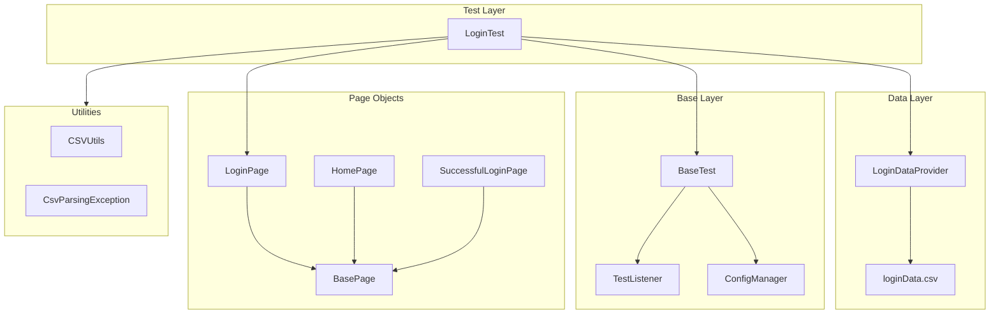
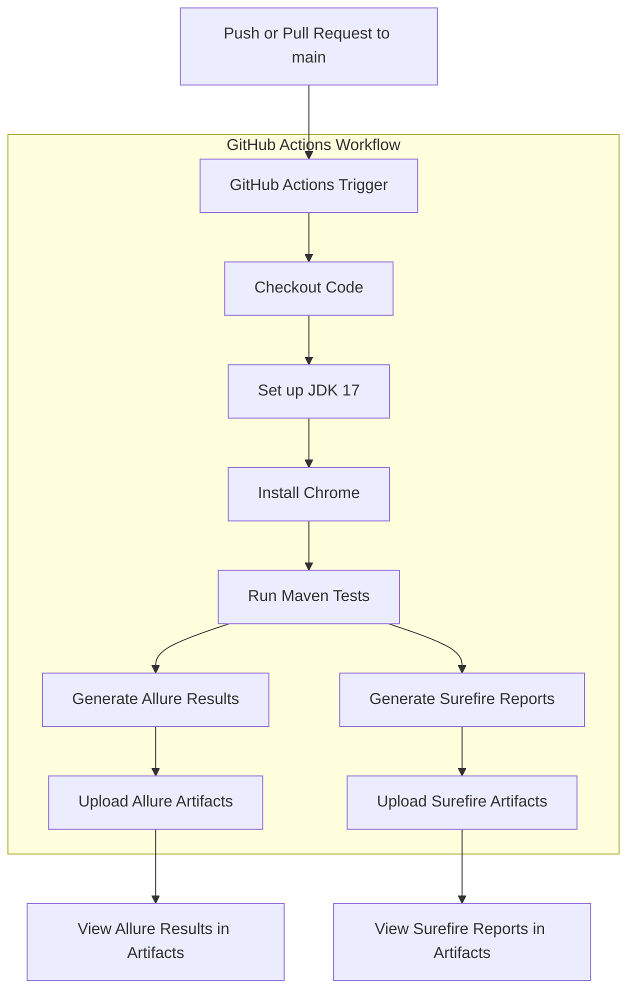
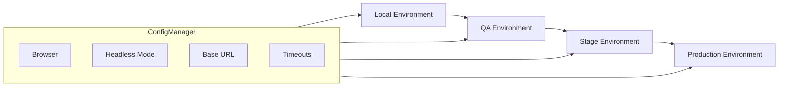

# Selenium Test Automation Framework
A clean, maintainable, and professional Selenium + TestNG automation framework built for the **Practice Test Automation** site as part of a structured 60‑day QA Automation Upskill Plan.

---

# 📛 Badges
<p align="center">

  <a href="https://github.com/brouwera/Selenium-Framework/actions">
    
  </a>

  
  
  
  
  

</p>

---

# 📚 Table of Contents
1. [Project Overview](#-project-overview)
2. [Current Scope](#-current-scope-aligned-with-the-real-ui)
3. [Key Features](#-completed-features)
4. [Project Structure](#-project-structure)
5. [How to Run Locally](#-how-to-run)
6. [How to Run in CI](#-how-to-run-in-ci)
7. [Day-by-Day Progress Log](#-day-by-day-progress-log)
8. [Upcoming Enhancements](#-upcoming-enhancements-planned)
9. [Author](#-author)

---

# 🚀 Project Overview

This framework automates the login functionality of:

**https://practicetestautomation.com/practice-test-login/**

It demonstrates:

- Clean Page Object Model (POM) architecture
- Explicit waits for stability
- Thread‑safe WebDriver setup
- Data‑driven testing
- Allure reporting
- Multi‑browser execution (Chrome, Edge, Firefox)
- CI/CD readiness

All tests currently pass with **zero failures** across all supported browsers.

---

# 🧰 Tech Stack

This framework is built using a modern, industry-standard automation stack:

- **Java 17** — primary programming language
- **Selenium WebDriver 4.18.1** — browser automation
- **TestNG 7.10** — test runner + annotations
- **Maven** — build + dependency management
- **Allure Reports** — rich test reporting
- **WebDriverManager** — automatic driver resolution
- **GitHub Actions** — CI/CD pipeline
- **Page Object Model (POM)** — maintainable architecture
- **ThreadLocal WebDriver** — parallel‑ready design
- **CSV Test Data** — data-driven testing

# 🏗️ Framework Architecture



# 🔄 CI Pipeline Architecture



# 🌍 Multi‑Environment Architecture (Planned)

This framework is designed to support multiple execution environments as it grows:



# 📊 Allure Report Preview

Below is an example of the Allure report generated by this framework.  
It includes detailed test steps, attachments, environment metadata, and execution history.


---

# 💡 Why This Framework Matters

This project demonstrates real-world automation engineering skills, not just basic Selenium usage:

- **Scalable architecture** using Page Object Model and layered design
- **Stable, flake‑resistant tests** built with explicit waits and clean synchronization
- **Data-driven testing** powered by CSV utilities and TestNG DataProviders
- **Thread-safe WebDriver management** using a BaseTest + ThreadLocal design
- **CI/CD integration** with GitHub Actions for automated, headless execution
- **Professional reporting** through Allure with steps, metadata, and artifacts
- **Portable configuration** using a centralized ConfigManager for browser and environment control

This framework mirrors the structure and practices used in enterprise QA automation teams.

---

# ✨ Features at a Glance

| Feature | Description |
|--------|-------------|
| 🧱 Page Object Model | Clean, maintainable, scalable architecture |
| 🔄 Data‑Driven Tests | CSV‑powered TestNG DataProviders |
| 🧪 Stable Test Execution | Explicit waits, no flakiness, consistent behavior |
| 🌐 Multi‑Browser Support | Chrome, Edge, Firefox (local + CI) |
| 🧵 Thread‑Safe WebDriver | Parallel‑ready design using ThreadLocal |
| 📊 Allure Reporting | Steps, metadata, history, and visual analytics |
| ⚙️ ConfigManager | Centralized environment + browser configuration |
| 🚀 CI/CD Ready | GitHub Actions workflow with headless execution |

---

# 📌 Current Scope (Aligned With the Real UI)

The Practice page currently includes:

- **Test Login Page**
- **Test Exceptions** (coming soon)
- **Test Table** (coming soon)

Removed modules (no longer present on the site):

- Test Inputs
- Test Alerts

This keeps the framework aligned with the real application under test.

---

# ✅ Completed Features

### ✔ Login Automation
- Full POM structure
- Positive + negative login tests
- Data‑driven testing via CSV
- Navigation flow validation
- Explicit waits everywhere
- ThreadLocal WebDriver
- Allure step annotations

### ✔ Framework Cleanup (Day 13)
- Removed deprecated modules
- Cleaned HomePage to match real UI
- Updated testng.xml
- Full green suite with `mvn clean test`
- TestListener integrated

### ✔ Multi‑Browser Support (Day 14)
- Chrome via WebDriverManager
- Edge via manual driver path (offline‑safe)
- Firefox via manual GeckoDriver path
- ConfigManager now controls all driver paths
- Fully portable + CI‑ready

---

# 📁 Project Structure

```
src
└── test
    ├── java
    │   ├── base
    │   │   └── BaseTest.java
    │   ├── pages
    │   │   ├── BasePage.java
    │   │   ├── HomePage.java
    │   │   ├── LoginPage.java
    │   │   └── SuccessfulLoginPage.java
    │   ├── tests
    │   │   └── LoginTest.java
    │   ├── dataproviders
    │   │   └── LoginDataProvider.java
    │   ├── listeners
    │   │   └── TestListener.java
    │   └── utils
    │       ├── CSVUtils.java
    │       └── CsvParsingException.java
    └── resources
        └── testData
            └── loginData.csv

```

---

# 🏁 How to Run

### Run full suite:

mvn clean test

### Run a specific test:

mvn -Dtest=LoginTest test

### Override browser:

mvn clean test -Dbrowser=edge

mvn clean test -Dbrowser=firefox

mvn clean test -Dbrowser=chrome


### Run headless:

mvn clean test -Dheadless=true


---

# 🏗️ How to Run in CI

This framework is fully CI‑ready and supports:

- Multi‑browser execution
- Headless mode
- Environment‑driven configuration
- Allure reporting

### Basic CI command:

mvn clean test -Denv=local -Dbrowser=chrome -Dheadless=true

### 📅 Day-by-Day Progress Log

### Day 3 — First Working Selenium + TestNG Login Automation
Built initial BaseTest

Created first LoginTest

Validated environment + WebDriver setup

### Day 5 — Explicit Waits + Stability

Added WebDriverWait

Replaced all direct interactions with explicit waits

Eliminated flakiness

### Day 7 — Page Object Model (POM)

Added LoginPage + HomePage

Clean locators + explicit waits

Tests rewritten to use POM

### Day 8 — Multi‑Page Navigation

Added SuccessfulLoginPage

Added full login flow test

Improved readability + maintainability

### Day 9 — Assertions + Allure + Stability

Added AssertionHelper

Added TestListener

Cleaned pom.xml

Achieved full green run

### Day 10 — Flow-Based Scenarios

Added navigation + logout flow tests

Added missing helper methods

Improved Allure structure

### Day 11 — Login Module Refactor

Removed legacy tests

Updated Page Objects

Added Inputs module (later removed)

Achieved full green suite

### Day 12 — Alerts Testing + Full Validation

Added Alerts module (later removed)

Validated entire framework

Added Allure environment metadata

### Day 13 — Framework Cleanup

Removed Inputs + Alerts

Cleaned navigation

Updated HomePage

Full green run

### Day 14 — Multi‑Browser + ConfigManager Upgrade

Added Edge + Firefox support

Added manual driver paths

Updated ConfigManager

Framework now fully portable + CI‑ready

### 🚧 Upcoming Enhancements (Planned)

### Exceptions Module

Page object

Error handling tests

### Table Module

Table parsing utilities

Sorting/filtering tests

### Framework Enhancements

Allure screenshots on failure

.env support for secrets

Multi‑environment execution

README visuals + architecture diagram

---

### 🗺️ Roadmap

A clear view of what’s coming next for this framework:

### Core Enhancements

- [ ] Exceptions module (page object + validation tests)

- [ ] Table module (table parsing utilities + sorting/filtering tests)

- [ ] Allure screenshots on failure

- [ ] Multi‑environment execution (local, qa, stage)

- [ ] .env support for secrets and environment variables

### Architecture & Stability

- [ ] Retry logic for flaky CI environments

- [ ] Logging improvements (SLF4J or Log4j2)

- [ ] Parallel execution support

- [ ] Enhanced ConfigManager with typed properties

### CI/CD & Reporting

- [ ] Allure history tracking in CI

- [ ] Allure categories.json for failure grouping

- [ ] Upload Allure report as a GitHub Pages artifact

- [ ] Add CI matrix for multi‑browser runs

### Documentation & Developer Experience

- [ ] Add demo GIF of test execution

- [ ] Add Contributing guidelines

- [ ] Add full API documentation for utilities

- [ ] Add architecture diagram for multi‑environment setup

---

### 🤝 Contributing

Contributions are welcome!

If you’d like to improve the framework, add new modules, or enhance documentation:

Fork the repository

Create a feature branch

Commit your changes with clear messages

Open a pull request describing your update

Please ensure your changes follow the existing project structure and coding style.

---

### 📄 License

This project is licensed under the MIT License.

You are free to use, modify, and distribute this framework for personal or commercial purposes.

---

👤 Author: 
Adam Brouwer    
QA Analyst / SDET in training  
Building a full automation framework as part of a structured 60‑day upskilling plan.