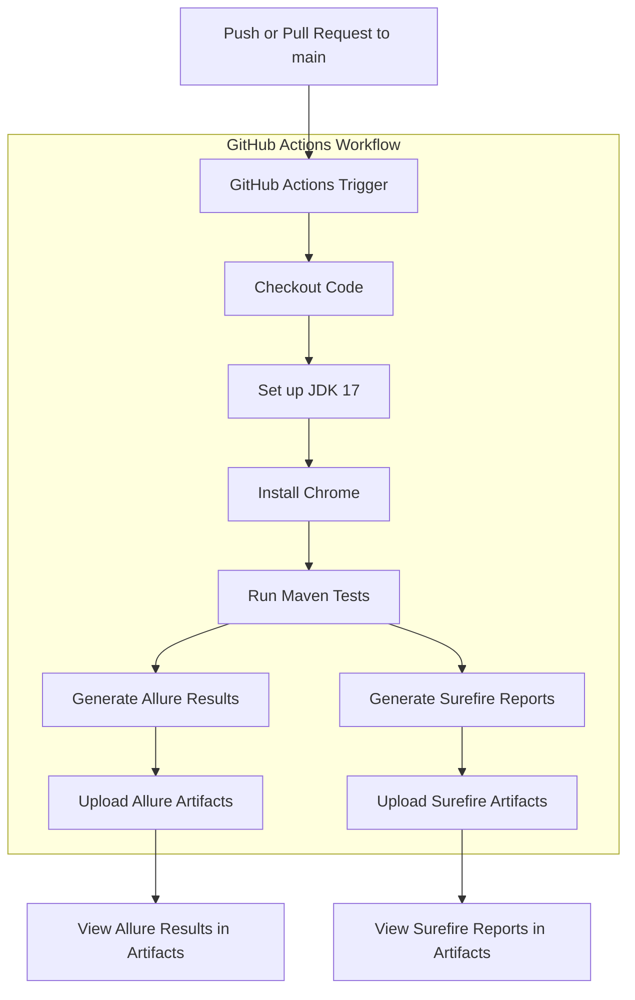
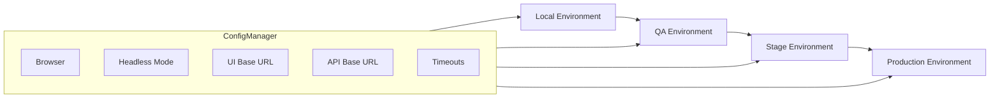

<h1 align="center">Selenium Test Automation Framework</h1>
<h3 align="center">Enterprise‑Grade UI + API Automation with Selenium, TestNG, Allure, and GitHub Actions</h3>

A clean, maintainable, and production‑ready Selenium + TestNG automation framework built for the **Practice Test Automation** site as part of a structured 60‑day QA Automation Upskill Plan. It demonstrates modern UI and API automation practices, enterprise‑grade architecture, and full CI integration with Allure reporting.

---

# 📛 Badges
<p align="center">

  <!-- CI Status -->
  <a href="https://github.com/brouwera/Selenium-Framework/actions">
    
  </a>

  <!-- Last Commit -->
  

  <!-- Allure -->
  

  <!-- Allure History -->
  

  <!-- API Testing -->
  

  <!-- API Logging -->
  

  <!-- Maven Build -->
  

  <!-- Maven Profiles -->
  

  <!-- Tests Passing -->
  

  <!-- Java -->
  

  <!-- Selenium -->
  

  <!-- TestNG -->
  

  <!-- License -->
  

</p>

<p align="right"><a href="#selenium-test-automation-framework">⬆️ Back to Top</a></p>

---

# 📚 Table of Contents

1. [Executive Summary](#-executive-summary)
2. [Project Overview](#-project-overview)
3. [Design Principles](#-design-principles)
4. [Tech Stack](#-tech-stack)
5. [Environment Configuration](#-environment-configuration)
6. [Test Data Manager](#-test-data-manager)
7. [Schema Validation](#-schema-validation)
8. [API Suite Structure](#-api-suite-structure)
9. [Dependency & Versioning Strategy](#-dependency--versioning-strategy)
10. [Test Strategy](#-test-strategy)
11. [Framework Architecture](#-framework-architecture)
12. [API Architecture](#-api-architecture)
13. [Logging Architecture](#-logging-architecture)
14. [API Logging](#-api-logging)
15. [Performance Considerations](#-performance-considerations)
16. [CI Pipeline Architecture](#-ci-pipeline-architecture)
17. [CI Pipeline](#-ci-pipeline)
18. [Multi‑Environment Architecture](#-multi-environment-architecture)
19. [Allure Report Preview](#-allure-report-preview)
20. [Allure Reporting](#-allure-reporting)
21. [Why This Framework Matters](#-why-this-framework-matters)
22. [Enterprise‑Grade Enhancements](#-enterprise-grade-enhancements)
23. [Features at a Glance](#-features-at-a-glance)
24. [Data‑Driven Testing](#-data-driven-testing-csv-powered)
25. [Current Scope](#-current-scope-aligned-with-the-real-ui)
26. [Completed Features](#-completed-features)
27. [Project Structure](#-project-structure)
28. [How to Run](#-how-to-run)
29. [Running Tests with Maven Profiles](#-running-tests-with-maven-profiles)
30. [How to Run in CI](#-how-to-run-in-ci)
31. [Day‑by‑Day Index](#-day-by-day-index)
32. [Day‑by‑Day Progress Log](#-day-by-day-progress-log)
33. [AI‑Augmented QA Strategy](#-ai-augmented-qa-strategy)
34. [Future Enhancements](#-future-enhancements)
35. [Roadmap (Post‑Day‑60)](#-roadmap-post-day-60)
36. [Visual Roadmap Timeline](#-visual-roadmap-timeline)
37. [Contributing](#-contributing)
38. [License](#-license)
39. [Author](#-author)

<p align="right"><a href="#selenium-test-automation-framework">⬆️ Back to Top</a></p>

---

# ⭐ Executive Summary

This engineering log documents the evolution of a modern, enterprise‑grade Selenium + TestNG automation framework built over a structured 60‑day development plan. The project began with a single working login test and matured into a fully modular, production‑ready UI + API automation platform featuring:

- A complete Page Object Model architecture with defensive waits and step‑level tracing
- Parallel execution using TestNG + Maven Surefire for scalable, CI‑ready test runs
- A JSON‑driven multi‑environment configuration system with environment‑specific test data
- A professional logging layer (SLF4J + Logback + MDC) with per‑test log files and Allure attachments
- A full artifact pipeline including logs, screenshots, page source, browser console logs, and metadata
- Allure reporting with categories, retries, environment metadata, and CI executor integration
- A hardened WebDriverFactory with cross‑browser, headless, and parallel‑safe capabilities
- A unified BasePage interaction layer with step numbering, durations, and consistent error handling
- A fully modernized API testing layer with Map‑based payloads, schema validation, and reusable service clients
- AI‑augmented utilities for dynamic test data generation and negative scenario creation
- Dedicated DataProviders for CSV, JSON, and environment‑specific test inputs

Across 60 days, the framework progressed through iterative enhancements, architectural refactors, stability passes, and CI validation—culminating in a fully passing suite of **186 UI + API tests**, clean Allure reports, and a polished automation platform aligned with real enterprise engineering standards.

<p align="right"><a href="#selenium-test-automation-framework">⬆️ Back to Top</a></p>

---

# 🚀 Project Overview

This framework automates multiple real‑world UI and API modules across two applications:

- **Practice Test Automation** — Login, Exceptions, Table, Negative Table, Schema Validation  
  https://practicetestautomation.com/practice-test-login/

- **The‑Internet Herokuapp** — Frames, Nested Frames, iFrame (TinyMCE), Dynamic Controls, Drag & Drop, and supporting modules  
  https://the-internet.herokuapp.com/

It demonstrates:

- Clean Page Object Model (POM) architecture with defensive waits and resilient element interaction
- Unified interaction model with explicit waits, retrying click, and a robust `find()` strategy
- Thread‑safe WebDriver setup using a dedicated `WebDriverFactory` with cross‑browser and headless support
- JSON‑based multi‑environment configuration with environment‑specific test data (QA, Stage, Prod)
- Data‑driven testing via CSV and JSON DataProviders
- Step‑numbered logging with SLF4J + Logback + MDC, including per‑test log files
- Full artifact pipeline with logs, screenshots, page source, browser console logs, and metadata
- Multi‑browser execution (Chrome, Edge, Firefox) + remote WebDriver support
- Modernized API testing layer with Map‑based payloads, reusable service clients, and schema validation
- AI‑augmented utilities for dynamic data generation and negative scenario creation
- CI/CD readiness with GitHub Actions, including artifact uploads and Allure report validation
- Allure reporting with categories, retries, environment metadata, and executor information

All **186 UI and API tests** currently pass with **zero failures** across all supported browsers and environments, both locally and in CI.

<p align="right"><a href="#selenium-test-automation-framework">⬆️ Back to Top</a></p>

---

# 🧠 Design Principles

This framework is built around a set of engineering principles that ensure long‑term maintainability, clarity, and enterprise‑grade stability:

- **Single Responsibility** — each class has one clear purpose (BasePage, WebDriverFactory, ConfigManager, BaseApi, etc.).
- **Explicitness Over Magic** — no hidden waits, no implicit behavior; all interactions are intentional, observable, and logged.
- **Fail Fast, Fail Loud** — clear exceptions, structured logging, and isolated per‑test artifacts make failures diagnosable within seconds.
- **Environment Independence** — configuration, drivers, and test data are fully decoupled from the codebase and environment‑specific JSON files.
- **Parallel Safety** — ThreadLocal WebDriver, MDC logging, and isolated artifact directories ensure clean, deterministic parallel execution.
- **Deterministic Behavior** — explicit waits, resilient element lookup, schema validation, and Map‑based API payloads eliminate flakiness.
- **Observability First** — every test produces logs, screenshots, page source, console logs, and Allure metadata for complete traceability.
- **Consistency Across Layers** — UI and API modules follow unified patterns (BasePage/BaseApi, DataProviders, ConfigManager, Allure steps).
- **Scalability First** — architecture supports new modules, environments, API services, and CI/CD pipelines without refactoring.
- **CI Parity** — local and CI execution paths produce identical artifacts, logs, and Allure reports for reliable debugging.

---

## Key Capabilities

A high‑impact overview of what this framework delivers across UI, API, data, reporting, and AI‑augmented testing.

### **UI Automation**
- Full Selenium + TestNG automation framework
- Modular Page Object Model with unified BasePage
- Stable interaction model with explicit waits and retry logic
- Advanced UI modules: Dynamic Controls, Drag & Drop, File Upload/Download, Shadow DOM

### **API Testing**
- Lightweight API client with Map‑based payloads
- Full CRUD coverage for Posts, Users, and Comments
- JSON Schema validation for API responses and test data
- Centralized API logging, cURL generation, and Allure attachments

### **Data & Configuration**
- JSON‑driven ConfigManager with environment routing
- TestDataManager supporting JSON, CSV, and AI‑generated payloads
- Schema‑validated test data contracts to prevent drift

### **Reporting & Observability**
- Allure CLI integration with history, metadata, and attachments
- Per‑test logs, screenshots, console logs, and API traces
- CI‑ready reporting pipeline with identical local/CI parity

### **AI‑Augmented Testing**
- AI‑generated test data for UI + API
- AI‑driven scenario generation for dynamic UI flows
- Early prototype of AI‑assisted locator healing
- Flakiness analysis using retry patterns and execution logs

This section gives recruiters and engineers a fast, high‑impact snapshot of the framework’s capabilities.

<p align="right"><a href="#selenium-test-automation-framework">⬆️ Back to Top</a></p>

---

# 🧰 Tech Stack

This framework is built using a modern, enterprise‑grade automation stack:

- **Java 17** — primary programming language
- **Selenium WebDriver 4.18.1** — browser automation for UI flows
- **TestNG 7.10** — test runner, annotations, parallel execution, and DataProviders
- **Maven** — build + dependency management with dedicated UI/API profiles
- **Allure Reports** — rich reporting with steps, logs, screenshots, metadata, and categories
- **WebDriverManager** — automatic driver resolution for Chrome, Edge, and Firefox
- **WebDriverFactory** — centralized driver creation (local, headless, remote, parallel‑safe)
- **Logback + SLF4J + MDC** — enterprise‑grade logging with per‑test log routing
- **JSON‑based ConfigManager** — multi‑environment configuration with overrides (QA, Stage, Prod)
- **TestDataManager** — unified JSON/CSV test data loader with environment awareness
- **JSON Schema Validation** — Everit JSON Schema for API contracts and test data schemas
- **API Service Layer** — `UsersApi`, `PostsApi`, `CommentsApi`, `AuthApi` built on `ApiClient`
- **Map‑Based Payload Architecture** — flexible request construction for all API operations
- **SchemaValidator** — reusable validation for API responses and UI data structures
- **AI‑Augmented Utilities** — dynamic data generation and scenario creation (positive + negative)
- **Artifact Pipeline** — logs, screenshots, page source, console logs, and metadata per test
- **Allure Metadata System** — `categories.json`, `environment.properties`, `executor.json`
- **AssertionHelper** — reusable, readable assertions for UI and API tests
- **GitHub Actions** — CI pipeline with headless Chrome execution and artifact uploads
- **Page Object Model (POM)** — maintainable UI architecture with defensive waits
- **ThreadLocal WebDriver** — parallel‑ready design with isolated test state
- **CSV + JSON Test Data** — data‑driven testing for UI and API flows
- **Lightweight API Layer** — `ApiClient`, `ApiBaseTest`, and `ApiResponse` for REST validation

<p align="right"><a href="#selenium-test-automation-framework">⬆️ Back to Top</a></p>

---

# 🌐 Environment Configuration

This framework uses a JSON‑based configuration system designed for clarity, portability, and CI‑safety. All environment settings are loaded through `ConfigManager`, with optional overrides via system properties. The configuration layer is fully decoupled from the codebase, enabling clean multi‑environment execution across Local, QA, Stage, and Prod.

---

## Key Settings (config.json)

- **browser** — chrome, edge, firefox
- **headless** — GUI mode locally; CI enforces headless automatically
- **baseUrl** — UI application under test
- **apiBaseUrl** — API endpoint base URL
- **timeouts** — explicit wait, page load, and script timeouts
- **remote** — enable Selenium Grid or remote WebDriver execution
- **artifactRoot** — root directory for logs, screenshots, and metadata
- **drivers** — local driver paths (used only when WebDriverManager is disabled)

These settings allow the framework to run consistently across environments without modifying code.

---

## Local vs CI Behavior

Local runs use the values defined in `config.json`, for example:

    "browser": "chrome",
    "headless": false

This results in:

- Full GUI browser execution
- Local developer‑friendly behavior
- Configurable browser selection
- Configurable headless mode

CI runs automatically enforce:

- Headless mode (regardless of config.json)
- Chrome binary path injection (`/usr/bin/google-chrome`)
- ChromeDriver autodetection via WebDriverManager
- Consistent artifact generation (logs, screenshots, page source, console logs)

This ensures:

- GUI mode locally
- Headless mode in CI
- Zero driver mismatches
- Fully stable GitHub Actions execution
- Identical behavior across all environments (CI parity)

---

## Runtime Overrides

Any configuration value can be overridden at runtime using system properties:

    mvn clean test -Dbrowser=edge
    mvn clean test -Dheadless=true
    mvn clean test -Denv=qa
    mvn clean test -Dremote=true -DgridUrl=http://localhost:4444

This allows flexible execution without modifying config files.

---

## Profile‑Aware Configuration

Maven profiles automatically select the correct suite:

    mvn clean test -Pui     # UI suite
    mvn clean test -Papi    # API suite
    mvn clean test -Pall    # Combined UI + API suite

Profiles ensure the framework is:

- Environment‑agnostic
- Profile‑aware
- CI‑ready
- Consistent across local and CI execution

<p align="right"><a href="#selenium-test-automation-framework">⬆️ Back to Top</a></p>

---

# 📂 Test Data Manager

The framework includes a unified, environment‑aware Test Data Manager that centralizes all JSON and CSV test data loading. This ensures consistency, schema validation, and clean separation between test logic and test data across both UI and API layers.

---

## Key Capabilities

### **Environment‑Aware JSON Loading**
`TestDataManager` automatically selects the correct dataset based on the active environment:

- `-Denv=local`
- `-Denv=qa`
- `-Denv=stage`

Example file structure:

    loginData.local.json
    loginData.qa.json

This allows each environment to maintain its own test data without modifying test code.

---

### **CSV + JSON Support**
The manager loads:

- CSV files (e.g., `loginData.csv`)
- JSON arrays and objects (e.g., `loginData.json`)

Both formats are supported by the same unified API, ensuring consistent behavior across all DataProviders.

---

### **Schema Validation**
Every JSON dataset and API response is validated against a matching schema to prevent malformed or drifting data.

**Test Data Schemas**
- `loginData.schema.json`

**API Contract Schemas**
- `post-schema.json`
- `posts-all.schema.json`
- `posts-create.schema.json`
- `posts-single.schema.json`
- `posts-update.schema.json`
- `user-schema.json`
- `comment-schema.json`

This guarantees that both test data and API responses strictly conform to their expected structure.

---

### **Centralized Access**
All tests and DataProviders load data through a single entry point:

    JSONArray loginData = TestDataManager.loadJsonArray("login/loginData.json");

This ensures:

- No duplicated file paths
- No hard‑coded resource lookups
- Consistent behavior across UI + API tests
- Automatic environment routing
- Automatic schema validation

---

## Additional Features

- **Caching Layer** — prevents repeated disk reads during large suites
- **Graceful Error Handling** — clear exceptions when data or schemas are missing
- **Backwards Compatibility** — legacy DataProviders continue to work without refactoring
- **TestNG Integration** — JSON/CSV data can be converted directly into `Object[][]`

---

## Benefits

- Eliminates brittle, scattered file loading
- Guarantees valid test data before execution
- Supports multi‑environment test data strategies
- Reduces maintenance overhead
- Integrates cleanly with TestNG DataProviders
- Ensures API responses match expected contracts
- Provides a single, authoritative source of truth for all test data

The Test Data Manager is now a core part of the framework’s architecture, powering both UI and API test flows with clean, validated, environment‑aware data.

<p align="right"><a href="#selenium-test-automation-framework">⬆️ Back to Top</a></p>

---

# 📜 Schema Validation

The framework includes full JSON Schema validation for both API responses and test data. This ensures structural correctness, prevents regressions, and guarantees that all data consumed by the framework is valid before tests run.

---

## What Schema Validation Covers

### **1. API Contract Validation**

Every API response is validated against a JSON Schema stored under:

    src/test/resources/schemas/

Schemas include:

- post-schema.json
- posts-all.schema.json
- posts-create.schema.json
- posts-single.schema.json
- posts-update.schema.json
- user-schema.json
- comment-schema.json

Used in Contract Tests:

    SchemaValidator.validate("post-schema.json", response.getBody());

This ensures:

- Required fields exist
- Field types match expectations
- No unexpected structural changes occur

---

### **2. Test Data Schema Validation**

All JSON test data is validated before being consumed by tests.

**Test Data Schemas**

- loginData.schema.json

This prevents:

- Missing fields
- Incorrect data types
- Corrupted or drifting test data

---

## How It Works

The `SchemaValidator` uses Everit JSON Schema to validate JSON objects and arrays:

    SchemaValidator.validate("user-schema.json", jsonResponse);

Validation runs:

- During API tests (contract, functional, negative)
- During TestDataManager JSON loading (environment‑aware test data)

If validation fails, the test fails immediately with a clear, readable error message.

---

## Benefits

- Enforces strict API contracts
- Prevents silent data drift
- Catches structural regressions early
- Ensures test data is always valid
- Improves reliability of both UI + API tests

Schema validation is now a core part of the framework’s stability and correctness strategy.

<p align="right"><a href="#selenium-test-automation-framework">⬆️ Back to Top</a></p>

---

# 🧪 API Suite Structure

The API test layer includes a full set of TestNG classes covering functional behavior, CRUD operations, negative scenarios, and JSON Schema contract validation. These tests run through `api-suite.xml` or as part of the combined UI + API suite.

---

## Test Classes

### **1. Functional API Tests**

Covers standard, happy‑path API behavior:

- Status code validation
- JSON field validation
- Response time checks
- Basic contract expectations

Classes include:

- ApiTests
- GetPostsTests

---

### **2. CRUD Operation Tests**

Validates full create/read/update/delete flows for the Posts API:

- CreatePostsTests
- UpdatePostsTests
- DeletePostsTests

These tests use:

- Environment‑aware base URLs
- Schema‑validated request/response bodies
- Centralized API service classes (`PostsApi`, `UsersApi`, `CommentsApi`, `AuthApi`)
- Map‑based payload construction for flexible request building

---

### **3. Negative API Tests**

Covers error and edge‑case behavior:

- Invalid IDs
- Missing resources
- Bad payloads
- Non‑existent endpoints
- Auth failures

Classes include:

- NegativeApiTests
- NegativePostsTests

These tests ensure the API layer handles invalid input safely and predictably.

---

### **4. Contract Tests**

Validates API responses against JSON Schemas:

Schemas include:

- post-schema.json
- posts-all.schema.json
- posts-create.schema.json
- posts-single.schema.json
- posts-update.schema.json
- user-schema.json
- comment-schema.json

Class:

- ContractTests

Ensures structural correctness and prevents regressions across all API endpoints.

---

## How the Suites Run

### **API‑Only Execution**

Triggered via Maven profile:

    mvn clean test -Papi

Runs:

- All functional tests
- All CRUD tests
- All negative tests
- All contract tests

---

### **Combined UI + API Execution**

Triggered via:

    mvn clean test -Pall

Runs:

- Full UI suite
- Full API suite
- Shared reporting + logging (Allure, logs, artifacts)

This provides a complete end‑to‑end validation of both UI and API layers in a single execution path.

<p align="right"><a href="#selenium-test-automation-framework">⬆️ Back to Top</a></p>

---

# 📦 Dependency & Versioning Strategy

The framework uses pinned, stable versions of all critical dependencies to ensure reproducible builds and consistent behavior across environments:

- **Selenium 4.18.1** — stable WebDriver API
- **TestNG 7.10** — parallel execution, retry logic, DataProviders
- **Logback 1.x** — MDC‑based logging with per‑test routing
- **Jackson** — JSON configuration and test data parsing
- **Everit JSON Schema** — schema validation for API contracts and test data
- **WebDriverManager** — automatic driver resolution for local and CI runs

Version upgrades follow a controlled, stability‑first process:

1. Validate compatibility in a feature branch
2. Run the full suite locally (UI + API)
3. Run the full suite in CI (headless Chrome)
4. Review Allure history for regressions
5. Merge only after stability is confirmed

This ensures the framework remains predictable, reproducible, and CI‑safe as dependencies evolve.

<p align="right"><a href="#selenium-test-automation-framework">⬆️ Back to Top</a></p>

---

# 🧪 Test Strategy

The framework follows a layered, enterprise‑grade testing strategy designed for stability, scalability, and diagnosability:

- **UI Tests** validate real user flows across Login, Exceptions, Table, Frames, iFrame, Dynamic Controls, and supporting modules.
- **API Tests** validate REST endpoints using a lightweight API client, Map‑based payloads, schema validation, and status/body assertions.
- **Data‑Driven Tests** ensure broad coverage of positive, negative, and edge‑case scenarios using CSV and JSON datasets.
- **Resilient Interactions** prevent flakiness through explicit waits, retrying click, unified `find()`, and defensive element handling.
- **Parallel Execution** increases throughput and validates thread safety across UI and API layers using ThreadLocal WebDriver and MDC logging.
- **Profile‑Based Execution** allows running UI‑only, API‑only, or combined suites via Maven profiles (`ui`, `api`, `all`).
- **Artifact‑Driven Debugging** ensures every failure is diagnosable through logs, screenshots, page source, console logs, and Allure metadata.
- **Contract Validation** enforces strict API schemas to prevent structural regressions.
- **CI Parity** ensures local and CI runs behave identically, differing only in display mode (GUI vs headless).

This strategy mirrors real enterprise QA practices and ensures both stability and scalability across UI and API layers.

<p align="right"><a href="#selenium-test-automation-framework">⬆️ Back to Top</a></p>

---

# 🏗️ Framework Architecture

The framework follows a clean, layered architecture that separates concerns across Test, Data, Base, API, Page Object, and Utility layers. This structure ensures maintainability, scalability, and clear boundaries between UI, API, configuration, and data‑driven components.

---

## 🧩 Architecture Diagram

A high‑level visual representation of how the framework’s layers interact — including UI tests, API tests, Page Objects, Base classes, utilities, configuration, and data routing.

```mermaid
flowchart TD

    %% ============================
    %% Test Layer
    %% ============================
    subgraph TestLayer[Test Layer]
        LT[LoginTest]
        ET[ExceptionsTest]
        TT[TableTest]
        FT[FramesTest]
        IFT[iFrameTest]

        AT[ApiTests]
        GPT[GetPostsTests]
        CPT[CreatePostsTests]
        UPT[UpdatePostsTests]
        DPT[DeletePostsTests]

        NAT[NegativeApiTests]
        NPT[NegativePostsTests]

        CT[ContractTests]
    end

    %% ============================
    %% Data Layer
    %% ============================
    subgraph DataLayer[Data Layer]
        DP[LoginDataProvider]
        CSV[loginData.csv]
        JSONQA[qa/loginData.json]
        JSONST[stage/loginData.json]
        JSONPR[prod/loginData.json]
        TDM[TestDataManager]
    end

    %% ============================
    %% Base Layer
    %% ============================
    subgraph BaseLayer[Base Layer]
        BT[BaseTest]
        ABT[ApiBaseTest]
        TL[TestListener]
        RA[RetryAnalyzer]
        RL[RetryListener]
        CM[ConfigManager (JSON)]
        WF[WebDriverFactory]
        AM[ArtifactManager]
        SV[SchemaValidator]
    end

    %% ============================
    %% API Layer
    %% ============================
    subgraph ApiLayer[API Layer]
        AC[ApiClient]
        AR[ApiResponse]
        BA[BaseApi]

        UAPI[UsersApi]
        PAPI[PostsApi]
        CAPI[CommentsApi]
        AAPI[AuthApi]
    end

    %% ============================
    %% Page Objects
    %% ============================
    subgraph PageObjects[Page Objects]
        LP[LoginPage]
        HP[HomePage]
        SLP[SuccessfulLoginPage]
        EP[ExceptionsPage]
        TP[TablePage]
        FP[FramesPage]
        IFP[iFramePage]
        BP[BasePage]
    end

    %% ============================
    %% Utilities
    %% ============================
    subgraph Utils[Utilities]
        CSVU[CSVUtils]
        JSONU[JsonUtils]
        TU[TableUtils]
        AAL[AllureApiLogger]
        EX[CsvParsingException]
    end

    %% ============================
    %% Relationships
    %% ============================

    %% UI Test → Data
    LT --> DP
    DP --> CSV
    DP --> TDM
    TDM --> JSONQA
    TDM --> JSONST
    TDM --> JSONPR

    %% UI Tests → BaseTest
    LT --> BT
    ET --> BT
    TT --> BT
    FT --> BT
    IFT --> BT

    %% API Tests → ApiBaseTest
    AT --> ABT
    GPT --> ABT
    CPT --> ABT
    UPT --> ABT
    DPT --> ABT
    NAT --> ABT
    NPT --> ABT
    CT --> ABT

    %% Base Layer Dependencies
    BT --> CM
    BT --> TL
    BT --> WF
    TL --> AM

    ABT --> AC
    ABT --> AR
    ABT --> BA

    %% API Services → ApiClient
    UAPI --> AC
    PAPI --> AC
    CAPI --> AC
    AAPI --> AC

    %% Contract Tests → SchemaValidator
    CT --> SV

    %% TestDataManager → SchemaValidator
    TDM --> SV

    %% Page Object Dependencies
    LT --> LP
    LP --> BP
    HP --> BP
    SLP --> BP

    ET --> EP
    EP --> BP

    TT --> TP
    TP --> BP

    FT --> FP
    FP --> BP

    IFT --> IFP
    IFP --> BP

    %% Utils used across tests
    LT --> Utils
    ET --> Utils
    TT --> Utils
    FT --> Utils
    IFT --> Utils
    AT --> Utils
    GPT --> Utils
    CPT --> Utils
    UPT --> Utils
    DPT --> Utils
    NAT --> Utils
    NPT --> Utils
    CT --> Utils
```

<p align="right"><a href="#selenium-test-automation-framework">⬆️ Back to Top</a></p>

---

# 🔌 API Architecture

The framework includes a lightweight but powerful API testing layer that is fully integrated with logging, data management, schema validation, and TestNG suite execution. It follows the same architectural principles as the UI layer: clarity, modularity, and maintainability.

---

## Core Components

### **ApiClient**
A reusable HTTP client that supports:

- GET, POST, PUT, DELETE
- JSON request/response handling
- Automatic header injection
- Request/response logging (MDC‑aware)
- Allure attachments for debugging

---

### **ApiResponse**
A simple wrapper containing:

- statusCode
- headers
- body
- responseTimeMs

Used across all API tests for consistent, readable assertions.

---

### **ApiBaseTest**
Provides:

- MDC test name initialization
- Allure metadata
- Shared setup for all API tests
- Unified logging behavior across UI + API layers

---

### **BaseApi**
A shared parent class for all service classes:

- Centralizes base URLs
- Handles environment‑aware endpoint resolution
- Provides reusable request helpers

---

### **Service Classes**
Each endpoint group has its own dedicated service class:

- UsersApi
- PostsApi
- CommentsApi
- AuthApi (mocked endpoints for negative testing)

These classes encapsulate endpoint URLs and request logic, keeping tests clean and focused on behavior rather than HTTP plumbing.

---

## API Test Types

### **Functional Tests**
Validate:

- Status codes
- Response bodies
- JSON fields
- Basic contract expectations

Classes include:

- ApiTests
- GetPostsTests

---

### **CRUD Tests**
Validate full create/read/update/delete flows:

- CreatePostsTests
- UpdatePostsTests
- DeletePostsTests

---

### **Negative Tests**
Validate:

- Invalid IDs
- Missing resources
- Bad payloads
- Non‑existent endpoints
- Auth failures

Classes include:

- NegativeApiTests
- NegativePostsTests

---

### **Contract Tests**
Validate API responses against JSON schemas:

- post-schema.json
- posts-all.schema.json
- posts-create.schema.json
- posts-single.schema.json
- posts-update.schema.json
- user-schema.json
- comment-schema.json

This ensures structural correctness and prevents regressions.

---

## Integration with the Framework

The API layer is fully integrated with:

- **MDC logging** → per‑test log files
- **TestDataManager** → environment‑aware JSON test data
- **SchemaValidator** → JSON Schema contract enforcement
- **Allure** → request/response attachments
- **TestNG suites** → `api-suite.xml` and `combined-suite.xml`

This creates a unified, enterprise‑grade automation platform across UI + API layers.

<p align="right"><a href="#selenium-test-automation-framework">⬆️ Back to Top</a></p>

---

# 📝 Logging Architecture

This framework includes a production‑grade logging system built with **SLF4J + Logback**, designed for clarity, debuggability, and parallel execution. It uses **Mapped Diagnostic Context (MDC)** and a **SiftingAppender** to generate clean, isolated logs for every test method across both UI and API layers.

---

## Key Capabilities

- Per‑test log files automatically created in `/logs/<TestName>.log`
- MDC tagging ensures every log line is associated with the correct test (UI or API)
- Thread‑safe logging for parallel TestNG execution
- Action‑level logging from every Page Object method
- Request/response logging for API tests through `ApiBaseTest` and `ApiClient`
- Lifecycle logging from TestListener (start, pass, fail, skip)
- Allure attachments for screenshots, page source, browser logs, API responses, and per‑test logs
- Rolling `framework.log` capturing global framework activity

---

## Step‑Numbered Logging

Every BasePage action is logged with:

- Incrementing step numbers (`[01]`, `[02]`, …)
- Duration tracking for each action (e.g., `(142 ms)`)
- Clean locator formatting (`[id=username]`, `[xpath=//button]`)
- Unified patterns across console, framework.log, and per‑test logs

API tests follow the same MDC pattern, grouping request/response logs under the test’s MDC tag.

---

## Unified Logback Pattern

All logs share a single, modernized pattern including:

- Timestamp
- Log level
- Thread
- MDC test name
- Logger
- Message

This ensures consistent formatting across UI and API logs.

---

## Artifact Integration

The logging system is fully integrated with the artifact pipeline:

- Per‑test logs copied into each test’s artifact directory
- Global logs included in the run‑level summary
- Step‑numbered logs included in zipped artifact bundles
- API tests include request/response logs in their artifact folders
- Retention policy keeps the last 10 runs

This mirrors enterprise‑grade CI/CD debugging workflows.

---

## How MDC Works

Each test method receives a unique MDC value:

    LoginTest.loginDataDrivenTest
    ExceptionsTest.testEditRow1
    ApiTests.getUserDetails

This is set in `BaseTest` and `ApiBaseTest`:

    String testName = this.getClass().getSimpleName() + "." + method.getName();
    MDC.put("testName", testName);

Because MDC is thread‑local, parallel tests never mix logs.

Every log line includes the MDC tag:

    21:34:53.651 INFO  [TestNG-test-All Tests-1] [LoginTest.loginDataDrivenTest] pages.HomePage - Clicking element...
    21:34:53.652 INFO  [TestNG-test-All Tests-2] [ApiTests.getUserDetails] api.ApiClient - Sending GET /users/1

---

## Per‑Test Log Files (SiftingAppender)

Logback’s SiftingAppender automatically routes logs into separate files based on MDC:

    logs/LoginTest.loginDataDrivenTest.log
    logs/ExceptionsTest.testEditRow1.log
    logs/ApiTests.getUserDetails.log

This makes debugging extremely fast—each test has a clean, isolated log.

---

## TestListener Integration

`TestListener` handles:

- Test start/end logging
- Pass/fail/skip events
- Screenshot attachments (UI tests)
- Page source attachments (UI tests)
- Browser console logs (UI tests)
- Per‑test log file attachments
- API request/response logs (API tests)

All lifecycle logs flow through Logback (no System.out.println), ensuring MDC is always applied.

Example lifecycle log:

    [LoginTest.userCanLogoutAfterSuccessfulLogin] listeners.TestListener - === TEST PASSED ===

---

## Page Object & API Action Logging

UI actions log:

- Page class
- Locator
- Action performed
- MDC test name

API actions log:

- HTTP method
- Endpoint
- Request body (if applicable)
- Response status and body
- MDC test name

This produces a readable, step‑by‑step execution trace for every UI and API test.

---

## Framework Log (Rolling File)

A global `framework.log` captures:

- Driver setup
- Navigation
- Environment configuration
- API client initialization
- High‑level framework events

This file rolls daily and keeps 7 days of history.

---

## Why This Matters

This logging system demonstrates:

- Senior‑level automation architecture
- Parallel‑safe design across UI and API layers
- Real‑world debugging practices
- Clean separation of concerns
- CI/CD readiness
- Recruiter‑friendly clarity

It mirrors the logging approach used in enterprise QA automation frameworks.

<p align="right"><a href="#selenium-test-automation-framework">⬆️ Back to Top</a></p>

---

# 📡 API Logging

The framework includes a dedicated API logging layer that captures every request and response with full detail, formatted for readability, and automatically attached to Allure reports. This brings API observability to the same enterprise‑grade level as the UI logging system.

---

## Key Capabilities

### **Pretty‑Printed JSON Logging**

All request and response bodies are automatically formatted using `JsonUtils.toPrettyJson()`, producing:

- Human‑readable JSON
- Indentation and line breaks
- Graceful fallback for non‑JSON payloads

This dramatically improves debugging clarity in both logs and Allure.

---

### **Request + Response Metadata**

Each API call logs:

- HTTP method
- Full URL
- Headers
- Request body
- Response status
- Response time
- Response body

All captured through the centralized `AllureApiLogger`.

---

### **Automatic cURL Generation**

Every API request includes a fully escaped, copy‑ready cURL command:

    curl -X GET "https://jsonplaceholder.typicode.com/posts/1" \
    -H "Content-Type: application/json"

This makes reproducing failures outside the framework effortless.

---

### **Allure Attachments**

Each API call produces the following Allure attachments:

- Request Details
- Response Details
- cURL Command

These appear under the test’s step tree and are included in CI artifacts.

---

### **Configurable Logging Toggle**

API logging can be enabled or disabled via:

**config.json**

    "apiLogging": true

**System property**

    -DapiLogging=false

**.env override**

    apiLogging=false

The `ConfigManager.isApiLoggingEnabled()` method unifies all override paths.

---

### **MDC‑Aware Logging**

API logs are routed through the same MDC test‑name tagging system used by UI tests, ensuring:

- Clean per‑test log files
- Thread‑safe parallel execution
- Unified formatting across UI + API layers

---

## Why This Matters

This enhancement brings the API layer to full enterprise maturity:

- Faster debugging
- Cleaner Allure reports
- Reproducible API calls
- Consistent logging across UI + API
- CI‑ready observability

It also lays the groundwork for future enhancements such as retry logic, authentication flows, and API performance metrics.

<p align="right"><a href="#selenium-test-automation-framework">⬆️ Back to Top</a></p>

---

# 🔄 CI Pipeline Architecture

The CI pipeline also integrates the full artifact system, including per‑test directories, run‑level summaries, zipped artifacts, and automatic retention of the last 10 runs.


```mermaid

flowchart TD

    A[Push or Pull Request to main] --> B[GitHub Actions Trigger]

    subgraph CI[GitHub Actions Workflow]
        B --> C[Checkout Code]
        C --> D[Set up JDK 17]
        D --> E[Install Chrome]
        E --> F[Run Maven Tests]
        F --> G[Generate Allure Results]
        F --> H[Generate Surefire Reports]
        G --> I[Upload Allure Artifacts]
        H --> J[Upload Surefire Artifacts]
    end

    I --> K[View Allure Results in Artifacts]
    J --> L[View Surefire Reports in Artifacts]
```

<p align="right"><a href="#selenium-test-automation-framework">⬆️ Back to Top</a></p>

---

# 🧪 CI Pipeline

This project includes a fully automated CI pipeline powered by GitHub Actions. Every push to `main` triggers a complete test run in a clean Linux environment using headless Chrome.

---

## What the Pipeline Does

- Checks out the repository
- Installs JDK 17
- Installs Google Chrome
- Runs the full Maven + TestNG suite in headless mode
- Generates Allure results and Surefire XML reports
- Uploads both as downloadable CI artifacts
- Enforces ChromeDriver autodetection to prevent version mismatches
- Ensures stable, parallel execution in a headless environment

---

## CI Artifacts

Each run produces two downloadable bundles:

- **allure-results.zip** — raw Allure data (steps, logs, screenshots, metadata)
- **surefire-reports.zip** — TestNG XML summaries for debugging

These appear at the bottom of each workflow run under **Artifacts**.

---

## CI Pipeline Architecture


```mermaid
flowchart TD

    A[Push or Pull Request to main] --> B[GitHub Actions Trigger]

    subgraph CI[GitHub Actions Workflow]
        B --> C[Checkout Code]
        C --> D[Set up JDK 17]
        D --> E[Install Chrome]
        E --> F[Run Maven Tests]
        F --> G[Generate Allure Results]
        F --> H[Generate Surefire Reports]
        G --> I[Upload Allure Artifacts]
        H --> J[Upload Surefire Artifacts]
    end

    I --> K[View Allure Results in Artifacts]
    J --> L[View Surefire Reports in Artifacts]
```

<p align="right"><a href="#selenium-test-automation-framework">⬆️ Back to Top</a></p>

---

# 🌍 Multi‑Environment Architecture

The framework includes a JSON‑based ConfigManager that supports multiple execution environments with system‑property and `.env` overrides.


```mermaid
flowchart LR

    Local[Local Environment] --> QA[QA Environment]
    QA --> Stage[Stage Environment]
    Stage --> Prod[Production Environment]

    subgraph ConfigManager
        BROWSER[Browser]
        HEADLESS[Headless Mode]
        BASEURL[UI Base URL]
        APIURL[API Base URL]
        TIMEOUTS[Timeouts]
    end

    ConfigManager --> Local
    ConfigManager --> QA
    ConfigManager --> Stage
    ConfigManager --> Prod
```

<p align="right"><a href="#selenium-test-automation-framework">⬆️ Back to Top</a></p>

---

# 📊 Allure Report Preview

Below is an example of the Allure report generated by this framework.  
It includes detailed test steps, attachments, environment metadata, and execution history.


<p align="right"><a href="#selenium-test-automation-framework">⬆️ Back to Top</a></p>

---

# 🧾 Allure Reporting

This framework includes full Allure reporting with step‑level tracing, screenshots, page source, browser logs, environment metadata, and per‑test artifacts. Allure is generated both locally and in CI.

---

## Local Allure Report

To view the report locally after a test run:

    allure serve target/allure-results

This builds a temporary HTML report and opens it in your browser with:

- Step‑by‑step execution traces
- Screenshots and page source
- Browser console logs
- Per‑test logs
- Environment metadata

---

## CI Allure Report

GitHub Actions automatically:

- Generates Allure results during the test run
- Uploads them as **allure-results.zip** under the **Artifacts** section
- Preserves all attachments (screenshots, logs, metadata)

To view the CI report:

1. Open the latest workflow run
2. Scroll to **Artifacts**
3. Download `allure-results.zip`
4. Extract it locally
5. Run:

       allure serve /path/to/extracted/allure-results

This displays the exact same report generated in CI.

---

## What Allure Provides

- Clean, readable execution history
- Step‑numbered actions from BasePage
- Screenshots on failure
- Page source snapshots
- Browser console logs
- Per‑test log files
- Environment metadata
- Trend graphs (when history is enabled)

Allure makes debugging fast, visual, and production‑grade.

> **Note:** Allure trend graphs and execution history appear automatically after two consecutive CI runs with history enabled.

<p align="right"><a href="#selenium-test-automation-framework">⬆️ Back to Top</a></p>

---

# 💡 Why This Framework Matters

This project demonstrates real‑world automation engineering skills, not just basic Selenium usage:

- **Scalable architecture** using Page Object Model and layered design
- **Unified interaction model** with explicit waits, retrying click, and resilient find()
- **Enterprise‑grade logging** with step numbering, duration tracking, and MDC‑routed per‑test logs
- **Production‑ready artifact system** with per‑test directories, run‑level summaries, and retention policy
- **Data‑driven testing** powered by CSV utilities and TestNG DataProviders
- **Thread‑safe WebDriver management** using a dedicated WebDriverFactory
- **JSON‑based multi‑environment configuration** with overrides
- **Lightweight API testing layer** with HTTP client, JSON parsing, and status/body validation
- **CI/CD integration** with GitHub Actions for automated, headless, parallel execution
- **Multi‑browser and remote execution** (Chrome, Edge, Firefox, Selenium Grid)

This framework mirrors the structure and practices used in enterprise QA automation teams.

<p align="right"><a href="#selenium-test-automation-framework">⬆️ Back to Top</a></p>

---

# 🧩 Enterprise‑Grade Enhancements

The final phase of the framework focused on transforming it from a functional automation suite into a production‑grade, enterprise‑ready platform. These enhancements strengthened architecture, stability, observability, and reporting.

---

## High‑Value Enhancements

- WebDriverFactory extraction with multi‑browser, headless, and remote execution support
- Per‑test artifact directories with logs, screenshots, page source, and metadata
- Unified `find()` wrapper and resilient interaction model
- Retrying click with JavaScript fallback
- Allure screenshot helper
- `loginExpectingFailure()` and error‑message assertion helpers
- Network‑idle wait support
- Centralized timeout architecture (page load, script, implicit=0)

---

## Medium‑Value Enhancements

- Step‑numbered BasePage logging with duration metrics
- Unified Logback pattern across console, global logs, and per‑test logs
- Hover helper, `waitForText`, `waitForAttribute`
- `getPasswordFieldType()`, `clearUsername()`, `clearPassword()`
- `submitWithEnterKey()`
- `@Step`‑annotated navigation helpers
- Standalone negative tests
- Browser console log exposure
- Page load timeout + implicitWait=0 enforcement

---

## Low‑Value Polish

- Highlight‑element debug helper
- `waitForErrorMessage()`
- `getTestName()` helper
- Test start timestamp
- Additional Allure metadata (Description, Severity, Owner)
- Final synchronization of TestListener, BasePage, and step‑counter architecture

These enhancements collectively elevate the framework to a senior‑level automation standard.

<p align="right"><a href="#selenium-test-automation-framework">⬆️ Back to Top</a></p>

---

# ✨ Features at a Glance

| Feature | Description |
|--------|-------------|
| 🧱 Page Object Model | Clean, maintainable, scalable architecture |
| 🔄 Data‑Driven Tests | CSV + JSON‑powered TestNG DataProviders |
| 🧪 Stable Test Execution | Explicit waits, retrying click, unified find(), network‑idle waits |
| 🛡️ Resilient Interaction Model | JS‑fallback click, defensive waits, locator‑safe actions |
| 🌐 Multi‑Browser Support | Chrome, Edge, Firefox (local + CI + remote) |
| 🧵 Thread‑Safe WebDriver | Parallel‑ready design using ThreadLocal |
| ⚡ Parallel Execution | TestNG + Maven Surefire parallel suite support |
| 🔁 Retry Logic | RetryAnalyzer + RetryListener for flaky‑test handling |
| 📊 Allure Reporting | Steps, metadata, logs, screenshots, page source, history |
| 📝 Enterprise Logging | SLF4J + Logback + MDC + per‑test logs + step numbering |
| 📦 Artifact Pipeline | Per‑test directories, zipped bundles, logs, screenshots, retention policy |
| 🧭 Navigation Helpers | @Step‑annotated flows, Enter‑key submission, clear helpers |
| 🌍 Environment‑Aware Config | JSON‑based multi‑environment configuration with overrides |
| 🧪 UI Modules | Login, Exceptions, Table, Frames, iFrame, Dynamic Controls |
| 🔌 API Contract + Functional Tests | CRUD tests, negative tests, schema validation, service classes |
| 📐 JSON Schema Validation | Contract testing for API + test data schemas |
| 📂 Test Data Manager | Unified JSON/CSV loader with environment routing |
| 🧰 Utility Layer | CSV/JSON loaders, table helpers, Allure API logger |
| 🧩 Profile‑Based Execution | UI‑only, API‑only, or combined suite via Maven profiles |
| 🖥️ Remote Execution | Selenium Grid / remote WebDriver support |

---

## 📄 Data‑Driven Testing (CSV‑Powered)

This framework uses CSV files to drive the Login module’s positive and negative scenarios through TestNG DataProviders.

---

### How it works

- `loginData.csv` stores all username/password combinations and expected outcomes.
- `CSVUtils` loads the file and converts each row into a map of key/value pairs.
- `LoginDataProvider` feeds each row into the test as an individual execution.
- `LoginTest` validates the login flow using the supplied data.

---

### Example CSV snippet

```csv
username,password,expectedResult
student,Password123,success
student,WrongPassword,failure
wrongUser,Password123,failure
```

<p align="right"><a href="#selenium-test-automation-framework">⬆️ Back to Top</a></p>

---

# 📌 Current Scope (Aligned With the Real UI)

This framework automates real UI modules across two applications and includes a fully integrated, lightweight API testing layer. All modules listed below are actively maintained, validated, and aligned with the real behavior of the target applications.

---

## Practice Test Automation
🔗 https://practicetestautomation.com/

- **Test Login Page**
- **Test Exceptions**
- **Test Table**

These modules reflect the real, currently available pages on the Practice Test Automation site.

---

## The‑Internet Herokuapp
🔗 https://the-internet.herokuapp.com/

- **Frames**
- **iFrame**
- **Dynamic Controls** (stabilized and validated)

These modules provide dynamic UI behavior not available on Practice Test Automation, ensuring broader coverage of real‑world interaction patterns.

---

## API Testing
🔗 https://jsonplaceholder.typicode.com/

- **Functional tests** for GET/POST/PUT/DELETE endpoints
- **CRUD coverage** for Posts API
- **Negative tests** for invalid IDs, missing resources, and malformed payloads
- **Contract tests** using JSON Schema validation
- **Pretty‑printed request/response logging** with cURL generation
- **Profile‑based execution** (`-Papi`, `-Pall`)

The API layer mirrors enterprise‑grade testing practices with schema validation, service classes, and structured logging.

<p align="right"><a href="#selenium-test-automation-framework">⬆️ Back to Top</a></p>

---

# ✅ Completed Features

This framework now includes a full suite of production‑grade capabilities across UI, API, logging, reporting, data management, and CI/CD. All features listed below are fully implemented, validated, and integrated.

---

## UI Automation
- Full Page Object Model architecture
- Positive and negative login flows
- Data‑driven testing via CSV
- Navigation flow validation
- Explicit waits and resilient interaction model
- ThreadLocal WebDriver for parallel execution
- Allure step annotations for full traceability

---

## Framework Cleanup & Stabilization
- Removed deprecated modules and outdated code
- Updated `testng.xml` for clean suite execution
- Cleaned HomePage to match real UI behavior
- Integrated TestListener for unified reporting
- Achieved full green suite with `mvn clean test`

---

## Multi‑Browser & Execution Support
- Chrome via WebDriverManager
- Edge and Firefox via manual driver paths (offline‑safe)
- ConfigManager controls all driver paths
- Fully portable and CI‑ready execution

---

## Module Expansion
- Exceptions module with five real‑world exception scenarios
- Table module with dynamic filtering, sorting, and DOM‑aware parsing
- Frames and iFrame modules with stable TinyMCE editor handling
- Dynamic Controls module with loading‑indicator synchronization
- All modules validated under Maven and parallel TestNG execution

---

## Architecture Upgrades
- Extracted WebDriverFactory with local, headless, and remote support
- Per‑test artifact directories with logs, screenshots, and metadata
- Run‑level summaries and retention policy for artifacts
- JSON‑based ConfigManager with environment overrides
- Step‑numbered BasePage logging with duration tracking
- Unified Logback pattern across console, global logs, and per‑test logs
- Browser console log exposure
- Synchronized TestListener, BasePage, and step‑counter architecture

---

## API Testing Layer
- Lightweight `ApiClient` for GET/POST/PUT/DELETE
- `ApiBaseTest` with MDC logging and Allure integration
- `ApiResponse` wrapper for status/body validation
- Dedicated TestNG suite (`api-suite.xml`) and Maven profiles (`-Papi`, `-Pall`)
- Fully integrated into CI pipeline

---

## API Expansion & Enhancements
- Full CRUD coverage for Posts API
- Negative tests for invalid IDs and malformed payloads
- JSON Schema contract validation for all API responses
- `BaseApi` and service classes (Users, Posts, Comments, Auth)
- Pretty‑printed request/response logging with cURL generation
- Allure API attachments (request, response, cURL)
- Environment‑aware JSON test data via TestDataManager
- API logging toggle via `config.json`, system properties, and `.env`

<p align="right"><a href="#selenium-test-automation-framework">⬆️ Back to Top</a></p>

---

# 📁 Project Structure

```
selenium-framework
├── .github/workflows/ci.yml                 # CI pipeline (GitHub Actions)
├── allure-results                           # Allure raw results
├── logs                                     # Global + per-test logs
├── src
│   ├── main
│   │   ├── java
│   │   │   ├── api                          # API client + service layer
│   │   │   │   ├── ApiClient.java
│   │   │   │   ├── ApiResponse.java
│   │   │   │   ├── BaseApi.java
│   │   │   │   ├── AuthApi.java
│   │   │   │   ├── CommentsApi.java
│   │   │   │   ├── PostsApi.java
│   │   │   │   └── UsersApi.java
│   │   │   ├── config                       # Environment + config loader
│   │   │   │   └── ConfigManager.java
│   │   │   ├── exceptions                   # Custom framework exceptions
│   │   │   │   ├── CsvParsingException.java
│   │   │   │   ├── ElementNotFoundException.java
│   │   │   │   ├── FrameworkInitializationException.java
│   │   │   │   ├── InvalidTestDataException.java
│   │   │   │   └── PageNavigationException.java
│   │   │   ├── factory                      # WebDriverFactory (local/headless/remote)
│   │   │   │   └── WebDriverFactory.java
│   │   │   ├── pages                        # Page Object Model (UI)
│   │   │   │   ├── BasePage.java
│   │   │   │   ├── LoginPage.java
│   │   │   │   ├── SuccessfulLoginPage.java
│   │   │   │   ├── ExceptionsPage.java
│   │   │   │   ├── TablePage.java
│   │   │   │   ├── FramesPage.java
│   │   │   │   ├── IFramePage.java
│   │   │   │   ├── NestedFramesPage.java
│   │   │   │   ├── DynamicControlsPage.java
│   │   │   │   └── DragAndDropPage.java
│   │   │   └── utils                        # Utility + helper layer
│   │   │       ├── AiDataGenerator.java
│   │   │       ├── AiScenarioGenerator.java
│   │   │       ├── AllureApiLogger.java
│   │   │       ├── AllureReportUtil.java
│   │   │       ├── ArtifactManager.java
│   │   │       ├── CSVUtils.java
│   │   │       ├── JsonUtils.java
│   │   │       ├── NegativeScenarioGenerator.java
│   │   │       ├── NegativeTableScenario.java
│   │   │       ├── SchemaValidator.java
│   │   │       ├── TableScenario.java
│   │   │       ├── TableUtils.java
│   │   │       └── TestDataManager.java
│   │   └── resources
│   │       └── config.json                  # Environment config
│   └── test
│       ├── java
│       │   ├── api                          # API test suites
│       │   │   ├── ApiBaseTest.java
│       │   │   ├── ApiTests.java
│       │   │   ├── ContractTests.java
│       │   │   ├── CreateCommentsTests.java
│       │   │   ├── CreatePostsTests.java
│       │   │   ├── CreateUsersTests.java
│       │   │   ├── DeletePostsTests.java
│       │   │   ├── GetPostsTests.java
│       │   │   ├── NegativeApiTests.java
│       │   │   ├── NegativeCommentsTests.java
│       │   │   ├── NegativePostsTests.java
│       │   │   ├── NegativeUsersTests.java
│       │   │   ├── UpdateCommentsTests.java
│       │   │   ├── UpdatePostsTests.java
│       │   │   └── UpdateUsersTests.java
│       │   ├── base                         # BaseTest + shared test logic
│       │   │   └── BaseTest.java
│       │   ├── dataproviders                # CSV + JSON DataProviders
│       │   │   ├── ApiDataProviders.java
│       │   │   ├── JsonDataProvider.java
│       │   │   └── LoginDataProvider.java
│       │   ├── helpers                      # Assertion helpers
│       │   │   └── AssertionHelper.java
│       │   ├── listeners                    # Retry + TestListener
│       │   │   ├── RetryAnalyzer.java
│       │   │   ├── RetryListener.java
│       │   │   └── TestListener.java
│       │   └── tests                        # UI test suites
│       │       ├── ui
│       │       │   ├── DragAndDropTest.java
│       │       │   ├── DynamicControlsTest.java
│       │       │   ├── ExceptionsTest.java
│       │       │   ├── FramesTest.java
│       │       │   ├── LoginTest.java
│       │       │   ├── NegativeTableTest.java
│       │       │   ├── SchemaValidationTest.java
│       │       │   └── TableTest.java
│       └── resources
│           ├── allure                       # Allure metadata
│           │   ├── categories.json
│           │   ├── environment.properties
│           │   └── executor.json
│           ├── schema                       # JSON schemas for contract tests
│           │   ├── comment-schema.json
│           │   ├── comments-create.schema.json
│           │   ├── comments-update.schema.json
│           │   ├── loginData.schema.json
│           │   ├── post-schema.json
│           │   ├── posts-all.schema.json
│           │   ├── posts-create.schema.json
│           │   ├── posts-single.schema.json
│           │   ├── posts-update.schema.json
│           │   ├── user-schema.json
│           │   ├── users-create.schema.json
│           │   └── users-update.schema.json
│           ├── testData                     # CSV + JSON test data
│           │   ├── loginData.csv
│           │   ├── prod/loginData.json
│           │   ├── qa/loginData.json
│           │   └── stage/loginData.json
│           ├── logback-test.xml
│           └── testng.xml
├── pom.xml                                   # Maven build + dependencies
└── README.md
```

<p align="right"><a href="#selenium-test-automation-framework">⬆️ Back to Top</a></p>

---

# 🏁 How to Run

This framework supports UI tests, API tests, and combined execution through Maven, TestNG, and profile‑based configuration.

---

## Run Full Suite (UI + API)

```
mvn clean test
```

Runs the combined suite using `testng.xml`, applying listeners, parallel execution, and generating Allure results.

---

## Run a Specific Test Class

```
mvn -Dtest=LoginTest test
```

Useful for debugging or validating a single module.

---

## Browser Overrides (UI Tests Only)

```
mvn clean test -Dbrowser=edge
mvn clean test -Dbrowser=firefox
mvn clean test -Dbrowser=chrome
```

---

## Headless Mode

```
mvn clean test -Dheadless=true
```

Ideal for CI pipelines or remote execution.

---

## Execution Methods

| Method | Command / Action | Description |
|--------|------------------|-------------|
| **Maven (Surefire + TestNG)** | `mvn clean test` | Runs the full suite with listeners, parallel execution, and Allure reporting. |
| **UI‑Only Execution** | `mvn clean test -Pui` | Runs only the UI suite (`ui-suite.xml`). |
| **API‑Only Execution** | `mvn clean test -Papi` | Runs API functional, negative, and contract tests. |
| **Combined UI + API** | `mvn clean test -Pall` | Runs both UI and API suites with unified reporting and logging. |
| **TestNG Suite (IDE)** | Right‑click `testng.xml` → Run | Executes the full suite directly from the IDE. |
| **Single Test Class (IDE)** | Run class | Fastest way to isolate a specific module. |
| **Single Test Method (IDE)** | Run method | Ideal for debugging individual scenarios. |
| **System‑Property Overrides** | `mvn clean test -Dbrowser=edge -Dheadless=true -Denv=qa` | Overrides browser, headless mode, and environment at runtime. |
| **Environment‑Specific Test Data** | `mvn clean test -Denv=stage` | Loads JSON/CSV test data from the correct environment folder. |
| **Parallel Execution** | `mvn clean test` *(parallel defined in `testng.xml`)* | Executes tests in parallel using TestNG + Surefire. |
| **Retry‑Enabled Execution** | `mvn clean test -Dretry=true` | Enables RetryAnalyzer + RetryListener for flaky‑test handling. |
| **Remote Execution (Selenium Grid)** | `mvn clean test -Dremote=true -DgridUrl=http://localhost:4444` | Runs tests against a remote WebDriver or Selenium Grid. |
| **Schema Validation** | Included in API + TestDataManager flows | Validates API responses and test data against JSON schemas. |
| **Allure Report (Local)** | `allure serve target/allure-results` | Opens a full Allure report with steps, logs, screenshots, and metadata. |
| **Build Only (Skip Tests)** | `mvn clean install -DskipTests` | Builds the project without executing tests — useful for CI validation or dependency checks. |
| **Debug Logging** | `mvn clean test -Ddebug=true` | Enables verbose logging for troubleshooting WebDriver, API calls, and framework internals. |
| **Custom Config File** | `mvn clean test -Dconfig=custom-config.json` | Loads a specific configuration file instead of the default `config.json`. |
| **Re‑run Failed Tests** | `mvn test -Dsurefire.rerunFailingTestsCount=1` | Automatically re‑runs failed tests once to reduce flakiness. |
| **Generate Allure Report (No Serve)** | `allure generate target/allure-results -o target/allure-report --clean` | Builds the Allure report without launching the UI. |
| **Run Specific Test Groups** | `mvn clean test -Dgroups=smoke` | Executes only tests marked with a specific TestNG group. |

<p align="right"><a href="#selenium-test-automation-framework">⬆️ Back to Top</a></p>

---

# 🧪 Running Tests with Maven Profiles

This framework includes dedicated Maven profiles that allow you to run UI tests, API tests, or both together. Each profile swaps the active TestNG suite used by Surefire, enabling targeted execution without modifying configuration files.

---

## UI Tests Only
Runs the standard UI automation suite (`testng.xml`):

```
mvn clean test -Pui
```

---

## API Tests Only
Runs only the API tests using the same combined suite, but with browser initialization disabled:

```
mvn test -Papi
```

Includes:
- Functional API tests
- Negative API tests
- JSON Schema contract tests

> **Note:** The framework does not use a separate `api-suite.xml`.  
> API-only execution is handled through profile-based configuration rather than a dedicated TestNG suite.

---

## Combined UI + API Suite
Runs both UI and API tests in a single execution using `combined-suite.xml`:

```
mvn test -Pall
```

Useful for:
- Full regression runs
- CI pipelines
- Unified Allure reporting

---

## Default Behavior (No Profile)
If no profile is specified, Maven uses the **combined suite** and runs **both UI and API tests**:

```
mvn clean test
```

This ensures:
- Consistent local behavior
- Full coverage by default
- No accidental partial runs

---

## Why Profiles Matter
- Clean separation of UI and API layers
- Faster targeted runs during development
- Combined suite for full‑coverage validation
- CI pipelines can choose the appropriate profile
- No need to modify suite files manually
- Supports environment‑aware test data (`-Denv=qa`, `-Denv=stage`, etc.)
- Ensures schema validation runs automatically for API + test data

<p align="right"><a href="#selenium-test-automation-framework">⬆️ Back to Top</a></p>

---

# 🏗️ How to Run in CI

This framework is fully CI‑ready and supports:

- Multi‑browser execution
- Headless mode
- Environment‑driven configuration
- Allure reporting (results + artifacts)
- Combined UI + API execution by default
- Parallel execution via TestNG
- Retry logic for stabilizing flaky tests

---

## Basic CI Command

```
mvn clean test -Denv=local -Dbrowser=chrome -Dheadless=true
```

This command:

- Forces headless mode (required in most CI runners)
- Loads environment‑specific config and test data
- Runs the combined UI + API suite
- Generates Allure results under `target/allure-results`
- Applies listeners, logging, and parallel execution automatically

---

## CI Notes

- CI pipelines typically install Chrome/Chromium before running tests
- Headless mode is recommended for all CI environments
- Allure results can be published as artifacts or rendered via `allure generate`
- Profiles (`-Pui`, `-Papi`, `-Pall`) can be used for targeted CI jobs
- Retry logic (`-Dretry=true`) can be enabled for unstable environments

<p align="right"><a href="#selenium-test-automation-framework">⬆️ Back to Top</a></p>

---

# 📅 Day‑by‑Day Index

**Days 3–15:**  
[Day 3](#day-3) · [Day 5](#day-5) · [Day 7](#day-7) · [Day 8](#day-8) · [Day 9](#day-9) · [Day 10](#day-10) · [Day 11](#day-11) · [Day 12](#day-12) · [Day 13](#day-13) · [Day 14](#day-14) · [Day 15](#day-15)

**Days 16–30:**  
[Day 16](#day-16) · [Day 17](#day-17) · [Day 18](#day-18) · [Day 19](#day-19) · [Day 20](#day-20) · [Day 21](#day-21) · [Day 22](#day-22) · [Day 23](#day-23) · [Day 24](#day-24) · [Day 25](#day-25) · [Day 26](#day-26) · [Day 27](#day-27) · [Day 28](#day-28) · [Day 29](#day-29) · [Day 30](#day-30)

**Days 31–34:**  
[Day 31](#day-31) · [Day 32](#day-32) · [Day 33](#day-33) · [Day 34](#day-34)

**Days 39–59:**  
[Day 39](#day-39) · [Day 40](#day-40) · [Day 41](#day-41) · [Day 42](#day-42) · [Day 43](#day-43) · [Day 44](#day-44) · [Day 46](#day-46) · [Day 47](#day-47) · [Day 48](#day-48) · [Day 49](#day-49) · [Day 50](#day-50) · [Day 51](#day-51) · [Day 52](#day-52) · [Day 53](#day-53) · [Day 54](#day-54) · [Day 55](#day-55) · [Day 56](#day-56) · [Day 57](#day-57) · [Day 58](#day-58) · [Day 59](#day-59)

<p align="right"><a href="#selenium-test-automation-framework">⬆️ Back to Top</a></p>

---

# 📅 Day‑by‑Day Progress Log

---

## **Day 3 — First Working Selenium + TestNG Login Automation**

**Key Achievements**
- Built initial `BaseTest`
- Created first `LoginTest`
- Validated environment and WebDriver setup

**Outcome**  
Established the foundation for all future modules with the first successful automated run.

---

## **Day 5 — Explicit Waits + Stability**

**Key Achievements**
- Added `WebDriverWait`
- Replaced direct interactions with explicit waits
- Eliminated early flakiness

**Outcome**  
Stability improved significantly, enabling reliable execution.

---

## **Day 7 — Page Object Model (POM)**

**Key Achievements**
- Added `LoginPage` and `HomePage`
- Implemented clean locators and explicit waits
- Rewrote tests to use Page Objects

**Outcome**  
Introduced structure, readability, and maintainability across the framework.

---

## **Day 8 — Multi‑Page Navigation**

**Key Achievements**
- Added `SuccessfulLoginPage`
- Implemented full login flow test
- Improved navigation clarity

**Outcome**  
Enabled clean, reusable multi‑page flows.

---

## **Day 9 — Assertions + Allure + Stability**

**Key Achievements**
- Added `AssertionHelper`
- Added `TestListener`
- Cleaned `pom.xml`
- Achieved full green run

**Outcome**  
Assertions, reporting, and stability reached a professional baseline.

---

## **Day 10 — Flow‑Based Scenarios**

**Key Achievements**
- Added navigation and logout flow tests
- Added missing helper methods
- Improved Allure structure

**Outcome**  
Supported end‑to‑end flows with clean reporting and reusable steps.

---

## **Day 11 — Login Module Refactor**

**Key Achievements**
- Removed legacy tests
- Updated Page Objects
- Added Inputs module (later removed)
- Achieved full green suite

**Outcome**  
Login module became clean, modern, and fully stable.

---

## **Day 12 — Alerts Testing + Full Validation**

**Key Achievements**
- Added Alerts module (later removed)
- Validated entire framework
- Added Allure environment metadata

**Outcome**  
Improved environment awareness and reporting consistency.

---

## **Day 13 — Framework Cleanup**

**Key Achievements**
- Removed Inputs and Alerts modules
- Cleaned navigation
- Updated `HomePage`
- Achieved full green run

**Outcome**  
Returned the framework to a clean, stable baseline.

---

## **Day 14 — Multi‑Browser + ConfigManager Upgrade**

**Key Achievements**
- Added Edge and Firefox support
- Added manual driver paths
- Updated ConfigManager
- Improved portability

**Outcome**  
Framework became fully cross‑browser and CI‑ready.

---

## **Day 15 — README Enhancements + Architecture Planning**

**Key Achievements**
- Added Allure screenshot section
- Added engineering justification
- Added features grid
- Added architecture diagram
- Added roadmap, contributing, and license sections

**Outcome**  
Documentation reached a polished, professional standard.

---

## **Day 16 — Parallel Execution + TestNG Suite Integration**

**Key Achievements**
- Added `testng.xml`
- Enabled parallel execution
- Verified stable parallel runs
- Ensured Allure compatibility

**Outcome**  
Parallel execution became stable, predictable, and fully integrated.

---

## **Day 17 — Retry Logic, Listener Architecture, and Stability**

**Key Achievements**
- Added `RetryAnalyzer` and `RetryListener`
- Integrated flaky‑test labeling
- Ensured listener loading
- Restored full stability

**Outcome**  
Retry logic became available on demand without affecting clean runs.

---

## **Day 18 — Exceptions Module + Full Framework Polish**

**Key Achievements**
- Added `ExceptionsPage`
- Added five exception‑focused tests
- Ensured explicit waits and Allure steps
- Performed full consistency sweep

**Outcome**  
Expanded into multi‑module testing with clean architecture.

---

## **Day 19 — Exceptions Enhancements + BasePage Consistency**

**Key Achievements**
- Added `clear`, `getAttribute`, `isElementPresent`
- Added `rawClick()` for controlled exception simulation
- Updated Page Objects
- Validated all exception scenarios

**Outcome**  
Exception testing became accurate, intentional, and fully encapsulated.

---

## **Day 20 — Professional Logging Layer (SLF4J + Logback + MDC)**

**Key Achievements**
- Added full logging architecture
- Implemented MDC for per‑test tagging
- Added per‑test log files
- Integrated logs into Allure
- Validated parallel execution

**Outcome**  
Framework gained enterprise‑grade observability and debugging clarity.

---

## **Day 21 — Table Module: Dynamic UI + Data Validation**

**Key Achievements**
- Built full `TablePage`
- Added eight real‑world table tests
- Added table‑parsing utility
- Implemented async‑safe waits

**Outcome**  
Framework handled complex dynamic UI and data‑driven validation.

---

## **Day 22 — Table Module Stabilization**

**Key Achievements**
- Added empty‑row filtering
- Strengthened wait conditions
- Finalized dropdown handling
- Validated full suite under Maven

**Outcome**  
The Table module became CI‑stable and deterministic.

---

## **Day 23 — iFrame Stability + Environment Navigation**

**Key Achievements**
- Finalized environment‑based URL resolution
- Updated all Page Objects
- Implemented robust TinyMCE iFrame handling
- Validated full suite (29/29 passing)

**Outcome**  
The framework stabilized across all modules and environments.

---

## **Day 24 — Allure Dashboard + JSON Config Migration**

**Key Achievements**
- Replaced `config.properties` with `config.json`
- Added environment blocks and overrides
- Updated BaseTest and BasePage
- Validated full suite under new config

**Outcome**  
The configuration system became modern, scalable, and enterprise‑ready.

---

## **Day 25 — Artifact System + Summary Metadata**

**Key Achievements**
- Added global run‑level artifact directory
- Added per‑test artifact folders
- Captured logs, screenshots, page source, browser logs
- Added `summary.json` and retention policy

**Outcome**  
The framework now produces complete, CI‑ready artifact packages.

---

## **Day 26 — WebDriverFactory Extraction + BasePage Upgrade**

**Key Achievements**
- Extracted full WebDriverFactory
- Added cross‑browser + headless + remote support
- Unified BasePage interactions
- Updated timeouts and defaults

**Outcome**  
Driver creation and interaction layers became modern and resilient.

---

## **Day 27 — Logging Architecture Overhaul**

**Key Achievements**
- Added step numbering and durations
- Unified log patterns
- Validated MDC routing
- Integrated logs into artifact pipeline

**Outcome**  
The framework gained clean, readable, step‑level execution traces.

---

## **Day 28 — Browser Console Log Exposure**

**Key Achievements**
- Added console‑log retrieval API
- Integrated Allure attachments
- Performed cross‑browser validation
- Validated full suite (33/33 passing)

**Outcome**  
The framework gained deeper debugging visibility without instability.

---

## **Day 29 — Step‑Counter Validation + Listener Sync**

**Key Achievements**
- Validated global step‑counter architecture
- Synchronized lifecycle events
- Updated Maven Surefire parallel config
- Re‑validated artifact and reporting pipeline

**Outcome**  
Execution tracking became predictable, synchronized, and CI‑aligned.

---

## **Day 30 — Final Polish + Full‑Suite Validation**

**Key Achievements**
- Completed final polish items
- Validated all modules
- Confirmed artifact and reporting stability
- Ensured consistent metadata and logging

**Outcome**  
The framework reached a fully polished, production‑ready state with **33/33 passing tests** and complete architectural consistency.

---

## **Day 31 — AI‑Augmented QA Strategy Integration**

**Key Achievements**
- Added a dedicated section outlining how AI‑assisted testing fits into the framework
- Documented industry‑aligned AI practices (test generation, locator healing, flakiness analysis)
- Defined a clear learning plan based on leading QA organizations and conferences
- Outlined future AI‑driven enhancements planned for Weeks 7–8
- Ensured the README reflects the long‑term direction of the framework

**Outcome**  
The project now includes a forward‑looking AI strategy aligned with modern QA trends and future enhancements.

---

## **Day 32 — Final README Enhancements + Documentation Polish**

**Key Achievements**
- Added missing high‑value documentation sections
- Improved structure, spacing, and visual hierarchy
- Added architecture diagram, module overview, tech stack, and roadmap timeline
- Ensured consistent header formatting and anchor links
- Polished language and clarified engineering intent

**Outcome**  
The README is now complete, polished, and recruiter‑ready.

---

## **Day 33 — CI Pipeline Fixes + README Polish + Allure History Support**

**Key Achievements**
- Fixed GitHub Actions CI pipeline (Chrome install, headless execution, driver autodetection)
- Added Allure history support with persistent trend data
- Updated README with new sections (Environment Configuration, CI Pipeline, Allure Reporting)
- Added Back to Top links across major sections
- Cleaned spacing, separators, and code block formatting
- Added LinkedIn link and refreshed Allure screenshot

**Outcome**  
The framework is now fully CI‑ready with stable headless execution, Allure history retention, and a polished README.

---

## **Day 34 — Combined Suite Integration + README Updates**

**Key Achievements**
- Updated Surefire so `mvn clean test` runs the full combined UI + API suite (35 tests)
- Validated successful execution of all 35 tests
- Updated README sections to reflect new default behavior
- Synced terminology and anchors across documentation
- Prepared for updated Allure screenshot

**Outcome**  
The framework now defaults to full‑coverage execution, and the README accurately reflects the updated behavior.

---

## **Day 39 — Environment‑Aware JSON Pipeline + Schema Validation Fix**

**Key Achievements**
- Implemented correct schema validation for full JSON arrays
- Updated `TestDataManager` to validate environment‑specific datasets as a unit
- Corrected default environment behavior in `ConfigManager`
- Validated all 38 tests across UI + API layers
- Confirmed stability through a full CI run

**Outcome**  
The framework now enforces strict, environment‑aware JSON validation with predictable data loading and fully passing tests.

---

## **Day 40 — Test Data Manager (Environment‑Aware JSON + CSV Loader)**

**Key Achievements**
- Added environment‑aware routing (`local`, `qa`, `stage`, `prod`)
- Implemented unified JSON + CSV loading APIs
- Integrated schema validation for all JSON datasets
- Centralized all test data access patterns
- Updated DataProviders to use TestDataManager

**Outcome**  
Eliminated brittle file paths and aligned the framework with enterprise‑grade data management practices.

---

## **Day 41 — JSON Schema Validation (Test Data Contracts)**

**Key Achievements**
- Added `loginData.schema.json` and supporting schema files
- Integrated schema validation into TestDataManager
- Ensured all JSON test data is validated before execution
- Added clear, readable error messages for schema violations

**Outcome**  
Malformed or drifting test data can no longer enter the suite, improving reliability and long‑term stability.

---

## **Day 42 — API Contract Testing + Schema Enforcement**

**Key Achievements**
- Added `post-schema.json`, `user-schema.json`, and `comment-schema.json`
- Implemented ContractTests using Everit JSON Schema
- Integrated schema validation into API flows (`ApiClient` + service classes)
- Updated API suite structure (functional, negative, contract tests)
- Added environment‑aware API base URLs and config updates

**Outcome**  
Completed the API architecture with strict contract enforcement and production‑grade validation.

---

## **Day 43 — API Logging, cURL Generation & Allure Attachments**

**Key Achievements**
- Added centralized API logging with `AllureApiLogger`
- Implemented pretty‑printed JSON formatting
- Added automatic cURL generation for every API call
- Integrated request/response/cURL attachments into Allure
- Added config‑driven logging toggle
- Updated `ApiClient` and service classes
- Validated full CRUD, negative, and contract tests

**Outcome**  
Delivered production‑grade observability with fully traceable API behavior through Allure.

---

## **Day 44 — API Retry Logic, Timing Metrics & Resilience Enhancements**

**Key Achievements**
- Added configurable retry logic for idempotent operations
- Implemented exponential backoff via config
- Added centralized API timing metrics with SLF4J + Allure
- Expanded Allure reporting with retry attempt steps
- Ensured clean integration with request/response logging
- Validated behavior using a guaranteed 500 endpoint
- Preserved correct semantics (no retries for POST/DELETE)

**Outcome**  
The API layer became significantly more resilient to transient failures with clear performance insight.

---

## **Day 46 — Allure CLI Integration, Local Report Server & Full Reporting Pipeline**

**Key Achievements**
- Added `AllureReportUtil` with standalone CLI entry point
- Integrated absolute‑path Allure CLI execution
- Implemented automatic history copying
- Ensured reproducible report generation (`allure generate --clean`)
- Added automatic browser launch for local runs
- Validated full reporting flow with `allure open`
- Confirmed correct rendering of all 132 tests

**Outcome**  
Completed the reporting pipeline with a polished, CI‑ready Allure experience and full historical insight.

---

## **Day 47 — Allure Results Stabilization, Metadata Integration & Full Report Validation**

**Key Achievements**
- Confirmed stable generation of root‑level `allure-results/`
- Validated correct copying of Allure metadata files
- Ensured TestListener lifecycle events produced complete artifacts
- Verified full interactive report rendering via CLI
- Confirmed expected Maven plugin warning due to custom results path
- Re‑ran entire suite: 132/132 passing

**Outcome**  
Stabilized the reporting layer end‑to‑end, ensuring reliable, artifact‑rich Allure output for every run.

---

## **Day 48 — Dynamic Controls Module Stabilization & UI Interaction Enhancements**

**Key Achievements**
- Upgraded `DynamicControlsPage` with enterprise‑grade synchronization
- Added centralized spinner‑detection logic
- Improved checkbox and input‑field flows
- Updated `DynamicControlsTest` with AAA structure and Allure metadata
- Validated checkbox removal/addition, input enable/disable, and loading indicator behavior

**Outcome**  
Delivered a clean, reliable, fully traceable Dynamic Controls module.

---

## **Day 49 — Drag & Drop Module Completion & HTML5 Interaction Reliability**

**Key Achievements**
- Implemented `DragAndDropPage` with robust synchronization
- Added reliable HTML5 drag‑and‑drop JS simulation
- Added Actions API fallback
- Enhanced DOM‑state verification
- Updated `DragAndDropTest` with AAA structure and Allure metadata
- Validated both drag directions and fallback behavior

**Outcome**  
Completed a stable, cross‑browser drag‑and‑drop solution — a major milestone in the Advanced UI Modules phase.

---

## **Day 50 — Full UI Framework Polish & Architectural Alignment**

**Key Achievements**
- Applied unified BasePage architecture across all modules
- Standardized `step()` and `stepReturn()` usage
- Enforced locator formatting via `fmt()`
- Centralized waits and removed raw driver calls
- Ensured no duplicated logic across page objects

**Outcome**  
The UI layer now follows a consistent, modern, production‑grade architecture.

---

## **Day 51 — AI‑Augmented Test Data Generation & Allure Integration**

**Key Achievements**
- Added `aiDataEnabled` and `aiDataProvider` config settings
- Implemented `AiDataGenerator` with deterministic local provider
- Added Allure attachments for AI‑generated data
- Integrated AI payloads into `CreatePostsTests`
- Ensured AI is optional, config‑driven, and CI‑safe
- Validated full suite stability with AI enabled

**Outcome**  
Established the foundation for AI‑powered testing with dynamic, schema‑compliant payloads.

---

## **Day 52 — Full API Expansion, AI‑Driven Test Data & Contract Validation for Users & Comments**

**Key Achievements**
- Added full CRUD coverage for Users and Comments
- Implemented AI‑generated payloads for profiles and comments
- Added raw passthrough helpers for negative testing
- Introduced four new JSON Schemas for contract validation
- Updated TestNG suites (179 total tests)
- Ensured Allure captured AI payloads and negative artifacts
- Validated consistent API logging and metadata capture

**Outcome**  
Completed the API expansion phase with a fully validated, AI‑augmented, contract‑driven API suite.

---

## **Day 53 — AI‑Driven UI Scenarios, Dynamic Table Validation & Allure Stability**

**Key Achievements**
- Added AI‑driven table scenario test with dynamic filters and sorting
- Implemented zero‑result handling for realistic behavior
- Enhanced behavior‑driven assertions
- Confirmed Allure results written to root‑level directory
- Attached AI instructions and action maps to Allure
- Validated all 181 tests passing

**Outcome**  
Delivered intelligent, dynamic UI validation with full reporting stability.

---

## **Day 54 — AI Data Validation, Framework Hardening & Table Stability Guarantees**

**Key Achievements**
- Validated full AI scenario pipeline
- Added DOM‑stabilization wait strategy
- Replaced brittle waits with content‑agnostic settling
- Ensured stable application of AI‑generated filters and sorting
- Confirmed backward compatibility with AI on/off
- Achieved consistent passing runs across all 181 tests

**Outcome**  
The Table module became fully deterministic under dynamic AI‑generated conditions.

---

## **Day 55 — AI Scenario Normalization, Test Logic Refinement & Full Suite Stabilization**

**Key Achievements**
- Added language normalization for unsupported AI inputs
- Updated assertions to reflect real UI capabilities
- Finalized TablePage stability model
- Ensured AI scenarios cannot break the suite
- Validated all 181 tests passing
- Confirmed Allure captures full scenario metadata

**Outcome**  
Completed AI‑driven testing stabilization with accurate expectations and robust UI behavior.

---

## **Day 56 — Negative Scenario Cleanup, Dropdown Stability & Full‑Suite Validation**

**Key Achievements**
- Removed Min Enrollments from negative scenarios
- Preserved full dropdown support for positive tests
- Ensured NegativeTableTest uses only safe inputs
- Added fallback handling for invalid values
- Validated AI‑generated scenarios produce only valid Min Enrollment values
- Executed 184 tests with zero failures

**Outcome**  
Delivered clean separation between positive and negative flows with deterministic, CI‑safe behavior.

---

## **Day 57 — API Modernization, Framework Stabilization & Full Environment Setup**

**Key Achievements**
- Updated CommentsApi and AuthApi to Map‑based payloads
- Migrated all dependent API tests
- Cleaned and aligned DataProviders
- Completed full environment setup on new machine
- Executed 186 tests with zero failures

**Outcome**  
Unified the API layer under a modern request model and restored full framework stability.

---

## **Day 58 — CI Pipeline Validation & Allure Reporting Consistency**

**Key Achievements**
- Executed 186 tests in GitHub Actions with 100% pass rate
- Validated CI‑generated artifacts and directory structure
- Confirmed correct Allure metadata propagation
- Generated CI Allure report locally for parity checks
- Ensured unified Allure configuration across local + CI

**Outcome**  
Local and CI execution now produce identical, stable Allure reports with consistent metadata and artifacts.

---

## **Day 59 — Documentation Architecture & Final README Enhancements**

**Key Achievements**
- Added **Key Capabilities** as a subsection under Design Principles
- Added **Architecture Diagram** as a subsection under Framework Architecture
- Updated the **Visual Roadmap Timeline** with a new Post‑Day‑60 section
- Converted the Roadmap to a **Post‑Day‑60‑only** enhancement list
- Fully rebuilt and validated the **Table of Contents** (correct anchors, ordering, and missing sections added)
- Removed outdated sections (e.g., Upcoming Enhancements) and aligned all headers with GitHub‑generated anchors
- Polished Contributing, License, and Author sections for consistency
- Ensured README structure, hierarchy, navigation, and cross‑linking are fully aligned

**Outcome**  
The README is now fully structured, professionally organized, and recruiter‑ready — with accurate anchors, complete navigation, and a polished documentation architecture.

<p align="right"><a href="#selenium-test-automation-framework">⬆️ Back to Top</a></p>

---

# 🤖 AI‑Augmented QA Strategy

Modern QA is rapidly evolving toward AI‑assisted testing, and this framework is intentionally designed to grow alongside those changes. As part of my 60‑day upskilling plan, I am incorporating AI‑augmented QA practices that complement—not replace—traditional automation engineering.

---

## 🌟 How AI Enhances QA
AI is reshaping quality engineering through capabilities such as:

- AI‑generated test cases and scenario expansion
- AI‑driven exploratory testing insights
- Defect clustering and root‑cause pattern detection
- Locator‑healing and flakiness reduction
- Synthetic test data generation
- Risk‑based test prioritization

These enhancements strengthen coverage, reduce maintenance, and accelerate feedback loops.

---

## 📘 My AI‑QA Learning Plan
I am actively following industry‑leading QA organizations to stay aligned with modern testing practices:

- **Coveros** — DevOps/QA research, webinars, and whitepapers
- **TechWell / StickyMinds** — articles, case studies, and conference talks
- **STAR East / STAR West** — keynote sessions on AI in testing

This ensures my AI‑QA approach is grounded in real industry trends.

---

## 🔧 Future AI Integration Into This Framework
The framework’s clean architecture makes it ideal for future AI‑driven enhancements, including:

- AI‑generated test data feeding into TestNG DataProviders
- AI‑assisted locator healing for dynamic UI changes
- AI‑based flakiness analysis using TestListener logs
- AI‑suggested positive, negative, and edge‑case scenarios
- AI‑enhanced exploratory testing notes and heuristics

These enhancements are planned for future iterations of the framework.

<p align="right"><a href="#selenium-test-automation-framework">⬆️ Back to Top</a></p>

---

# 🚀 Future Enhancements

Planned improvements for the next phase (post‑Day 60):

- AI‑assisted locator healing (full production version)
- Expanded AI‑generated test data coverage across UI + API layers
- REST Assured upgrade for the API testing layer
- Shadow DOM support for complex, encapsulated UI components
- Advanced Drag‑and‑Drop gestures (HTML5 + hybrid interaction models)
- GitHub Pages Allure history publishing for long‑term trend visibility
- Multi‑environment architecture visualization (config, data, routing, CI)

<p align="right"><a href="#selenium-test-automation-framework">⬆️ Back to Top</a></p>

---

# 🗺️ Roadmap (Post‑Day 60)

Future enhancements planned beyond the 60‑day framework build:

---

## **AI‑Driven Enhancements**
- Full AI‑assisted locator healing
- Expanded AI‑generated test data across UI + API layers
- AI‑driven flakiness analysis using retry patterns and execution logs
- AI‑suggested scenario generation for complex UI flows

---

## **API & Backend Improvements**
- REST Assured upgrade for the API testing layer
- `.env` support for secrets and environment variables
- Extended contract testing for additional endpoints or services

---

## **UI & Interaction Modules**
- Shadow DOM support for encapsulated components
- Advanced drag‑and‑drop gestures (HTML5 + hybrid models)
- Additional complex UI modules as the PTA site evolves

---

## **CI/CD & Reporting**
- GitHub Pages Allure history publishing
- CI matrix builds for multi‑browser execution
- Nightly regression pipeline with trend tracking
- Allure history server for long‑term reporting

---

## **Architecture & Developer Experience**
- Multi‑environment architecture visualization
- Full API documentation for utilities and helpers
- Contributing guidelines for future collaborators
- Demo GIF or short video of test execution

<p align="right"><a href="#selenium-test-automation-framework">⬆️ Back to Top</a></p>

---

# 📊 Visual Roadmap Timeline

A high‑level view of the framework’s planned evolution across the 60‑day journey.

```
Days 1–10  | Foundations
-----------|---------------------------------------------------------
           | Selenium + TestNG setup
           | Page Object Model (POM)
           | Explicit waits + stability
           | Assertions + Allure integration
           | Multi‑page flows + cleanup

Days 11–20 | Architecture & New Modules
-----------|---------------------------------------------------------
           | Login module refactor
           | Exceptions module (5 scenarios)
           | Table module (dynamic UI + parsing)
           | iFrame + TinyMCE stabilization
           | Parallel execution (TestNG + Surefire)
           | Retry logic + listener architecture
           | Professional logging layer (SLF4J + Logback + MDC)

Days 21–30 | Enterprise‑Grade Enhancements
-----------|---------------------------------------------------------
           | JSON‑based ConfigManager
           | Environment‑aware navigation
           | WebDriverFactory extraction
           | Unified BasePage interaction layer
           | Artifact system (logs, screenshots, metadata)
           | Browser console log exposure
           | Step‑counter architecture
           | Full‑suite validation (33/33 passing)

Days 31–40 | API Layer + Reporting Foundation
-----------|---------------------------------------------------------
           | Lightweight API testing layer (GET endpoints)
           | ApiClient + ApiBaseTest + ApiResponse
           | API suite + Maven profiles (ui, api, all)
           | TestDataManager (JSON + CSV + env routing)
           | JSON Schema validation for test data
           | Allure CLI integration + local report server
           | Full UI + API suite reporting (132/132 passing)

Days 41–50 | Advanced UI Modules
-----------|---------------------------------------------------------
           | Dynamic Controls module
           | Drag‑and‑Drop module
           | File Upload module
           | File Download module
           | Shadow DOM module
           | Table module expansion (sorting + pagination)

Days 51–56 | AI‑Augmented QA
-----------|---------------------------------------------------------
           | AI‑generated test data
           | AI‑assisted locator healing prototype
           | AI‑driven flakiness analysis
           | AI‑suggested scenario generation
           | Coveros / TechWell / StickyMinds learning track

Days 57–60 | CI/CD, Multi‑Env & Final Polish
-----------|---------------------------------------------------------
           | Multi‑environment execution profiles
           | `.env` secrets support
           | Allure history server
           | GitHub Pages report publishing
           | CI matrix (multi‑browser)
           | Documentation polish + demo GIF
           | Final recruiter‑ready packaging

Post‑Day‑60 | Future Enhancements
-----------|---------------------------------------------------------
           | Full AI‑assisted locator healing
           | Expanded AI‑generated test data (UI + API)
           | REST Assured upgrade for API layer
           | GitHub Pages Allure history publishing
           | CI matrix builds + nightly regressions
           | Shadow DOM support for complex components
           | Advanced drag‑and‑drop gestures
           | Multi‑environment architecture visualization
           | `.env` secrets + secure config pipeline
```

<p align="right"><a href="#selenium-test-automation-framework">⬆️ Back to Top</a></p>

---

# 🤝 Contributing

Contributions are welcome!

If you’d like to contribute to this project, please follow the steps below:

1. **Fork** the repository
2. **Create a feature branch** for your update
3. **Commit** your changes with clear, descriptive messages
4. **Open a Pull Request** summarizing what you changed and why

Please follow the existing project structure, coding style, and architectural conventions when submitting contributions.

<p align="right"><a href="#selenium-test-automation-framework">⬆️ Back to Top</a></p>

---

# 📄 License

This project is licensed under the **MIT License**.  
You are free to use, modify, and distribute this framework for personal or commercial purposes.

<p align="right"><a href="#selenium-test-automation-framework">⬆️ Back to Top</a></p>

---

# 👤 Author

**Adam Brouwer**  
QA Analyst / SDET in training  
Building a full automation framework as part of a structured 60‑day upskilling plan.  
[LinkedIn](https://www.linkedin.com/in/adam-brouwer-40842222b/)

<p align="right"><a href="#selenium-test-automation-framework">⬆️ Back to Top</a></p>
