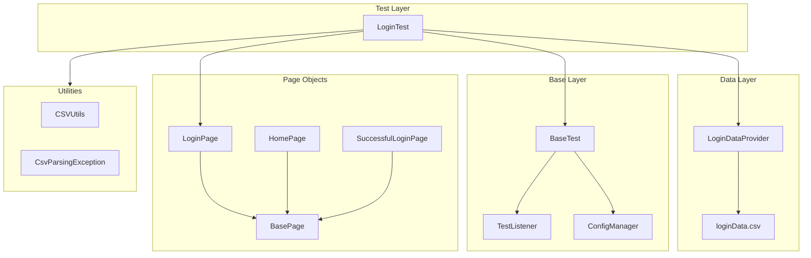
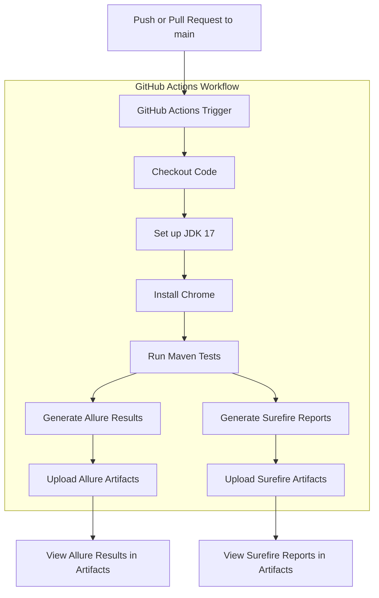
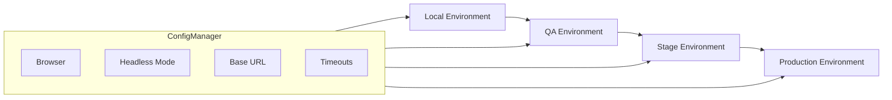

# Selenium Test Automation Framework
A clean, maintainable, and professional Selenium + TestNG automation framework built for the **Practice Test Automation** site as part of a structured 60‑day QA Automation Upskill Plan.

---

# 📛 Badges
<p align="center">

  <a href="https://github.com/brouwera/Selenium-Framework/actions">
    
  </a>

  
  
  
  
  

</p>

---

# 📚 Table of Contents
1. [Project Overview](#-project-overview)
2. [Current Scope](#-current-scope-aligned-with-the-real-ui)
3. [Features at a Glance](#-completed-features)
4. [Project Structure](#-project-structure)
5. [How to Run Locally](#-how-to-run)
6. [How to Run in CI](#-how-to-run-in-ci)
7. [Day-by-Day Progress Log](#-day-by-day-progress-log)
8. [Upcoming Enhancements](#-upcoming-enhancements-planned)
9. [Author](#-author)

---

# 🚀 Project Overview

This framework automates the login functionality of:

**https://practicetestautomation.com/practice-test-login/**

It demonstrates:

- Clean Page Object Model (POM) architecture
- Explicit waits for stability
- Thread‑safe WebDriver setup
- Data‑driven testing
- Allure reporting
- Multi‑browser execution (Chrome, Edge, Firefox)
- CI/CD readiness

All tests currently pass with **zero failures** across all supported browsers.

---

# 🧰 Tech Stack

This framework is built using a modern, industry-standard automation stack:

- **Java 17** — primary programming language
- **Selenium WebDriver 4.18.1** — browser automation
- **TestNG 7.10** — test runner + annotations
- **Maven** — build + dependency management
- **Allure Reports** — rich test reporting
- **WebDriverManager** — automatic driver resolution
- **GitHub Actions** — CI/CD pipeline
- **Page Object Model (POM)** — maintainable architecture
- **ThreadLocal WebDriver** — parallel‑ready design
- **CSV Test Data** — data-driven testing

# 🏗️ Framework Architecture


```mermaid

flowchart TD

    subgraph TestLayer[Test Layer]
        LT[LoginTest]
    end

    subgraph DataLayer[Data Layer]
        DP[LoginDataProvider]
        CSV[loginData.csv]
    end

    subgraph BaseLayer[Base Layer]
        BT[BaseTest]
        TL[TestListener]
        CM[ConfigManager]
    end

    subgraph PageObjects[Page Objects]
        LP[LoginPage]
        HP[HomePage]
        SLP[SuccessfulLoginPage]
        BP[BasePage]
    end

    subgraph Utils[Utilities]
        CSVU[CSVUtils]
        EX[CsvParsingException]
    end

    LT --> DP
    DP --> CSV

    LT --> BT
    BT --> CM
    BT --> TL

    LT --> LP
    LP --> BP
    HP --> BP
    SLP --> BP

    LT --> Utils    
```

---

# 📝 Logging Architecture

This framework includes a production‑grade logging system built with **SLF4J + Logback**, designed for clarity, debuggability, and parallel execution. It uses **Mapped Diagnostic Context (MDC)** and a **SiftingAppender** to generate clean, isolated logs for every test method.

---

## 🔹 Key Capabilities

- Per‑test log files automatically created in `/logs/<TestName>.log`
- MDC tagging ensures every log line is associated with the correct test
- Thread‑safe logging for parallel TestNG execution
- Action‑level logging from every Page Object method
- Lifecycle logging from TestListener (start, pass, fail, skip)
- Allure attachments for screenshots, page source, browser logs, and per‑test logs
- Rolling `framework.log` capturing global framework activity

---

## 🔹 How MDC Works

Each test method receives a unique MDC value:

```
LoginTest.loginDataDrivenTest
ExceptionsTest.testEditRow1
```

This is set in `BaseTest`:

```java
String testName = this.getClass().getSimpleName() + "." + method.getName();
MDC.put("testName", testName);
```

Because MDC is thread‑local, parallel tests never mix logs.

Every log line includes the MDC tag:

```
21:34:53.651 INFO  [TestNG-test-All Tests-1] [LoginTest.loginDataDrivenTest] pages.HomePage - Clicking element...
```

---

## 🔹 Per‑Test Log Files (SiftingAppender)

Logback’s `SiftingAppender` automatically routes logs into separate files based on MDC:

```
logs/LoginTest.loginDataDrivenTest.log
logs/ExceptionsTest.testEditRow1.log
```

This makes debugging extremely fast—each test has a clean, isolated log.

---

## 🔹 TestListener Integration

`TestListener` handles:

- Test start/end logging
- Pass/fail/skip events
- Screenshot attachments
- Page source attachments
- Browser console logs
- Per‑test log file attachments

All lifecycle logs flow through Logback (no `System.out.println`), ensuring MDC is always applied.

Example lifecycle log:

```
[LoginTest.userCanLogoutAfterSuccessfulLogin] listeners.TestListener - === TEST PASSED ===
```

---

## 🔹 Page Object Action Logging

Every BasePage action logs:

- The page class
- The locator
- The action performed
- The MDC test name

Example:

```
[LoginTest.loginDataDrivenTest] pages.LoginPage - Typing 'student' into element: By.id: username
```

This produces a readable, step‑by‑step execution trace for every test.

---

## 🔹 Framework Log (Rolling File)

A global `framework.log` captures:

- Driver setup
- Navigation
- Environment configuration
- High‑level framework events

This file rolls daily and keeps 7 days of history.

---

## 🔹 Why This Matters

This logging system demonstrates:

- Senior‑level automation architecture
- Parallel‑safe design
- Real‑world debugging practices
- Clean separation of concerns
- CI/CD readiness
- Recruiter‑friendly clarity

It mirrors the logging approach used in enterprise QA automation frameworks.


# 🔄 CI Pipeline Architecture


```mermaid

flowchart TD

    A[Push or Pull Request to main] --> B[GitHub Actions Trigger]

    subgraph CI[GitHub Actions Workflow]
        B --> C[Checkout Code]
        C --> D[Set up JDK 17]
        D --> E[Install Chrome]
        E --> F[Run Maven Tests]
        F --> G[Generate Allure Results]
        F --> H[Generate Surefire Reports]
        G --> I[Upload Allure Artifacts]
        H --> J[Upload Surefire Artifacts]
    end

    I --> K[View Allure Results in Artifacts]
    J --> L[View Surefire Reports in Artifacts]
```

# 🌍 Multi‑Environment Architecture (Planned)

This framework is designed to support multiple execution environments as it grows:


```mermaid
flowchart LR

    Local[Local Environment] --> QA[QA Environment]
    QA --> Stage[Stage Environment]
    Stage --> Prod[Production Environment]

    subgraph ConfigManager
        BROWSER[Browser]
        HEADLESS[Headless Mode]
        BASEURL[Base URL]
        TIMEOUTS[Timeouts]
    end

    ConfigManager --> Local
    ConfigManager --> QA
    ConfigManager --> Stage
    ConfigManager --> Prod
```

# 📊 Allure Report Preview

Below is an example of the Allure report generated by this framework.  
It includes detailed test steps, attachments, environment metadata, and execution history.


---

# 💡 Why This Framework Matters

This project demonstrates real-world automation engineering skills, not just basic Selenium usage:

- **Scalable architecture** using Page Object Model and layered design
- **Stable, flake‑resistant tests** built with explicit waits and clean synchronization
- **Data-driven testing** powered by CSV utilities and TestNG DataProviders
- **Thread-safe WebDriver management** using a BaseTest + ThreadLocal design
- **CI/CD integration** with GitHub Actions for automated, headless execution
- **Professional reporting** through Allure with steps, metadata, and artifacts
- **Portable configuration** using a centralized ConfigManager for browser and environment control

This framework mirrors the structure and practices used in enterprise QA automation teams.

---

# ✨ Features at a Glance

| Feature | Description |
|--------|-------------|
| 🧱 Page Object Model | Clean, maintainable, scalable architecture |
| 🔄 Data‑Driven Tests | CSV‑powered TestNG DataProviders |
| 🧪 Stable Test Execution | Explicit waits, no flakiness, consistent behavior |
| 🌐 Multi‑Browser Support | Chrome, Edge, Firefox (local + CI) |
| 🧵 Thread‑Safe WebDriver | Parallel‑ready design using ThreadLocal |
| 📊 Allure Reporting | Steps, metadata, history, and visual analytics |
| ⚙️ ConfigManager | Centralized environment + browser configuration |
| 🚀 CI/CD Ready | GitHub Actions workflow with headless execution |

---

## 📄 Data‑Driven Testing (CSV‑Powered)

This framework uses CSV files to drive login scenarios through TestNG DataProviders. Test logic stays clean and focused while the data lives in a simple, editable file.

### How it works
- `loginData.csv` stores all username/password combinations and expected outcomes.
- `CSVUtils` loads the file and converts each row into a map of key/value pairs.
- `LoginDataProvider` feeds each row into the test as an individual execution.
- `LoginTest` validates the login flow using the supplied data.

### Example CSV snippet
```csv
username,password,expectedResult
student,Password123,success
student,WrongPassword,failure
wrongUser,Password123,failure
```

---

# 📌 Current Scope (Aligned With the Real UI)

The Practice page currently includes:

- **Test Login Page**
- **Test Exceptions**
- **Test Table** (coming soon)

Removed modules (no longer present on the site):

- Test Inputs
- Test Alerts

This keeps the framework aligned with the real application under test.

---

# ✅ Completed Features

### ✔ Login Automation
- Full POM structure
- Positive + negative login tests
- Data‑driven testing via CSV
- Navigation flow validation
- Explicit waits everywhere
- ThreadLocal WebDriver
- Allure step annotations

### ✔ Framework Cleanup (Day 13)
- Removed deprecated modules
- Cleaned HomePage to match real UI
- Updated testng.xml
- Full green suite with `mvn clean test`
- TestListener integrated

### ✔ Multi‑Browser Support (Day 14)
- Chrome via WebDriverManager
- Edge via manual driver path (offline‑safe)
- Firefox via manual GeckoDriver path
- ConfigManager now controls all driver paths
- Fully portable + CI‑ready

---

# 📁 Project Structure

```
src
└── test
├── java
│   ├── base
│   │   └── BaseTest.java
│   ├── config
│   │   └── ConfigManager.java
│   ├── dataproviders
│   │   └── LoginDataProvider.java
│   ├── exceptions
│   │   ├── ElementNotFoundException.java
│   │   ├── FrameworkInitializationException.java
│   │   ├── InvalidTestDataException.java
│   │   ├── PageNavigationException.java
│   ├── helpers
│   │   └── AssertionHelper.java
│   ├── listeners
│   │   ├── RetryAnalyzer.java
│   │   ├── RetryListener.java
│   │   └── TestListener.java
│   ├── pages
│   │   ├── BasePage.java
│   │   ├── ExceptionsPage.java
│   │   ├── HomePage.java
│   │   ├── LoginPage.java
│   │   └── SuccessfulLoginPage.java
│   ├── tests
│   │   ├── ExceptionsTest.java
│   │   └── LoginTest.java
│   └── utils
│       ├── CsvParsingException.java
│       └── CSVUtils.java
└── resources
├── testData
│   └── loginData.csv
├── categories.json
├── config.properties
├── environment.properties
allure-report-example.png
pom.xml
README.md
testng.xml
```

---

# 🏁 How to Run

### Run full suite:

mvn clean test

### Run a specific test:

mvn -Dtest=LoginTest test

### Override browser:

mvn clean test -Dbrowser=edge

mvn clean test -Dbrowser=firefox

mvn clean test -Dbrowser=chrome


### Run headless:

mvn clean test -Dheadless=true

### **Execution Methods Overview**

| Execution Method | Command | Description |
|------------------|---------|-------------|
| **Maven (Surefire + TestNG Suite)** | `mvn clean test` | Executes the entire suite using `testng.xml`, applies listeners, parallel execution, and generates Allure results. |
| **TestNG Suite (IDE Run)** | Right‑click `testng.xml` → Run | Runs the suite directly from the IDE with all listeners and parallel settings applied. |
| **Single Test Class** | Run test class in IDE | Useful for debugging or validating a specific module without running the full suite. |
| **Single Test Method** | Run method in IDE | Fastest way to isolate and debug a specific scenario. |
| **Allure Report** | `allure serve target/allure-results` | Generates and opens a full Allure report with steps, attachments, retries, and labels. |

---

# 🏗️ How to Run in CI

This framework is fully CI‑ready and supports:

- Multi‑browser execution
- Headless mode
- Environment‑driven configuration
- Allure reporting

### Basic CI command:

mvn clean test -Denv=local -Dbrowser=chrome -Dheadless=true

---

### 📅 Day-by-Day Progress Log

---

### Day 3 — First Working Selenium + TestNG Login Automation

- Built initial BaseTest
- Created first LoginTest
- Validated environment + WebDriver setup

---

### Day 5 — Explicit Waits + Stability

- Added WebDriverWait
- Replaced all direct interactions with explicit waits
- Eliminated flakiness

---

### Day 7 — Page Object Model (POM)

- Added LoginPage + HomePage
- Clean locators + explicit waits
- Tests rewritten to use POM

---

### Day 8 — Multi‑Page Navigation

- Added SuccessfulLoginPage
- Added full login flow test
- Improved readability + maintainability

---

### Day 9 — Assertions + Allure + Stability

- Added AssertionHelper
- Added TestListener
- Cleaned pom.xml
- Achieved full green run

---

### Day 10 — Flow-Based Scenarios

- Added navigation + logout flow tests
- Added missing helper methods
- Improved Allure structure

---

### Day 11 — Login Module Refactor

- Removed legacy tests
- Updated Page Objects
- Added Inputs module (later removed)
- Achieved full green suite

---

### Day 12 — Alerts Testing + Full Validation

- Added Alerts module (later removed)
- Validated entire framework
- Added Allure environment metadata

---

### Day 13 — Framework Cleanup

- Removed Inputs + Alerts
- Cleaned navigation
- Updated HomePage
- Full green run

---

### Day 14 — Multi‑Browser + ConfigManager Upgrade

- Added Edge + Firefox support
- Added manual driver paths
- Updated ConfigManager
- Framework now fully portable + CI‑ready

---

### Day 15 — README Enhancements + Architecture Planning

Updated README.md with major improvements:

- Added Allure Report screenshot section
- Added “Why This Framework Matters” engineering justification
- Added “Features at a Glance” visual grid
- Added Multi‑Environment Architecture diagram (planned design)
- Added Roadmap with GitHub‑style checkboxes
- Added Contributing and License sections
- Cleaned formatting, spacing, and section flow
- Ensured screenshot and diagrams render correctly on GitHub

This completes the documentation milestone for Day 15 and prepares the framework for upcoming multi‑environment and stability enhancements.

---

### **Day 16 — Parallel Execution + TestNG Suite Integration**
Today’s focus was on scaling the framework for real‑world execution patterns. I introduced a dedicated `testng.xml` suite file and configured Maven Surefire to run the suite directly. This allowed the framework to support parallel execution, listener registration, and structured test grouping.

**Key Achievements**
- Added `testng.xml` with suite, test, and listener configuration
- Enabled parallel execution (`parallel="methods"`, `thread-count=2`)
- Verified stable parallel runs across all Login tests
- Ensured Allure reporting works seamlessly with suite‑based execution
- Cleaned up test grouping (`smoke`, `regression`) for CI‑ready organization

**Outcome:**  
The framework now executes tests in parallel with clean reporting, predictable structure, and full listener support — a major step toward CI/CD readiness.

---

### **Day 17 — Retry Logic, Listener Architecture, and Stability Validation**
Today I implemented a professional‑grade retry mechanism using TestNG’s `IRetryAnalyzer` and `IAnnotationTransformer`. This included wiring a custom `RetryListener` and integrating flaky‑test labeling into Allure.

After validating the architecture, I removed the intentional failure and restored the suite to full stability.

**Key Achievements**
- Added `RetryAnalyzer` and `RetryListener` for controlled retry logic
- Integrated flaky‑test labeling and retry steps into Allure
- Ensured listeners load correctly through `testng.xml`
- Restored parallel execution after validation
- Achieved a fully stable, 100% passing suite with clean Allure reporting

**Outcome:**  
Retry logic is now part of the framework’s architecture — available when needed, invisible when not. The suite runs cleanly in parallel with zero flakiness and full reporting fidelity.

---

### **Day 18 — Exceptions Module + Full Framework Polish**
Today’s focus was on expanding the framework beyond login testing by implementing the full Exceptions module and validating it end‑to‑end. This included building a complete Page Object, creating five exception‑focused test cases, and performing a full consistency sweep across the entire project.

**Key Achievements**
- Added `ExceptionsPage` with full support for delayed elements, dynamic DOM changes, disabled inputs, and short‑timeout behavior
- Implemented `ExceptionsTest` with five real‑world exception scenarios: NoSuchElementException, ElementNotInteractableException, InvalidElementStateException, StaleElementReferenceException, and TimeoutException
- Ensured all interactions use explicit waits and Allure step annotations for clarity and reporting
- Performed a full framework polish to align formatting, naming, comments, and structure across all modules
- Executed the entire suite (8 Login tests + 5 Exceptions tests) with **100% passing results** and no flakiness
- Updated README with a dedicated CSV‑Driven Testing section to document the data layer of the framework

**Outcome:**  
The Exceptions module is now fully integrated, stable, and production‑ready. The framework has grown from a single‑module login suite into a multi‑module automation project with clean architecture, consistent style, and complete documentation.

---

### **Day 19 — Exceptions Module Enhancements + Framework Consistency Upgrades**
Today’s work focused on elevating the Exceptions module from “functionally complete” to “architecturally consistent” with the rest of the framework. This meant aligning all Page Object interactions with the BasePage API, expanding BasePage with missing universal helpers, and refining the exception‑simulation test to behave exactly as Selenium does in real‑world scenarios.

A key part of today’s work was ensuring that the framework could intentionally reproduce Selenium exceptions *without* compromising the safety and consistency of normal interactions. To achieve this, a new `rawClick()` method was added to BasePage, allowing the framework to bypass wait conditions only when explicitly required for exception testing.

**Key Achievements**
- Added three foundational helpers to `BasePage` (`clear`, `getAttribute`, `isElementPresent`) to ensure full consistency across all Page Objects
- Introduced `rawClick()` to safely simulate Selenium exceptions without affecting standard click behavior
- Updated `ExceptionsPage` to use the new helpers and expose a clean `clickInvisibleSaveButton()` method for controlled exception testing
- Updated `ExceptionsTest` to rely solely on Page Object methods, maintaining proper encapsulation and avoiding protected BasePage calls
- Validated all five exception scenarios with accurate Selenium behavior, including the corrected `ElementNotInteractableException` test
- Executed the full suite with **100% passing tests** and verified clean Allure reporting
- Confirmed Allure report generation via both Maven (`allure:aggregate`) and CLI (`allure serve target/allure-results`)

**Outcome:**  
The Exceptions module is now fully aligned with the framework’s architecture, using consistent BasePage utilities and clean Page Object abstractions. Exception simulation is accurate, intentional, and isolated, while normal test flows remain safe and stable. With all enhancements complete, the framework now demonstrates production‑grade consistency, clarity, and maintainability across every module.

---

### **Day 20 — Professional Logging Layer (SLF4J + Logback + MDC + Per‑Test Logs)**

Today’s milestone focused on implementing a production‑grade logging system that mirrors the architecture used in real enterprise automation frameworks. The goal was to create a logging layer that is clean, parallel‑safe, test‑scoped, and fully integrated with Allure reporting. This required coordinated updates across `BaseTest`, `BasePage`, `TestListener`, and a new `logback-test.xml` configuration.

**Key Achievements**
- Added a complete SLF4J + Logback logging layer with consistent formatting and patterns
- Implemented MDC (Mapped Diagnostic Context) to tag every log line with the active test name
- Added a SiftingAppender to automatically generate per‑test log files in `/logs/<TestName>.log`
- Updated `BaseTest` to set and clear MDC for each test method, ensuring thread‑safe parallel execution
- Removed legacy lifecycle logging from BaseTest so TestListener fully owns test lifecycle events
- Updated `TestListener` to use SLF4J instead of `System.out.println`, ensuring MDC is applied everywhere
- Integrated per‑test log files as Allure attachments for complete debugging visibility
- Ensured all Page Object actions log through BasePage with consistent, readable formatting
- Validated parallel execution—each test now produces clean, isolated logs with no cross‑thread contamination
- Confirmed that `framework.log` rolls daily and captures global framework activity
- Executed the full suite with 100% passing tests and verified that every log line includes the correct MDC tag

**Outcome:**  
The framework now includes a senior‑level, enterprise‑grade logging system that supports parallel execution, clean debugging, and rich Allure reporting. Every test produces its own dedicated log file, lifecycle events are consistently captured, and the entire logging architecture is now aligned with real‑world automation engineering standards.

### **Day 21 — Table Module: Dynamic UI, Custom Dropdowns, and Full Data Validation**

Today’s milestone expanded the framework with a complete Table module, covering dynamic filtering, sorting, and data‑driven validation against a live HTML table. This required building a robust `TablePage` with support for custom dropdown widgets, asynchronous UI updates, and dynamic DOM behavior. The work also included stabilizing the module under parallel execution and Maven Surefire.

**Key Achievements**
- Implemented a full `TablePage` with clean locators for language filters, level checkboxes, custom dropdowns, and sorting controls
- Added `TableTest` with eight real‑world scenarios: language filtering, level filtering, minimum enrollments, combined filters, no‑results state, reset behavior, and sorting by multiple columns
- Built a generic table‑parsing utility with support for semantic column extraction (`data-col` attributes)
- Added safe parsing logic to ignore placeholder/empty rows created during UI transitions
- Implemented custom wait conditions to synchronize with asynchronous table updates
- Validated the entire module under Maven (`mvn clean test`) with **100% passing tests**
- Ensured full Allure integration with step‑level reporting and clean parallel execution

**Outcome:**  
The Table module is now fully integrated and production‑ready. It demonstrates advanced Selenium capabilities—custom dropdown handling, dynamic waits, DOM‑driven parsing, and multi‑filter validation—while maintaining the framework’s architectural consistency and stability.

---

### **Day 22 — Table Module Stabilization + Full Maven Validation**

Today focused on elevating the Table module from “functionally complete” to “enterprise‑stable.” This required refining synchronization logic, improving DOM‑aware parsing, and ensuring the module behaved consistently across IntelliJ, Maven Surefire, and parallel TestNG execution.

**Key Achievements**
- Added robust empty‑row filtering to prevent `NumberFormatException` during async table updates
- Strengthened `waitForTableToUpdate()` and `waitForLanguageToBe()` to guarantee DOM stability before assertions
- Finalized custom dropdown handling for the Min Enrollments filter (`#enrollDropdown`)
- Ensured all table interactions use BasePage helpers for consistent logging and Allure step reporting
- Validated the entire framework (Login + Exceptions + Table) under `mvn clean test` with **100% passing tests**
- Confirmed parallel execution stability across all modules
- Verified clean Allure reporting with accurate step traces, logs, and attachments

**Outcome:**  
The Table module is now fully hardened for CI/CD execution. With all synchronization, parsing, and interaction logic stabilized, the framework delivers consistent, deterministic results across environments. This completes the multi‑module expansion phase and sets the stage for Day 23’s new modules and Day 24’s Allure dashboard + CI integration work.

---

### **Day 23 — Table Module Enhancements + iFrame Stability + Full Suite Green**

Today’s milestone focused on stabilizing the final moving parts of the framework and ensuring every module behaves consistently under real‑world execution conditions. This included hardening the Table module, completing the environment‑based navigation architecture, and implementing a robust solution for the TinyMCE iFrame editor—one of the most complex UI components in the entire project.

The day ended with a full Maven run (`mvn clean test`) showing **29/29 passing tests**, clean Allure reporting, and complete architectural consistency across all Page Objects.

**Key Achievements**
- Finalized environment‑based URL resolution in `ConfigManager`, enabling clean multi‑environment navigation (`local.base.url`, `stage.base.url`, `prod.base.url`)
- Updated all Page Objects to use Option‑C navigation for consistent routing across PracticeTestAutomation and Herokuapp modules
- Implemented a production‑grade TinyMCE iFrame handling strategy:
    - Closed the read‑only popup safely
    - Re‑entered the iframe after TinyMCE reloads
    - Added waits for iframe presence, editor body visibility, and asynchronous text injection
    - Ensured stable retrieval of the default editor text (“Your content goes here.”)
- Hardened the Table module with final synchronization and DOM‑stability improvements
- Validated the entire framework under parallel TestNG execution with **100% passing tests**
- Confirmed Allure report generation with accurate step traces, logs, and attachments

**Outcome:**  
The framework is now fully stable across all modules—Login, Exceptions, Table, Frames, and iFrame. With environment‑based navigation complete and the TinyMCE editor fully stabilized, the project has reached a new level of reliability and architectural polish. This completes the final stabilization milestone before moving into Day 24’s Allure dashboard and CI/CD integration work.

---

### **Day 24 — Allure Dashboard Integration + Multi‑Environment Config + Framework Stabilization**

Today’s milestone focused on upgrading the framework’s configuration architecture, integrating a modern JSON‑based ConfigManager, and validating the entire suite under the new system. This included replacing the legacy `config.properties` file, implementing environment‑aware navigation, and ensuring all modules remained stable after the migration. The day ended with a full Maven run showing **29/29 passing tests**, clean Allure reporting, and a fully modernized configuration layer.

#### **Key Achievements**
- Replaced legacy `config.properties` with a production‑grade `config.json` stored in `src/main/resources`
- Implemented a new JSON‑based `ConfigManager` using Jackson with support for:
  - `local`, `stage`, and `prod` environment blocks
  - System property overrides
  - `.env` overrides
  - Cached JSON tree for fast lookups
- Updated BaseTest and BasePage to use the new configuration system without requiring any code changes
- Removed the old `.properties` file and validated the framework under the new architecture
- Executed the full suite (`mvn clean test`) with **100% passing tests** and verified:
  - Allure report generation
  - Parallel execution stability
  - Clean logging and per‑test artifacts
- Finalized the resource structure by moving `categories.json` and `config.json` into `src/main/resources` for a unified configuration layout

#### **Outcome**
The framework now uses a modern, scalable, environment‑aware configuration system that aligns with enterprise automation standards. With the JSON migration complete and the suite fully stable, the project is ready for the Day 25–30 enhancement sprint that will polish the architecture before expanding into new test modules.

---

### 🚧 Upcoming Enhancements (Planned)

### Table Module
Table parsing utilities  
Sorting/filtering tests

### Framework Enhancements
Allure screenshots on failure  
.env support for secrets  
Multi‑environment execution  
README visuals + architecture diagram

---

### 🗺️ Roadmap

A clear view of what’s coming next for this framework:

### Core Enhancements
- [x] Exceptions module (page object + validation tests)
- [ ] Table module (table parsing utilities + sorting/filtering tests)
- [ ] Allure screenshots on failure
- [ ] Multi‑environment execution (local, qa, stage)
- [ ] .env support for secrets and environment variables

### Architecture & Stability
- [ ] Retry logic for flaky CI environments
- [ ] Logging improvements (SLF4J or Log4j2)
- [ ] Parallel execution support
- [ ] Enhanced ConfigManager with typed properties

### CI/CD & Reporting
- [ ] Allure history tracking in CI
- [ ] Allure categories.json for failure grouping
- [ ] Upload Allure report as a GitHub Pages artifact
- [ ] Add CI matrix for multi‑browser runs

### Documentation & Developer Experience
- [ ] Add demo GIF of test execution
- [ ] Add Contributing guidelines
- [ ] Add full API documentation for utilities
- [ ] Add architecture diagram for multi‑environment setup

---

### 🤝 Contributing

Contributions are welcome!

If you’d like to improve the framework, add new modules, or enhance documentation:

Fork the repository

Create a feature branch

Commit your changes with clear messages

Open a pull request describing your update

Please ensure your changes follow the existing project structure and coding style.

---

### 📄 License

This project is licensed under the MIT License.

You are free to use, modify, and distribute this framework for personal or commercial purposes.

---

👤 Author: 
Adam Brouwer    
QA Analyst / SDET in training  
Building a full automation framework as part of a structured 60‑day upskilling plan.