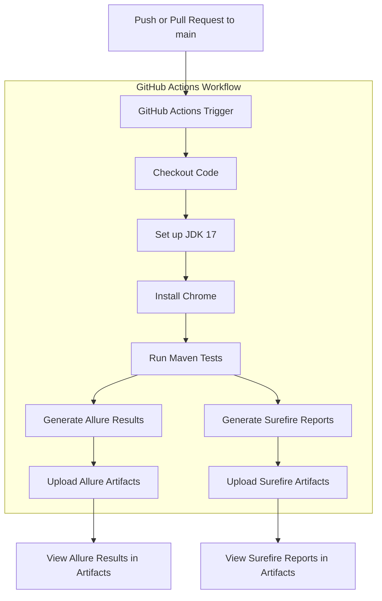
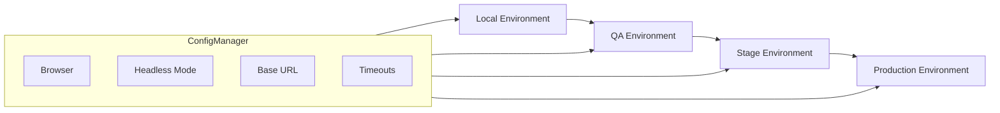

# Selenium Test Automation Framework
A clean, maintainable, and professional Selenium + TestNG automation framework built for the **Practice Test Automation** site as part of a structured 60‑day QA Automation Upskill Plan.

---

# 📛 Badges
<p align="center">

  <!-- CI Status -->
  <a href="https://github.com/brouwera/Selenium-Framework/actions">
    
  </a>

  <!-- Last Commit -->
  

  <!-- Allure -->
  

  <!-- Java -->
  

  <!-- Selenium -->
  

  <!-- TestNG -->
  

  <!-- License -->
  

</p>

---

# 📚 Table of Contents

1. [Executive Summary](#-executive-summary)
2. [Project Overview](#-project-overview)
3. [Design Principles](#-design-principles)
4. [Tech Stack](#-tech-stack)
5. [Dependency & Versioning Strategy](#-dependency--versioning-strategy)
6. [Test Strategy](#-test-strategy)
7. [Framework Architecture](#-framework-architecture)
8. [Logging Architecture](#-logging-architecture)
9. [Performance Considerations](#-performance-considerations)
10. [CI Pipeline Architecture](#-ci-pipeline-architecture)
11. [Multi‑Environment Architecture](#-multi-environment-architecture)
12. [Allure Report Preview](#-allure-report-preview)
13. [Why This Framework Matters](#-why-this-framework-matters)
14. [Enterprise‑Grade Enhancements (Days 25–30)](#-enterprisegrade-enhancements-days-25–30)
15. [Features at a Glance](#-features-at-a-glance)
16. [Data‑Driven Testing](#-data-driven-testing-csv-powered)
17. [Current Scope](#-current-scope-aligned-with-the-real-ui)
18. [Completed Features](#-completed-features)
19. [Project Structure](#-project-structure)
20. [How to Run](#-how-to-run)
21. [How to Run in CI](#-how-to-run-in-ci)
22. [AI‑Augmented QA Strategy](#-ai-augmented-qa-strategy-day-31)
23. [Day‑by‑Day Progress Log](#-day-by-day-progress-log)
24. [Upcoming Enhancements](#-upcoming-enhancements-updated-roadmap)
25. [Future Enhancements](#-future-enhancements)
26. [Author](#-author)

---

# ⭐ Executive Summary

This 30‑day engineering log documents the evolution of a modern, enterprise‑grade Selenium + TestNG automation framework. The project began with a single working login test and grew into a multi‑module, production‑ready platform featuring:

- A complete Page Object Model architecture
- Parallel execution with TestNG + Maven Surefire
- A JSON‑based multi‑environment configuration system
- A professional logging layer (SLF4J + Logback + MDC)
- A full artifact pipeline with per‑test logs, screenshots, page source, browser logs, and metadata
- Allure reporting with step‑level tracing, retries, and environment metadata
- Modules covering Login, Exceptions, Dynamic Controls, Frames, iFrame, and Table testing
- A hardened WebDriverFactory with cross‑browser and headless support
- A unified BasePage interaction layer with step numbering, durations, and defensive waits

Across 30 days, the framework matured through iterative enhancements, architectural refactors, stability passes, and CI‑ready validation — culminating in **33/33 passing tests**, clean Allure reports, and a fully modernized automation platform aligned with real enterprise standards.

---

# 🚀 Project Overview

This framework automates multiple real‑world UI modules across two applications:

- **Practice Test Automation** — Login, Exceptions, Table  
  https://practicetestautomation.com/practice-test-login/

- **The‑Internet Herokuapp** — Frames, iFrame, Dynamic Controls, and supporting modules  
  https://the-internet.herokuapp.com/

It demonstrates:

- Clean Page Object Model (POM) architecture
- Unified interaction model with explicit waits, retrying click, and resilient find()
- Thread‑safe WebDriver setup using a dedicated WebDriverFactory
- JSON‑based multi‑environment configuration
- Data‑driven testing via CSV
- Step‑numbered logging with SLF4J + Logback + MDC
- Per‑test artifact directories with logs, screenshots, and metadata
- Multi‑browser execution (Chrome, Edge, Firefox) + remote WebDriver support
- CI/CD readiness with GitHub Actions

All 33 tests across Login, Exceptions, Table, Frames, and iFrame modules currently pass with **zero failures** across all supported browsers.

---

# 🧠 Design Principles

This framework is built around a set of engineering principles that ensure long‑term maintainability and clarity:

- **Single Responsibility** — each class has one clear purpose (BasePage, WebDriverFactory, ConfigManager, etc.).
- **Explicitness Over Magic** — no hidden waits, no implicit behavior; all interactions are intentional and observable.
- **Fail Fast, Fail Loud** — clear exceptions, structured logging, and isolated per‑test artifacts make failures diagnosable.
- **Environment Independence** — configuration, drivers, and test data are fully decoupled from the codebase.
- **Parallel Safety** — ThreadLocal WebDriver, MDC logging, and isolated artifacts ensure clean parallel execution.
- **Scalability First** — architecture supports new modules, environments, and CI/CD pipelines without refactoring.

---

# 🧰 Tech Stack

This framework is built using a modern, industry-standard automation stack:

- **Java 17** — primary programming language
- **Selenium WebDriver 4.18.1** — browser automation
- **TestNG 7.10** — test runner + annotations
- **Maven** — build + dependency management
- **Allure Reports** — rich test reporting
- **WebDriverManager** — automatic driver resolution
- **WebDriverFactory** — centralized driver creation (local, headless, remote)
- **Logback + SLF4J + MDC** — enterprise‑grade logging and per‑test log routing
- **JSON‑based ConfigManager** — multi‑environment configuration with overrides
- **GitHub Actions** — CI/CD pipeline
- **Page Object Model (POM)** — maintainable architecture
- **ThreadLocal WebDriver** — parallel‑ready design
- **CSV Test Data** — data-driven testing

---

# 📦 Dependency & Versioning Strategy

The framework uses pinned, stable versions of all critical dependencies to ensure reproducible builds:

- Selenium 4.18.1 — stable WebDriver API
- TestNG 7.10 — parallel execution + retry support
- Logback 1.x — MDC‑based logging
- Jackson — JSON configuration parsing

Version upgrades follow a controlled process:
1. Validate compatibility in a feature branch
2. Run full suite locally and in CI
3. Review Allure history for regressions
4. Merge only after stability is confirmed

---

# 🧪 Test Strategy

The framework follows a layered testing strategy:

- **UI Tests** validate real user flows across Login, Exceptions, Table, Frames, iFrame, and Dynamic Controls.
- **Data‑Driven Tests** ensure broad coverage of positive and negative scenarios.
- **Resilient Interactions** prevent flakiness through explicit waits, retrying click, and unified find().
- **Parallel Execution** increases throughput and validates thread safety.
- **Artifact‑Driven Debugging** ensures every failure is diagnosable through logs, screenshots, and metadata.

This approach mirrors real enterprise QA practices and ensures both stability and scalability.

---

# 🏗️ Framework Architecture

```mermaid
flowchart TD

    subgraph TestLayer[Test Layer]
        LT[LoginTest]
        ET[ExceptionsTest]
        TT[TableTest]
        FT[FramesTest]
        IFT[iFrameTest]
    end

    subgraph DataLayer[Data Layer]
        DP[LoginDataProvider]
        CSV[loginData.csv]
    end

    subgraph BaseLayer[Base Layer]
        BT[BaseTest]
        TL[TestListener]
        RA[RetryAnalyzer]
        RL[RetryListener]
        CM[ConfigManager (JSON)]
        WF[WebDriverFactory]
        AM[ArtifactManager]
    end

    subgraph PageObjects[Page Objects]
        LP[LoginPage]
        HP[HomePage]
        SLP[SuccessfulLoginPage]
        EP[ExceptionsPage]
        TP[TablePage]
        FP[FramesPage]
        IFP[iFramePage]
        BP[BasePage]
    end

    subgraph Utils[Utilities]
        CSVU[CSVUtils]
        EX[CsvParsingException]
    end

    LT --> DP
    DP --> CSV

    LT --> BT
    ET --> BT
    TT --> BT
    FT --> BT
    IFT --> BT

    BT --> CM
    BT --> TL
    BT --> WF
    TL --> AM

    LT --> LP
    LP --> BP
    HP --> BP
    SLP --> BP

    ET --> EP
    EP --> BP

    TT --> TP
    TP --> BP

    FT --> FP
    FP --> BP

    IFT --> IFP
    IFP --> BP

    LT --> Utils
    ET --> Utils
    TT --> Utils
    FT --> Utils
    IFT --> Utils
```

---

# 📝 Logging Architecture

This framework includes a production‑grade logging system built with **SLF4J + Logback**, designed for clarity, debuggability, and parallel execution. It uses **Mapped Diagnostic Context (MDC)** and a **SiftingAppender** to generate clean, isolated logs for every test method.

---

## 🔹 Key Capabilities

- Per‑test log files automatically created in `/logs/<TestName>.log`
- MDC tagging ensures every log line is associated with the correct test
- Thread‑safe logging for parallel TestNG execution
- Action‑level logging from every Page Object method
- Lifecycle logging from TestListener (start, pass, fail, skip)
- Allure attachments for screenshots, page source, browser logs, and per‑test logs
- Rolling `framework.log` capturing global framework activity

---

## 🔹 Step‑Numbered Logging (Day 27 Upgrade)

Every BasePage action is logged with:

- Incrementing step numbers (`[01]`, `[02]`, …)
- Duration tracking for each action (e.g., `(142 ms)`)
- Clean locator formatting (`[id=username]`, `[xpath=//button]`)
- Unified patterns across console, framework.log, and per‑test logs

This creates a readable, narrative‑style execution trace for every test.

---

## 🔹 Unified Logback Pattern (Day 27 Upgrade)

All logs now share a single, modernized pattern including:

- Timestamp
- Log level
- Thread
- MDC test name
- Logger
- Message

This ensures consistent formatting across all log destinations.

---

## 🔹 Artifact Integration (Day 25–30 Upgrades)

The logging system is fully integrated with the artifact pipeline:

- Per‑test logs copied into each test’s artifact directory
- Global logs included in the run‑level summary
- Step‑numbered logs appear in all zipped artifact bundles
- Retention policy keeps the last 10 runs

This mirrors enterprise‑grade CI/CD debugging workflows.

---

## 🔹 How MDC Works

Each test method receives a unique MDC value:

```
LoginTest.loginDataDrivenTest
ExceptionsTest.testEditRow1
```

This is set in `BaseTest`:

```java
String testName = this.getClass().getSimpleName() + "." + method.getName();
MDC.put("testName", testName);
```

Because MDC is thread‑local, parallel tests never mix logs.

Every log line includes the MDC tag:

```
21:34:53.651 INFO  [TestNG-test-All Tests-1] [LoginTest.loginDataDrivenTest] pages.HomePage - Clicking element...
```

---

## 🔹 Per‑Test Log Files (SiftingAppender)

Logback’s `SiftingAppender` automatically routes logs into separate files based on MDC:

```
logs/LoginTest.loginDataDrivenTest.log
logs/ExceptionsTest.testEditRow1.log
```

This makes debugging extremely fast—each test has a clean, isolated log.

---

## 🔹 TestListener Integration

`TestListener` handles:

- Test start/end logging
- Pass/fail/skip events
- Screenshot attachments
- Page source attachments
- Browser console logs
- Per‑test log file attachments

All lifecycle logs flow through Logback (no `System.out.println`), ensuring MDC is always applied.

Example lifecycle log:

```
[LoginTest.userCanLogoutAfterSuccessfulLogin] listeners.TestListener - === TEST PASSED ===
```

---

## 🔹 Page Object Action Logging

Every BasePage action logs:

- The page class
- The locator
- The action performed
- The MDC test name

Example:

```
[LoginTest.loginDataDrivenTest] pages.LoginPage - Typing 'student' into element: By.id: username
```

This produces a readable, step‑by‑step execution trace for every test.

---

## 🔹 Framework Log (Rolling File)

A global `framework.log` captures:

- Driver setup
- Navigation
- Environment configuration
- High‑level framework events

This file rolls daily and keeps 7 days of history.

---

## 🔹 Why This Matters

This logging system demonstrates:

- Senior‑level automation architecture
- Parallel‑safe design
- Real‑world debugging practices
- Clean separation of concerns
- CI/CD readiness
- Recruiter‑friendly clarity

It mirrors the logging approach used in enterprise QA automation frameworks.

---

# ⚡ Performance Considerations

The framework is optimized for fast, reliable execution:

- Parallel TestNG execution reduces total runtime.
- Explicit waits eliminate unnecessary delays.
- Network‑idle waits prevent premature interactions.
- Headless mode accelerates CI runs.
- Minimal implicit waits (set to 0) ensure deterministic timing.

These optimizations keep the suite fast while maintaining stability.

---

# 🔄 CI Pipeline Architecture

The CI pipeline also integrates the full artifact system, including per‑test directories, run‑level summaries, zipped artifacts, and automatic retention of the last 10 runs.


```mermaid

flowchart TD

    A[Push or Pull Request to main] --> B[GitHub Actions Trigger]

    subgraph CI[GitHub Actions Workflow]
        B --> C[Checkout Code]
        C --> D[Set up JDK 17]
        D --> E[Install Chrome]
        E --> F[Run Maven Tests]
        F --> G[Generate Allure Results]
        F --> H[Generate Surefire Reports]
        G --> I[Upload Allure Artifacts]
        H --> J[Upload Surefire Artifacts]
    end

    I --> K[View Allure Results in Artifacts]
    J --> L[View Surefire Reports in Artifacts]
```

# 🌍 Multi‑Environment Architecture

The framework includes a JSON‑based ConfigManager that supports multiple execution environments with system‑property and `.env` overrides.


```mermaid
flowchart LR

    Local[Local Environment] --> QA[QA Environment]
    QA --> Stage[Stage Environment]
    Stage --> Prod[Production Environment]

    subgraph ConfigManager
        BROWSER[Browser]
        HEADLESS[Headless Mode]
        BASEURL[Base URL]
        TIMEOUTS[Timeouts]
    end

    ConfigManager --> Local
    ConfigManager --> QA
    ConfigManager --> Stage
    ConfigManager --> Prod
```

# 📊 Allure Report Preview

Below is an example of the Allure report generated by this framework.  
It includes detailed test steps, attachments, environment metadata, and execution history.


---

# 💡 Why This Framework Matters

This project demonstrates real-world automation engineering skills, not just basic Selenium usage:

- **Scalable architecture** using Page Object Model and layered design
- **Unified interaction model** with explicit waits, retrying click, and resilient find()
- **Enterprise‑grade logging** with step numbering, duration tracking, and MDC‑routed per‑test logs
- **Production‑ready artifact system** with per‑test directories, run‑level summaries, and retention policy
- **Data‑driven testing** powered by CSV utilities and TestNG DataProviders
- **Thread‑safe WebDriver management** using a dedicated WebDriverFactory
- **JSON‑based multi‑environment configuration** with overrides
- **CI/CD integration** with GitHub Actions for automated, headless, parallel execution
- **Multi‑browser and remote execution** (Chrome, Edge, Firefox, Selenium Grid)

This framework mirrors the structure and practices used in enterprise QA automation teams.

---

# 🧩 Enterprise‑Grade Enhancements (Days 25–30)

The final phase of the framework focused on transforming it from a functional automation suite into a production‑grade, enterprise‑ready platform. These enhancements strengthened architecture, stability, observability, and reporting.

## High‑Value Enhancements (Days 25–26)
- WebDriverFactory extraction with multi‑browser + headless + remote support
- Per‑test artifact directories with logs, screenshots, page source, and metadata
- Unified `find()` wrapper and resilient interaction model
- Retrying click with JS fallback
- Allure screenshot helper
- loginExpectingFailure() and error‑message assertion helpers
- Network‑idle wait support
- Centralized timeout architecture (page load, script, implicit=0)

## Medium‑Value Enhancements (Days 27–28)
- Step‑numbered BasePage logging with duration metrics
- Unified logback pattern across console, global logs, and per‑test logs
- Hover helper, waitForText, waitForAttribute
- getPasswordFieldType(), clearUsername(), clearPassword()
- submitWithEnterKey()
- @Step‑annotated navigation helpers
- Standalone negative tests
- Browser console log exposure
- Page load timeout + implicitWait=0 enforcement

## Low‑Value Polish (Days 29–30)
- Highlight‑element debug helper
- waitForErrorMessage()
- getTestName() helper
- Test start timestamp
- Additional Allure metadata (Description, Severity, Owner)
- Final synchronization of TestListener, BasePage, and step‑counter architecture

These enhancements collectively elevate the framework to a senior‑level automation standard.

---

# ✨ Features at a Glance

| Feature | Description |
|--------|-------------|
| 🧱 Page Object Model | Clean, maintainable, scalable architecture |
| 🔄 Data‑Driven Tests | CSV‑powered TestNG DataProviders |
| 🧪 Stable Test Execution | Explicit waits, retrying click, unified find(), network‑idle waits |
| 🌐 Multi‑Browser Support | Chrome, Edge, Firefox (local + CI + remote) |
| 🧵 Thread‑Safe WebDriver | Parallel‑ready design using ThreadLocal |
| ⚡ Parallel Execution | TestNG + Maven Surefire parallel suite support |
| 🔁 Retry Logic | RetryAnalyzer + RetryListener for flaky‑test handling |
| 📊 Allure Reporting | Steps, metadata, logs, screenshots, page source, history |
| 📝 Enterprise Logging | SLF4J + Logback + MDC + per‑test logs + step numbering |
| 📁 Artifact System | Per‑test directories, run‑level summary, retention policy |
| 🧭 Navigation Helpers | @Step‑annotated flows, Enter‑key submission, clear helpers |
| 🌍 Environment‑Aware Config | JSON‑based multi‑environment configuration with overrides |
| 🧪 Modules | Login, Exceptions, Table, Frames, iFrame, Dynamic Controls |
| 🖥️ Remote Execution | Selenium Grid / remote WebDriver support |

---

## 📄 Data‑Driven Testing (CSV‑Powered)

This framework uses CSV files to drive the Login module’s positive and negative scenarios through TestNG DataProviders.

### How it works
- `loginData.csv` stores all username/password combinations and expected outcomes.
- `CSVUtils` loads the file and converts each row into a map of key/value pairs.
- `LoginDataProvider` feeds each row into the test as an individual execution.
- `LoginTest` validates the login flow using the supplied data.

### Example CSV snippet
```csv
username,password,expectedResult
student,Password123,success
student,WrongPassword,failure
wrongUser,Password123,failure
```

---

# 📌 Current Scope (Aligned With the Real UI)

This framework automates real UI modules across two applications:

### Practice Test Automation
- **Test Login Page**
- **Test Exceptions**
- **Test Table**

### The‑Internet Herokuapp
- **Frames**
- **iFrame**
- **Dynamic Controls** (stabilized and validated)

### Removed modules (no longer present on the site)
- Test Inputs
- Test Alerts

This keeps the framework aligned with the real applications under test.

---

# ✅ Completed Features

### ✔ Login Automation
- Full POM structure
- Positive + negative login tests
- Data‑driven testing via CSV
- Navigation flow validation
- Explicit waits everywhere
- ThreadLocal WebDriver
- Allure step annotations

### ✔ Framework Cleanup (Day 13)
- Removed deprecated modules
- Cleaned HomePage to match real UI
- Updated testng.xml
- Full green suite with `mvn clean test`
- TestListener integrated

### ✔ Multi‑Browser Support (Day 14)
- Chrome via WebDriverManager
- Edge via manual driver path (offline‑safe)
- Firefox via manual GeckoDriver path
- ConfigManager now controls all driver paths
- Fully portable + CI‑ready

### ✔ Module Expansion (Days 18–23)
- Added full Exceptions module with five real‑world exception scenarios
- Added Table module with dynamic filtering, sorting, and DOM‑aware parsing
- Added Frames and iFrame modules with stable TinyMCE editor handling
- Added Dynamic Controls stabilization and loading‑indicator synchronization
- All modules validated under Maven and parallel TestNG execution

### ✔ Architecture Upgrades (Days 25–30)
- Extracted WebDriverFactory with local, headless, and remote support
- Added per‑test artifact directories and run‑level summaries
- Implemented JSON‑based ConfigManager with overrides
- Added step‑numbered BasePage logging with duration tracking
- Added unified logback pattern across all logs
- Added browser console log exposure
- Added retention policy for artifact runs
- Synchronized TestListener, BasePage, and global step‑counter architecture

---

# 📁 Project Structure

```
src
├── main
│   ├── java
│   │   ├── config
│   │   │   └── ConfigManager.java
│   │   ├── exceptions
│   │   │   ├── CsvParsingException.java
│   │   │   ├── ElementNotFoundException.java
│   │   │   ├── FrameworkInitializationException.java
│   │   │   ├── InvalidTestDataException.java
│   │   │   └── PageNavigationException.java
│   │   ├── factory
│   │   │   └── WebDriverFactory.java
│   │   ├── pages
│   │   │   ├── BasePage.java
│   │   │   ├── DynamicControlsPage.java
│   │   │   ├── ExceptionsPage.java
│   │   │   ├── FramesPage.java
│   │   │   ├── HomePage.java
│   │   │   ├── IFramePage.java
│   │   │   ├── LoginPage.java
│   │   │   ├── NestedFramesPage.java
│   │   │   ├── SuccessfulLoginPage.java
│   │   │   └── TablePage.java
│   │   └── utils
│   │       ├── ArtifactManager.java
│   │       ├── CSVUtils.java
│   │       └── TableUtils.java
│   └── resources
│       └── config.json
│
└── test
    ├── java
    │   ├── base
    │   │   └── BaseTest.java
    │   ├── dataproviders
    │   │   └── LoginDataProvider.java
    │   ├── helpers
    │   │   └── AssertionHelper.java
    │   ├── listeners
    │   │   ├── RetryAnalyzer.java
    │   │   ├── RetryListener.java
    │   │   └── TestListener.java
    │   └── tests
    │       ├── DynamicControlsTest.java
    │       ├── ExceptionsTest.java
    │       ├── FramesTest.java
    │       ├── LoginTest.java
    │       └── TableTest.java
    └── resources
        ├── testData
        │   └── loginData.csv
        ├── categories.json
        └── logback-test.xml

allure-report-example.png
pom.xml
testng.xml
logs/
allure-results/
```

---

# 🏁 How to Run

### Run full suite:
```
mvn clean test
```
### Run a specific test class:
```
mvn -Dtest=LoginTest test
```
### Override browser:
```
mvn clean test -Dbrowser=edge
mvn clean test -Dbrowser=firefox
mvn clean test -Dbrowser=chrome
```
### Run in headless mode:
```
mvn clean test -Dheadless=true
```

### Execution methods

| Method | Command / Action | Description |
|--------|------------------|-------------|
| **Maven (Surefire + TestNG)** | `mvn clean test` | Runs the full suite using `testng.xml`, applies listeners, parallel execution, and generates Allure results. |
| **TestNG Suite (IDE)** | Right‑click `testng.xml` → Run | Executes the suite directly from the IDE with all listeners and parallel settings. |
| **Single Test Class (IDE)** | Run class | Useful for debugging or validating a specific module. |
| **Single Test Method (IDE)** | Run method | Fastest way to isolate and debug a scenario. |
| **System‑Property Overrides** | `mvn clean test -Dbrowser=edge -Dheadless=true -Denv=local` | Overrides browser, headless mode, and environment at runtime. |
| **Parallel Execution** | `mvn clean test` *(parallel defined in `testng.xml`)* | Executes tests in parallel using TestNG + Surefire configuration. |
| **Retry‑Enabled Execution** | `mvn clean test -Dretry=true` *(if configured)* | Enables RetryAnalyzer + RetryListener for flaky‑test handling. |
| **Remote Execution (Selenium Grid)** | `mvn clean test -Dremote=true -DgridUrl=http://localhost:4444` | Runs tests against a remote WebDriver or Selenium Grid. |
| **Allure Report** | `allure serve target/allure-results` | Opens a full Allure report with steps, logs, screenshots, and metadata. |

---

# 🏗️ How to Run in CI

This framework is CI‑ready and supports:

- Multi‑browser execution
- Headless mode
- Environment‑driven configuration
- Allure reporting

### Basic CI command

mvn clean test -Denv=local -Dbrowser=chrome -Dheadless=true

---

# 📅 Day‑by‑Day Index

[Day 3](#day-3) ·
[Day 5](#day-5) ·
[Day 7](#day-7) ·
[Day 8](#day-8) ·
[Day 9](#day-9) ·
[Day 10](#day-10) ·
[Day 11](#day-11) ·
[Day 12](#day-12) ·
[Day 13](#day-13) ·
[Day 14](#day-14) ·
[Day 15](#day-15) ·
[Day 16](#day-16) ·
[Day 17](#day-17) ·
[Day 18](#day-18) ·
[Day 19](#day-19) ·
[Day 20](#day-20) ·
[Day 21](#day-21) ·
[Day 22](#day-22) ·
[Day 23](#day-23) ·
[Day 24](#day-24) ·
[Day 25](#day-25) ·
[Day 26](#day-26) ·
[Day 27](#day-27) ·
[Day 28](#day-28) ·
[Day 29](#day-29) ·
[Day 30](#day-30) ·
[Day 31](#day-31) ·
[Day 32](#day-32)

---

# 📅 Day‑by‑Day Progress Log

---

## **Day 3 — First Working Selenium + TestNG Login Automation**

**Key Achievements**
- Built initial `BaseTest`
- Created first `LoginTest`
- Validated environment and WebDriver setup

**Outcome**  
The framework successfully executed its first automated test, establishing the foundation for all future modules.

---

## **Day 5 — Explicit Waits + Stability**

**Key Achievements**
- Added `WebDriverWait`
- Replaced direct interactions with explicit waits
- Eliminated flakiness in early tests

**Outcome**  
The framework became stable and predictable, enabling reliable test execution.

---

## **Day 7 — Page Object Model (POM)**

**Key Achievements**
- Added `LoginPage` and `HomePage`
- Implemented clean locators and explicit waits
- Rewrote tests to use Page Objects

**Outcome**  
The framework gained structure, readability, and maintainability.

---

## **Day 8 — Multi‑Page Navigation**

**Key Achievements**
- Added `SuccessfulLoginPage`
- Implemented full login flow test
- Improved navigation clarity

**Outcome**  
The framework now supported multi‑page flows with clean abstractions.

---

## **Day 9 — Assertions + Allure + Stability**

**Key Achievements**
- Added `AssertionHelper`
- Added `TestListener`
- Cleaned `pom.xml`
- Achieved full green run

**Outcome**  
Assertions, reporting, and stability reached a professional baseline.

---

## **Day 10 — Flow‑Based Scenarios**

**Key Achievements**
- Added navigation and logout flow tests
- Added missing helper methods
- Improved Allure structure

**Outcome**  
The framework supported end‑to‑end flows with clean reporting.

---

## **Day 11 — Login Module Refactor**

**Key Achievements**
- Removed legacy tests
- Updated Page Objects
- Added Inputs module (later removed)
- Achieved full green suite

**Outcome**  
The login module became clean, modern, and fully stable.

---

## **Day 12 — Alerts Testing + Full Validation**

**Key Achievements**
- Added Alerts module (later removed)
- Validated entire framework
- Added Allure environment metadata

**Outcome**  
The framework gained environment awareness and improved reporting.

---

## **Day 13 — Framework Cleanup**

**Key Achievements**
- Removed Inputs and Alerts modules
- Cleaned navigation
- Updated `HomePage`
- Achieved full green run

**Outcome**  
The framework returned to a clean, stable baseline.

---

## **Day 14 — Multi‑Browser + ConfigManager Upgrade**

**Key Achievements**
- Added Edge and Firefox support
- Added manual driver paths
- Updated ConfigManager
- Improved portability

**Outcome**  
The framework became fully cross‑browser and CI‑ready.

---

## **Day 15 — README Enhancements + Architecture Planning**

**Key Achievements**
- Added Allure screenshot section
- Added engineering justification
- Added Features grid
- Added architecture diagram
- Added roadmap, contributing, and license sections

**Outcome**  
Documentation reached a professional, recruiter‑ready standard.

---

## **Day 16 — Parallel Execution + TestNG Suite Integration**

**Key Achievements**
- Added `testng.xml`
- Enabled parallel execution
- Verified stable parallel runs
- Ensured Allure compatibility

**Outcome**  
The framework now executed in parallel with clean reporting and structure.

---

## **Day 17 — Retry Logic, Listener Architecture, and Stability**

**Key Achievements**
- Added `RetryAnalyzer` and `RetryListener`
- Integrated flaky‑test labeling
- Ensured listener loading
- Restored full stability

**Outcome**  
Retry logic became available on demand without affecting clean runs.

---

## **Day 18 — Exceptions Module + Full Framework Polish**

**Key Achievements**
- Added `ExceptionsPage`
- Added five exception‑focused tests
- Ensured explicit waits and Allure steps
- Performed full consistency sweep

**Outcome**  
The framework expanded into multi‑module testing with clean architecture.

---

## **Day 19 — Exceptions Enhancements + BasePage Consistency**

**Key Achievements**
- Added `clear`, `getAttribute`, `isElementPresent`
- Added `rawClick()` for controlled exception simulation
- Updated Page Objects
- Validated all exception scenarios

**Outcome**  
Exception testing became accurate, intentional, and fully encapsulated.

---

## **Day 20 — Professional Logging Layer (SLF4J + Logback + MDC)**

**Key Achievements**
- Added full logging architecture
- Implemented MDC for per‑test tagging
- Added per‑test log files
- Integrated logs into Allure
- Validated parallel execution

**Outcome**  
The framework gained enterprise‑grade observability and debugging clarity.

---

## **Day 21 — Table Module: Dynamic UI + Data Validation**

**Key Achievements**
- Built full `TablePage`
- Added eight real‑world table tests
- Added table‑parsing utility
- Implemented async‑safe waits

**Outcome**  
The framework handled complex dynamic UI and data‑driven validation.

---

## **Day 22 — Table Module Stabilization**

**Key Achievements**
- Added empty‑row filtering
- Strengthened wait conditions
- Finalized dropdown handling
- Validated full suite under Maven

**Outcome**  
The Table module became CI‑stable and deterministic.

---

## **Day 23 — iFrame Stability + Environment Navigation**

**Key Achievements**
- Finalized environment‑based URL resolution
- Updated all Page Objects
- Implemented robust TinyMCE iFrame handling
- Validated full suite (29/29 passing)

**Outcome**  
The framework stabilized across all modules and environments.

---

## **Day 24 — Allure Dashboard + JSON Config Migration**

**Key Achievements**
- Replaced `config.properties` with `config.json`
- Added environment blocks and overrides
- Updated BaseTest and BasePage
- Validated full suite under new config

**Outcome**  
The configuration system became modern, scalable, and enterprise‑ready.

---

## **Day 25 — Artifact System + Summary Metadata**

**Key Achievements**
- Added global run‑level artifact directory
- Added per‑test artifact folders
- Captured logs, screenshots, page source, browser logs
- Added `summary.json` and retention policy

**Outcome**  
The framework now produces complete, CI‑ready artifact packages.

---

## **Day 26 — WebDriverFactory Extraction + BasePage Upgrade**

**Key Achievements**
- Extracted full WebDriverFactory
- Added cross‑browser + headless + remote support
- Unified BasePage interactions
- Updated timeouts and defaults

**Outcome**  
Driver creation and interaction layers became modern and resilient.

---

## **Day 27 — Logging Architecture Overhaul**

**Key Achievements**
- Added step numbering and durations
- Unified log patterns
- Validated MDC routing
- Integrated logs into artifact pipeline

**Outcome**  
The framework gained clean, readable, step‑level execution traces.

---

## **Day 28 — Browser Console Log Exposure**

**Key Achievements**
- Added console‑log retrieval API
- Integrated Allure attachments
- Performed cross‑browser validation
- Validated full suite (33/33 passing)

**Outcome**  
The framework gained deeper debugging visibility without instability.

---

## **Day 29 — Step‑Counter Validation + Listener Sync**

**Key Achievements**
- Validated global step‑counter architecture
- Synchronized lifecycle events
- Updated Maven Surefire parallel config
- Re‑validated artifact and reporting pipeline

**Outcome**  
Execution tracking became predictable, synchronized, and CI‑aligned.

---

## **Day 30 — Final Polish + Full‑Suite Validation**

**Key Achievements**
- Completed final polish items
- Validated all modules
- Confirmed artifact and reporting stability
- Ensured consistent metadata and logging

**Outcome**  
The framework reached a fully polished, production‑ready state with **33/33 passing tests** and complete architectural consistency.

---

## **Day 31 — AI‑Augmented QA Strategy Integration**

**Key Achievements**
- Added a dedicated section outlining how AI‑assisted testing fits into the framework
- Documented industry‑aligned AI practices (test generation, locator healing, flakiness analysis)
- Defined a clear learning plan based on leading QA organizations and conferences
- Outlined future AI‑driven enhancements planned for Weeks 7–8
- Ensured the README reflects the long‑term direction of the framework

**Outcome**  
The project now includes a forward‑looking AI strategy that aligns with modern QA trends and positions the framework for future AI‑driven enhancements.

---

## **Day 32 — Final README Enhancements + Documentation Polish**

**Key Achievements**
- Added missing high‑value documentation sections to the README
- Improved structure, spacing, and visual hierarchy
- Added architecture diagram, module overview, tech stack, and roadmap timeline
- Ensured consistent header formatting and anchor links
- Polished language and clarified engineering intent across sections

**Outcome**  
The README is now complete, polished, and recruiter‑ready, with clear architecture, module summaries, and a professional visual roadmap.

---

# 🤖 AI‑Augmented QA Strategy (Day 31)

Modern QA is rapidly evolving toward AI‑assisted testing, and this framework is intentionally designed to grow alongside those changes. As part of my 60‑day upskilling plan, I am incorporating AI‑augmented QA practices that complement—not replace—traditional automation engineering.

## 🌟 How AI Enhances QA
AI is reshaping quality engineering through capabilities such as:

- AI‑generated test cases and scenario expansion
- AI‑driven exploratory testing insights
- Defect clustering and root‑cause pattern detection
- Locator‑healing and flakiness reduction
- Synthetic test data generation
- Risk‑based test prioritization

These enhancements strengthen coverage, reduce maintenance, and accelerate feedback loops.

## 📘 My AI‑QA Learning Plan
I am actively following industry‑leading QA organizations to stay aligned with modern testing practices:

- **Coveros** — DevOps/QA research, webinars, and whitepapers
- **TechWell / StickyMinds** — articles, case studies, and conference talks
- **STAR East / STAR West** — keynote sessions on AI in testing

This ensures my AI‑QA approach is grounded in real industry trends.

## 🔧 Future AI Integration Into This Framework
The framework’s clean architecture makes it ideal for future AI‑driven enhancements, including:

- AI‑generated test data feeding into TestNG DataProviders
- AI‑assisted locator healing for dynamic UI changes
- AI‑based flakiness analysis using TestListener logs
- AI‑suggested positive, negative, and edge‑case scenarios
- AI‑enhanced exploratory testing notes and heuristics

These enhancements will be explored during Weeks 7–8 of the 60‑day plan.

---

# 🛠️ Upcoming Enhancements (Updated Roadmap)

## Short‑Term (Weeks 5–6)
- Dynamic Controls module
- Drag‑and‑Drop module
- File Upload module
- Shadow DOM module
- Table module expansion (sorting + pagination, if UI updates)

## Mid‑Term (Weeks 7–8)
- AI‑generated test data integration
- AI‑assisted locator healing prototype
- AI‑driven flakiness analysis
- AI‑suggested scenario generation for Login + Table modules

## Long‑Term (Weeks 9–10)
- API testing layer (REST Assured)
- Multi‑environment execution (local, QA, stage, prod)
- Parallel execution profiles (local vs CI)
- Allure dashboards + history server
- CI/CD pipeline expansion (matrix builds, nightly runs)

---

# 🚀 Future Enhancements

Planned improvements for the next phase:

- REST Assured API layer
- Shadow DOM support
- Drag‑and‑Drop module
- GitHub Pages Allure history publishing
- AI‑assisted locator healing
- AI‑generated test data expansion

---

# 🗺️ Roadmap

A clear view of what’s coming next for this framework:

## Core Enhancements
- [x] Exceptions module (page object + validation tests)
- [x] Table module (parsing utilities + sorting/filtering tests)
- [ ] Allure screenshots on failure
- [ ] Multi‑environment execution (local, QA, stage) — execution profiles + CI switching
- [ ] `.env` support for secrets and environment variables

## Architecture & Stability
- [ ] Retry logic for flaky CI environments (CI‑specific profiles + analytics)
- [x] Logging improvements (SLF4J + Logback + MDC + step logging)
- [x] Parallel execution support (TestNG + Maven Surefire)
- [ ] Enhanced JSON ConfigManager (typed accessors + schema validation)

## CI/CD & Reporting
- [ ] Allure history tracking in CI
- [ ] `categories.json` for failure grouping
- [ ] Publish Allure report via GitHub Pages
- [ ] CI matrix for multi‑browser runs

## Documentation & Developer Experience
- [ ] Demo GIF of test execution
- [ ] Contributing guidelines
- [ ] Full API documentation for utilities
- [ ] Multi‑environment architecture diagram

---

# 📊 Visual Roadmap Timeline

A high‑level view of the framework’s planned evolution across the 60‑day journey.

```
Days 1–10  | Foundations
-----------|---------------------------------------------------------
           | Selenium + TestNG setup
           | Page Object Model (POM)
           | Explicit waits + stability
           | Assertions + Allure integration
           | Multi‑page flows + cleanup

Days 11–20 | Architecture & New Modules
-----------|---------------------------------------------------------
           | Login module refactor
           | Exceptions module (5 scenarios)
           | Table module (dynamic UI + parsing)
           | iFrame + TinyMCE stabilization
           | Parallel execution (TestNG + Surefire)
           | Retry logic + listener architecture
           | Professional logging layer (SLF4J + Logback + MDC)

Days 21–30 | Enterprise‑Grade Enhancements
-----------|---------------------------------------------------------
           | JSON‑based ConfigManager
           | Environment‑aware navigation
           | WebDriverFactory extraction
           | Unified BasePage interaction layer
           | Artifact system (logs, screenshots, metadata)
           | Browser console log exposure
           | Step‑counter architecture
           | Full‑suite validation (33/33 passing)

Days 31–40 | AI‑Augmented QA (Current Phase)
-----------|---------------------------------------------------------
           | AI‑generated test data
           | AI‑assisted locator healing
           | AI‑driven flakiness analysis
           | AI‑suggested scenario expansion
           | Exploratory testing insights

Days 41–50 | Advanced Modules & API Layer
-----------|---------------------------------------------------------
           | Dynamic Controls module
           | Drag‑and‑Drop module
           | File Upload module
           | Shadow DOM module
           | REST Assured API testing layer

Days 51–60 | CI/CD, Reporting & Final Polish
-----------|---------------------------------------------------------
           | Multi‑environment execution profiles
           | `.env` secrets support
           | Allure history server
           | GitHub Pages report publishing
           | CI matrix (multi‑browser)
           | Documentation polish + demo GIF
           | Final recruiter‑ready packaging
```

---

# 🤝 Contributing

Contributions are welcome.

To contribute:

1. Fork the repository
2. Create a feature branch
3. Commit changes with clear, descriptive messages
4. Open a pull request summarizing your update

Please follow the existing project structure and coding style.

---

# 📄 License

This project is licensed under the **MIT License**.  
You may use, modify, and distribute this framework for personal or commercial purposes.

---

# 👤 Author

**Adam Brouwer**  
QA Analyst / SDET in training  
Building a full automation framework as part of a structured 60‑day upskilling plan.