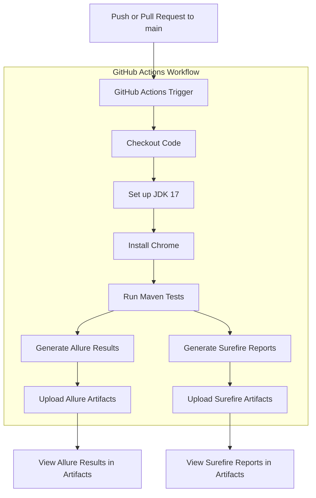
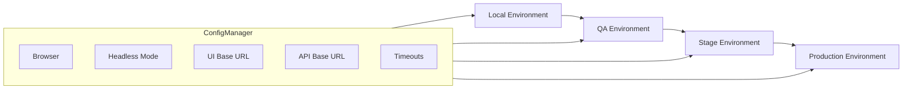
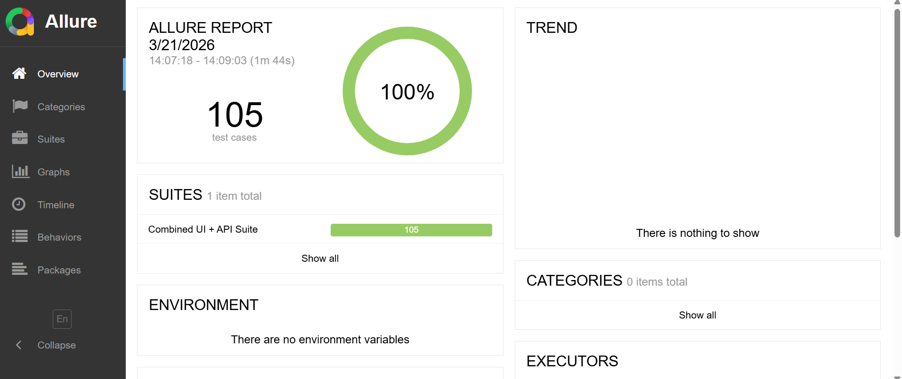

<h1 align="center">Selenium Test Automation Framework</h1>
<h3 align="center">Enterprise‑Grade UI + API Automation with Selenium, TestNG, Allure, and GitHub Actions</h3>

A clean, maintainable, and professional Selenium + TestNG automation framework built for the **Practice Test Automation** site as part of a structured 60‑day QA Automation Upskill Plan.

---

# 📛 Badges
<p align="center">

  <!-- CI Status -->
  <a href="https://github.com/brouwera/Selenium-Framework/actions">
    
  </a>

  <!-- Last Commit -->
  

  <!-- Allure -->
  

  <!-- Allure History -->
  

  <!-- API Testing -->
  

  <!-- API Logging -->
  

  <!-- Maven Build -->
  

  <!-- Maven Profiles -->
  

  <!-- Tests Passing -->
  

  <!-- Java -->
  

  <!-- Selenium -->
  

  <!-- TestNG -->
  

  <!-- License -->
  

</p>

<p align="right"><a href="#selenium-test-automation-framework">⬆️ Back to Top</a></p>

---

# 📚 Table of Contents

1. [Executive Summary](#-executive-summary)
2. [Project Overview](#-project-overview)
3. [Design Principles](#-design-principles)
4. [Tech Stack](#-tech-stack)
5. [Environment Configuration](#-environment-configuration)
6. [Test Data Manager](#-test-data-manager-day-40)
7. [Schema Validation](#-schema-validation-days-41–42)
8. [API Suite Structure](#-api-suite-structure)
9. [Dependency & Versioning Strategy](#-dependency--versioning-strategy)
10. [Test Strategy](#-test-strategy)
11. [Framework Architecture](#-framework-architecture)
12. [API Architecture](#-api-architecture-days-40–42)
13. [Logging Architecture](#-logging-architecture)
14. [API Logging](#-api-logging)
15. [Performance Considerations](#-performance-considerations)
16. [CI Pipeline Architecture](#-ci-pipeline-architecture)
17. [CI Pipeline](#-ci-pipeline)
18. [Multi‑Environment Architecture](#-multi-environment-architecture)
19. [Allure Report Preview](#-allure-report-preview)
20. [Allure Reporting](#-allure-reporting)
21. [Why This Framework Matters](#-why-this-framework-matters)
22. [Enterprise‑Grade Enhancements (Days 25–30)](#-enterprisegrade-enhancements-days-25–30)
23. [Features at a Glance](#-features-at-a-glance)
24. [Data‑Driven Testing](#-data-driven-testing-csv-powered)
25. [Current Scope](#-current-scope-aligned-with-the-real-ui)
26. [Completed Features](#-completed-features)
27. [Project Structure](#-project-structure)
28. [How to Run](#-how-to-run)
29. [Running Tests with Maven Profiles](#-running-tests-with-maven-profiles)
30. [How to Run in CI](#-how-to-run-in-ci)
31. [AI‑Augmented QA Strategy](#-ai-augmented-qa-strategy-day-31)
32. [Day‑by‑Day Progress Log](#-day-by-day-progress-log)
33. [Upcoming Enhancements](#-upcoming-enhancements-updated-roadmap)
34. [Future Enhancements](#-future-enhancements)
35. [Visual Roadmap Timeline](#-visual-roadmap-timeline)
36. [Contributing](#-contributing)
37. [License](#-license)
38. [Author](#-author)

<p align="right"><a href="#selenium-test-automation-framework">⬆️ Back to Top</a></p>

---

# ⭐ Executive Summary

This 30‑day engineering log documents the evolution of a modern, enterprise‑grade Selenium + TestNG automation framework. The project began with a single working login test and grew into a multi‑module, production‑ready platform featuring:

- A complete Page Object Model architecture
- Parallel execution with TestNG + Maven Surefire
- A JSON‑based multi‑environment configuration system
- A professional logging layer (SLF4J + Logback + MDC)
- A full artifact pipeline with per‑test logs, screenshots, page source, browser logs, and metadata
- Allure reporting with step‑level tracing, retries, and environment metadata
- Modules covering Login, Exceptions, Dynamic Controls, Frames, iFrame, and Table testing
- A hardened WebDriverFactory with cross‑browser and headless support
- A unified BasePage interaction layer with step numbering, durations, and defensive waits
- A lightweight API testing layer with JSON parsing, status validation, and dedicated Maven profiles

Across 30 days, the framework matured through iterative enhancements, architectural refactors, stability passes, and CI‑ready validation — culminating in a fully passing UI + API test suite, clean Allure reports, and a fully modernized automation platform aligned with real enterprise standards.

<p align="right"><a href="#selenium-test-automation-framework">⬆️ Back to Top</a></p>

---

# 🚀 Project Overview

This framework automates multiple real‑world UI modules across two applications:

- **Practice Test Automation** — Login, Exceptions, Table  
  https://practicetestautomation.com/practice-test-login/

- **The‑Internet Herokuapp** — Frames, iFrame, Dynamic Controls, and supporting modules  
  https://the-internet.herokuapp.com/

It demonstrates:

- Clean Page Object Model (POM) architecture
- Unified interaction model with explicit waits, retrying click, and resilient find()
- Thread‑safe WebDriver setup using a dedicated WebDriverFactory
- JSON‑based multi‑environment configuration
- Data‑driven testing via CSV
- Step‑numbered logging with SLF4J + Logback + MDC
- Per‑test artifact directories with logs, screenshots, and metadata
- Multi‑browser execution (Chrome, Edge, Firefox) + remote WebDriver support
- Lightweight API testing layer with JSON parsing and status/body validation
- CI/CD readiness with GitHub Actions

All UI and API tests currently pass with **zero failures** across all supported browsers.

<p align="right"><a href="#selenium-test-automation-framework">⬆️ Back to Top</a></p>

---

# 🧠 Design Principles

This framework is built around a set of engineering principles that ensure long‑term maintainability and clarity:

- **Single Responsibility** — each class has one clear purpose (BasePage, WebDriverFactory, ConfigManager, etc.).
- **Explicitness Over Magic** — no hidden waits, no implicit behavior; all interactions are intentional and observable.
- **Fail Fast, Fail Loud** — clear exceptions, structured logging, and isolated per‑test artifacts make failures diagnosable.
- **Environment Independence** — configuration, drivers, and test data are fully decoupled from the codebase.
- **Parallel Safety** — ThreadLocal WebDriver, MDC logging, and isolated artifacts ensure clean parallel execution.
- **Scalability First** — architecture supports new modules, environments, and CI/CD pipelines without refactoring.

<p align="right"><a href="#selenium-test-automation-framework">⬆️ Back to Top</a></p>

---

# 🧰 Tech Stack

This framework is built using a modern, industry-standard automation stack:

- **Java 17** — primary programming language
- **Selenium WebDriver 4.18.1** — browser automation
- **TestNG 7.10** — test runner + annotations
- **Maven** — build + dependency management with UI/API profiles
- **Allure Reports** — rich test reporting with steps, logs, screenshots, and history
- **WebDriverManager** — automatic driver resolution
- **WebDriverFactory** — centralized driver creation (local, headless, remote)
- **Logback + SLF4J + MDC** — enterprise‑grade logging and per‑test log routing (UI + API)
- **JSON‑based ConfigManager** — multi‑environment configuration with overrides
- **TestDataManager** — unified, environment‑aware JSON/CSV test data loading with schema validation
- **JSON Schema Validation** — Everit JSON Schema for API contracts and test data schemas
- **API Service Layer** — `UsersApi`, `PostsApi`, `CommentsApi`, `AuthApi` on top of `ApiClient`
- **AssertionHelper** — reusable, readable assertions for UI and API tests
- **GitHub Actions** — CI/CD pipeline with headless Chrome execution
- **Page Object Model (POM)** — maintainable UI architecture
- **ThreadLocal WebDriver** — parallel‑ready design
- **CSV + JSON Test Data** — data-driven testing for UI and API flows
- **Lightweight API Layer** — `ApiClient`, `ApiBaseTest`, and `ApiResponse` for REST validation

<p align="right"><a href="#selenium-test-automation-framework">⬆️ Back to Top</a></p>

---

# 🌐 Environment Configuration

This framework uses a JSON‑based configuration system designed for clarity, portability, and CI‑safety. All environment settings are loaded through `ConfigManager`, with optional overrides via system properties.

---

## Key Settings (config.json)
- **browser** — chrome, edge, firefox
- **headless** — local GUI mode by default
- **baseUrl** — UI application under test
- **apiBaseUrl** — API endpoint base URL
- **timeouts** — page load + script timeouts
- **remote** — enable Selenium Grid execution

---

## Local vs CI Behavior
Local runs use the values in `config.json`:

```
"browser": "chrome",
"headless": false
```

CI runs automatically enforce:
- **headless mode** (regardless of config.json)
- **Chrome binary path** (`/usr/bin/google-chrome`)
- **ChromeDriver autodetection**

This ensures:
- GUI mode locally
- Headless mode in CI
- Zero driver mismatches
- Fully stable GitHub Actions execution

---

## Runtime Overrides
You can override any setting at runtime:

```
mvn clean test -Dbrowser=edge
mvn clean test -Dheadless=true
mvn clean test -Denv=local
mvn clean test -Dremote=true -DgridUrl=http://localhost:4444
```

---

## Profile‑Aware Configuration
Maven profiles automatically select the correct suite:

```
mvn clean test -Pui     # UI suite
mvn clean test -Papi    # API suite
mvn clean test -Pall    # Combined UI + API suite
```

This makes the framework fully environment‑agnostic, profile‑aware, and CI‑ready.

<p align="right"><a href="#selenium-test-automation-framework">⬆️ Back to Top</a></p>

---

# 📂 Test Data Manager

The framework includes a unified, environment‑aware Test Data Manager that centralizes all JSON and CSV test data loading. This ensures consistency, schema validation, and clean separation between test logic and test data.

---

## 🔹 Key Capabilities

### **Environment‑Aware JSON Loading**
`TestDataManager` automatically selects the correct dataset based on:
- `-Denv=local`
- `-Denv=qa`
- `-Denv=stage`

Example:

```
loginData.local.json
loginData.qa.json
```

### **CSV + JSON Support**
The manager loads:
- CSV files (e.g., `loginData.csv`)
- JSON arrays and objects (e.g., `loginData.json`)

### **Schema Validation**
Every JSON dataset and API response is validated against a matching schema:

**Test Data Schemas**
- `loginData.schema.json`

**API Contract Schemas**
- `post-schema.json`
- `posts-all.schema.json`
- `posts-create.schema.json`
- `posts-single.schema.json`
- `posts-update.schema.json`
- `user-schema.json`
- `comment-schema.json`

This ensures that both test data and API responses strictly conform to their expected structure, preventing malformed or drifting data from entering the suite.

### **Centralized Access**
All tests and DataProviders load data through:

```java
JSONArray loginData = TestDataManager.loadJsonArray("login/loginData.json");
```

This ensures:

- No duplicated file paths
- No hard‑coded resource lookups
- Consistent behavior across UI + API tests

---

## 🔹 Benefits

- Eliminates brittle, scattered file loading
- Guarantees valid test data before execution
- Supports multi‑environment test data strategies
- Reduces maintenance overhead
- Integrates cleanly with TestNG DataProviders

The Test Data Manager is now a core part of the framework’s architecture, powering both UI and API test flows with clean, validated, environment‑aware data.

<p align="right"><a href="#selenium-test-automation-framework">⬆️ Back to Top</a></p>

---

# 📜 Schema Validation

The framework includes full JSON Schema validation for both API responses and test data. This ensures structural correctness, prevents regressions, and guarantees that all data consumed by the framework is valid before tests run.

---

## 🔹 What Schema Validation Covers

### **1. API Contract Validation**
Every API response is validated against a JSON Schema stored under:

```
src/test/resources/schemas/
```

Schemas include:

- `post-schema.json`
- `posts-all.schema.json`
- `posts-create.schema.json`
- `posts-single.schema.json`
- `posts-update.schema.json`
- `user-schema.json`
- `comment-schema.json`

Used in Contract Tests:

```java
SchemaValidator.validate("post-schema.json", response.getBody());
```

This ensures:
- Required fields exist
- Field types match expectations
- No unexpected structural changes occur

---

### **2. Test Data Schema Validation**
All JSON test data is validated before being consumed by tests.

**Test Data Schemas**
- `loginData.schema.json`

This prevents:
- Missing fields
- Incorrect data types
- Corrupted or drifting test data

---

## 🔹 How It Works

The `SchemaValidator` uses Everit JSON Schema to validate JSON objects and arrays:

```java
SchemaValidator.validate("user-schema.json", jsonResponse);
```

Validation runs:
- During API tests (contract, functional, negative)
- During TestDataManager JSON loading (environment‑aware test data)

If validation fails, the test fails immediately with a clear, readable error message.

---

## 🔹 Benefits

- Enforces strict API contracts
- Prevents silent data drift
- Catches structural regressions early
- Ensures test data is always valid
- Improves reliability of both UI + API tests

Schema validation is now a core part of the framework’s stability and correctness strategy.

<p align="right"><a href="#selenium-test-automation-framework">⬆️ Back to Top</a></p>

---

# 🧪 API Suite Structure

The API test layer includes a full set of TestNG classes covering functional behavior, CRUD operations, negative scenarios, and JSON Schema contract validation. These tests run through `api-suite.xml` or as part of the combined UI + API suite.

---

## 🔹 Test Classes

### **1. Functional API Tests**
Covers standard, happy‑path API behavior:
- Status code validation
- JSON field validation
- Response time checks
- Basic contract expectations

Classes include:
- `ApiTests`
- `GetPostsTests`

---

### **2. CRUD Operation Tests**
Validates full create/read/update/delete flows for the Posts API:

- `CreatePostsTests`
- `UpdatePostsTests`
- `DeletePostsTests`

These tests use:
- Environment‑aware base URLs
- Schema‑validated request/response bodies
- Centralized API service classes (`PostsApi`, `UsersApi`, `CommentsApi`, `AuthApi`)

---

### **3. Negative API Tests**
Covers error and edge‑case behavior:
- Invalid IDs
- Missing resources
- Bad payloads
- Non‑existent endpoints
- Auth failures

Classes include:
- `NegativeApiTests`
- `NegativePostsTests`

---

### **4. Contract Tests**
Validates API responses against JSON Schemas:

Schemas include:
- `post-schema.json`
- `posts-all.schema.json`
- `posts-create.schema.json`
- `posts-single.schema.json`
- `posts-update.schema.json`
- `user-schema.json`
- `comment-schema.json`

Class:
- `ContractTests`

Ensures structural correctness and prevents regressions.

---

## 🔹 How the Suites Run

### **API‑Only Execution**
Triggered via Maven profile:

```java
mvn clean test -Papi
```

Runs:
- All functional tests
- All CRUD tests
- All negative tests
- All contract tests

---

### **Combined UI + API Execution**
Triggered via:

```java
mvn clean test -Pall
```

Runs:
- Full UI suite
- Full API suite
- Shared reporting + logging

<p align="right"><a href="#selenium-test-automation-framework">⬆️ Back to Top</a></p>

---

# 📦 Dependency & Versioning Strategy

The framework uses pinned, stable versions of all critical dependencies to ensure reproducible builds:

- Selenium 4.18.1 — stable WebDriver API
- TestNG 7.10 — parallel execution + retry support
- Logback 1.x — MDC‑based logging
- Jackson — JSON configuration parsing

Version upgrades follow a controlled process:
1. Validate compatibility in a feature branch
2. Run full suite locally and in CI
3. Review Allure history for regressions
4. Merge only after stability is confirmed

<p align="right"><a href="#selenium-test-automation-framework">⬆️ Back to Top</a></p>

---

# 🧪 Test Strategy

The framework follows a layered testing strategy:

- **UI Tests** validate real user flows across Login, Exceptions, Table, Frames, iFrame, and Dynamic Controls.
- **API Tests** validate REST endpoints using a lightweight API client, JSON parsing, and status/body assertions.
- **Data‑Driven Tests** ensure broad coverage of positive and negative scenarios.
- **Resilient Interactions** prevent flakiness through explicit waits, retrying click, and unified find().
- **Parallel Execution** increases throughput and validates thread safety across UI and API layers.
- **Profile‑Based Execution** allows running UI‑only, API‑only, or combined suites via Maven profiles.
- **Artifact‑Driven Debugging** ensures every failure is diagnosable through logs, screenshots, and metadata.

This approach mirrors real enterprise QA practices and ensures both stability and scalability across UI and API layers.

<p align="right"><a href="#selenium-test-automation-framework">⬆️ Back to Top</a></p>

---

# 🏗️ Framework Architecture

```mermaid
flowchart TD

    %% ============================
    %% Test Layer
    %% ============================
    subgraph TestLayer[Test Layer]
        LT[LoginTest]
        ET[ExceptionsTest]
        TT[TableTest]
        FT[FramesTest]
        IFT[iFrameTest]

        AT[ApiTests]
        GPT[GetPostsTests]
        CPT[CreatePostsTests]
        UPT[UpdatePostsTests]
        DPT[DeletePostsTests]

        NAT[NegativeApiTests]
        NPT[NegativePostsTests]

        CT[ContractTests]
    end

    %% ============================
    %% Data Layer
    %% ============================
    subgraph DataLayer[Data Layer]
        DP[LoginDataProvider]
        CSV[loginData.csv]
        JSONQA[qa/loginData.json]
        JSONST[stage/loginData.json]
        JSONPR[prod/loginData.json]
        TDM[TestDataManager]
    end

    %% ============================
    %% Base Layer
    %% ============================
    subgraph BaseLayer[Base Layer]
        BT[BaseTest]
        ABT[ApiBaseTest]
        TL[TestListener]
        RA[RetryAnalyzer]
        RL[RetryListener]
        CM[ConfigManager (JSON)]
        WF[WebDriverFactory]
        AM[ArtifactManager]
        SV[SchemaValidator]
    end

    %% ============================
    %% API Layer
    %% ============================
    subgraph ApiLayer[API Layer]
        AC[ApiClient]
        AR[ApiResponse]
        BA[BaseApi]

        UAPI[UsersApi]
        PAPI[PostsApi]
        CAPI[CommentsApi]
        AAPI[AuthApi]
    end

    %% ============================
    %% Page Objects
    %% ============================
    subgraph PageObjects[Page Objects]
        LP[LoginPage]
        HP[HomePage]
        SLP[SuccessfulLoginPage]
        EP[ExceptionsPage]
        TP[TablePage]
        FP[FramesPage]
        IFP[iFramePage]
        BP[BasePage]
    end

    %% ============================
    %% Utilities
    %% ============================
    subgraph Utils[Utilities]
        CSVU[CSVUtils]
        JSONU[JsonUtils]
        TU[TableUtils]
        AAL[AllureApiLogger]
        EX[CsvParsingException]
    end

    %% ============================
    %% Relationships
    %% ============================

    %% UI Test → Data
    LT --> DP
    DP --> CSV
    DP --> TDM
    TDM --> JSONQA
    TDM --> JSONST
    TDM --> JSONPR

    %% UI Tests → BaseTest
    LT --> BT
    ET --> BT
    TT --> BT
    FT --> BT
    IFT --> BT

    %% API Tests → ApiBaseTest
    AT --> ABT
    GPT --> ABT
    CPT --> ABT
    UPT --> ABT
    DPT --> ABT
    NAT --> ABT
    NPT --> ABT
    CT --> ABT

    %% Base Layer Dependencies
    BT --> CM
    BT --> TL
    BT --> WF
    TL --> AM

    ABT --> AC
    ABT --> AR
    ABT --> BA

    %% API Services → ApiClient
    UAPI --> AC
    PAPI --> AC
    CAPI --> AC
    AAPI --> AC

    %% Contract Tests → SchemaValidator
    CT --> SV

    %% TestDataManager → SchemaValidator
    TDM --> SV

    %% Page Object Dependencies
    LT --> LP
    LP --> BP
    HP --> BP
    SLP --> BP

    ET --> EP
    EP --> BP

    TT --> TP
    TP --> BP

    FT --> FP
    FP --> BP

    IFT --> IFP
    IFP --> BP

    %% Utils used across tests
    LT --> Utils
    ET --> Utils
    TT --> Utils
    FT --> Utils
    IFT --> Utils
    AT --> Utils
    GPT --> Utils
    CPT --> Utils
    UPT --> Utils
    DPT --> Utils
    NAT --> Utils
    NPT --> Utils
    CT --> Utils
```

---

# 🔌 API Architecture

The framework includes a lightweight but powerful API testing layer that is fully integrated with logging, data management, schema validation, and TestNG suite execution. It follows the same architectural principles as the UI layer: clarity, modularity, and maintainability.

---

## 🧱 Core Components

### **ApiClient**
A reusable HTTP client that supports:
- GET, POST, PUT, DELETE
- JSON request/response handling
- Automatic header injection
- Request/response logging (MDC‑aware)
- Allure attachments for debugging

### **ApiResponse**
A simple wrapper containing:
- `statusCode`
- `headers`
- `body`
- `responseTimeMs`

Used across all API tests for consistent, readable assertions.

### **ApiBaseTest**
Provides:
- MDC test name initialization
- Allure metadata
- Shared setup for all API tests
- Unified logging behavior across UI + API layers

### **BaseApi**
A shared parent class for all service classes:
- Centralizes base URLs
- Handles environment‑aware endpoint resolution
- Provides reusable request helpers

### **Service Classes**
Each endpoint group has its own dedicated service class:

- `UsersApi`
- `PostsApi`
- `CommentsApi`
- `AuthApi` (mocked endpoints for negative testing)

These classes encapsulate endpoint URLs and request logic, keeping tests clean and focused on behavior rather than HTTP plumbing.

---

## 🧪 API Test Types

### **Functional Tests**
Validate:
- Status codes
- Response bodies
- JSON fields
- Basic contract expectations

Classes include:
- `ApiTests`
- `GetPostsTests`

### **CRUD Tests**
Validate full create/read/update/delete flows:

- `CreatePostsTests`
- `UpdatePostsTests`
- `DeletePostsTests`

### **Negative Tests**
Validate:
- Invalid IDs
- Missing resources
- Bad payloads
- Non‑existent endpoints
- Auth failures

Classes include:
- `NegativeApiTests`
- `NegativePostsTests`

### **Contract Tests**
Validate API responses against JSON schemas:

- `post-schema.json`
- `posts-all.schema.json`
- `posts-create.schema.json`
- `posts-single.schema.json`
- `posts-update.schema.json`
- `user-schema.json`
- `comment-schema.json`

This ensures structural correctness and prevents regressions.

---

## 🧩 Integration with the Framework

The API layer is fully integrated with:

- **MDC logging** → per‑test log files
- **TestDataManager** → environment‑aware JSON test data
- **SchemaValidator** → JSON Schema contract enforcement
- **Allure** → request/response attachments
- **TestNG suites** → `api-suite.xml` and `combined-suite.xml`

This creates a unified, enterprise‑grade automation platform across UI + API layers.

<p align="right"><a href="#selenium-test-automation-framework">⬆️ Back to Top</a></p>

---

# 📝 Logging Architecture

This framework includes a production‑grade logging system built with **SLF4J + Logback**, designed for clarity, debuggability, and parallel execution. It uses **Mapped Diagnostic Context (MDC)** and a **SiftingAppender** to generate clean, isolated logs for every test method across both UI and API layers.

---

## 🔹 Key Capabilities

- Per‑test log files automatically created in `/logs/<TestName>.log`
- MDC tagging ensures every log line is associated with the correct test (UI or API)
- Thread‑safe logging for parallel TestNG execution
- Action‑level logging from every Page Object method
- Request/response logging for API tests through `ApiBaseTest` and `ApiClient`
- Lifecycle logging from TestListener (start, pass, fail, skip)
- Allure attachments for screenshots, page source, browser logs, API responses, and per‑test logs
- Rolling `framework.log` capturing global framework activity

---

## 🔹 Step‑Numbered Logging (Day 27 Upgrade)

Every BasePage action is logged with:

- Incrementing step numbers (`[01]`, `[02]`, …)
- Duration tracking for each action (e.g., `(142 ms)`)
- Clean locator formatting (`[id=username]`, `[xpath=//button]`)
- Unified patterns across console, framework.log, and per‑test logs

API tests also follow the same MDC pattern, with request/response logs grouped under the test’s MDC tag.

---

## 🔹 Unified Logback Pattern (Day 27 Upgrade)

All logs now share a single, modernized pattern including:

- Timestamp
- Log level
- Thread
- MDC test name
- Logger
- Message

This ensures consistent formatting across UI and API logs.

---

## 🔹 Artifact Integration (Day 25–30 Upgrades)

The logging system is fully integrated with the artifact pipeline:

- Per‑test logs copied into each test’s artifact directory
- Global logs included in the run‑level summary
- Step‑numbered logs appear in all zipped artifact bundles
- API tests include request/response logs in their artifact folders
- Retention policy keeps the last 10 runs

This mirrors enterprise‑grade CI/CD debugging workflows.

---

## 🔹 How MDC Works

Each test method receives a unique MDC value:

```
LoginTest.loginDataDrivenTest
ExceptionsTest.testEditRow1
ApiTests.getUserDetails
```

This is set in `BaseTest` and `ApiBaseTest`:

```java
String testName = this.getClass().getSimpleName() + "." + method.getName();
MDC.put("testName", testName);
```

Because MDC is thread‑local, parallel tests never mix logs.

Every log line includes the MDC tag:

```
21:34:53.651 INFO  [TestNG-test-All Tests-1] [LoginTest.loginDataDrivenTest] pages.HomePage - Clicking element...
21:34:53.652 INFO  [TestNG-test-All Tests-2] [ApiTests.getUserDetails] api.ApiClient - Sending GET /users/1
```

---

## 🔹 Per‑Test Log Files (SiftingAppender)

Logback’s SiftingAppender automatically routes logs into separate files based on MDC:

```
logs/LoginTest.loginDataDrivenTest.log
logs/ExceptionsTest.testEditRow1.log
logs/ApiTests.getUserDetails.log
```

This makes debugging extremely fast—each test has a clean, isolated log.

---

## 🔹 TestListener Integration

`TestListener` handles:

- Test start/end logging
- Pass/fail/skip events
- Screenshot attachments (UI tests)
- Page source attachments (UI tests)
- Browser console logs (UI tests)
- Per‑test log file attachments
- API request/response logs (API tests)

All lifecycle logs flow through Logback (no System.out.println), ensuring MDC is always applied.

Example lifecycle log:

```
[LoginTest.userCanLogoutAfterSuccessfulLogin] listeners.TestListener - === TEST PASSED ===
```

---

## 🔹 Page Object & API Action Logging

UI actions log:

- Page class
- Locator
- Action performed
- MDC test name

API actions log:

- HTTP method
- Endpoint
- Request body (if applicable)
- Response status and body
- MDC test name

This produces a readable, step‑by‑step execution trace for every UI and API test.

---

## 🔹 Framework Log (Rolling File)

A global `framework.log` captures:

- Driver setup
- Navigation
- Environment configuration
- API client initialization
- High‑level framework events

This file rolls daily and keeps 7 days of history.

---

## 🔹 Why This Matters

This logging system demonstrates:

- Senior‑level automation architecture
- Parallel‑safe design across UI and API layers
- Real‑world debugging practices
- Clean separation of concerns
- CI/CD readiness
- Recruiter‑friendly clarity

It mirrors the logging approach used in enterprise QA automation frameworks.

<p align="right"><a href="#selenium-test-automation-framework">⬆️ Back to Top</a></p>

---

# 📡 API Logging

The framework includes a dedicated API logging layer that captures every request and response with full detail, formatted for readability, and automatically attached to Allure reports. This brings API observability to the same enterprise‑grade level as the UI logging system.

---

## 🔹 Key Capabilities

### **Pretty‑Printed JSON Logging**
All request and response bodies are automatically formatted using `JsonUtils.toPrettyJson()`, producing:

- Human‑readable JSON
- Indentation and line breaks
- Graceful fallback for non‑JSON payloads

This dramatically improves debugging clarity in both logs and Allure.

---

### **Request + Response Metadata**
Each API call logs:

- HTTP method
- Full URL
- Headers
- Request body
- Response status
- Response time
- Response body

All captured through the centralized `AllureApiLogger`.

---

### **Automatic cURL Generation**
Every API request includes a fully escaped, copy‑ready cURL command:

```
curl -X GET "https://jsonplaceholder.typicode.com/posts/1" \
-H "Content-Type: application/json"
```

This makes reproducing failures outside the framework effortless.

---

### **Allure Attachments**
Each API call produces the following Allure attachments:

- **Request Details**
- **Response Details**
- **cURL Command**

These appear under the test’s step tree and are included in CI artifacts.

---

### **Configurable Logging Toggle**
API logging can be enabled or disabled via:

#### **config.json**

```json
"apiLogging": true
```

---

#### **System property**

```
-DapiLogging=false
```

#### **.env override**

```
apiLogging=false
```


The `ConfigManager.isApiLoggingEnabled()` method unifies all override paths.

---

### **MDC‑Aware Logging**
API logs are routed through the same MDC test‑name tagging system used by UI tests, ensuring:

- Clean per‑test log files
- Thread‑safe parallel execution
- Unified formatting across UI + API layers

---

## 🔹 Why This Matters

This enhancement brings the API layer to full enterprise maturity:

- Faster debugging
- Cleaner Allure reports
- Reproducible API calls
- Consistent logging across UI + API
- CI‑ready observability

It also lays the groundwork for future enhancements such as retry logic, authentication flows, and API performance metrics.

<p align="right"><a href="#selenium-test-automation-framework">⬆️ Back to Top</a></p>

---

# ⚡ Performance Considerations

The framework is optimized for fast, reliable execution:

- Parallel TestNG execution reduces total runtime.
- Explicit waits eliminate unnecessary delays.
- Network‑idle waits prevent premature interactions.
- Headless mode accelerates CI runs.
- Minimal implicit waits (set to 0) ensure deterministic timing.

These optimizations keep the suite fast while maintaining stability.

<p align="right"><a href="#selenium-test-automation-framework">⬆️ Back to Top</a></p>

---

# 🔄 CI Pipeline Architecture

The CI pipeline also integrates the full artifact system, including per‑test directories, run‑level summaries, zipped artifacts, and automatic retention of the last 10 runs.


```mermaid

flowchart TD

    A[Push or Pull Request to main] --> B[GitHub Actions Trigger]

    subgraph CI[GitHub Actions Workflow]
        B --> C[Checkout Code]
        C --> D[Set up JDK 17]
        D --> E[Install Chrome]
        E --> F[Run Maven Tests]
        F --> G[Generate Allure Results]
        F --> H[Generate Surefire Reports]
        G --> I[Upload Allure Artifacts]
        H --> J[Upload Surefire Artifacts]
    end

    I --> K[View Allure Results in Artifacts]
    J --> L[View Surefire Reports in Artifacts]
```

<p align="right"><a href="#selenium-test-automation-framework">⬆️ Back to Top</a></p>

---

# 🧪 CI Pipeline

This project includes a fully automated CI pipeline powered by GitHub Actions. Every push to `main` triggers a complete test run in a clean Linux environment using headless Chrome.

---

## What the Pipeline Does
- Checks out the repository
- Installs JDK 17
- Installs Google Chrome
- Runs the full Maven + TestNG suite in headless mode
- Generates Allure results and Surefire XML reports
- Uploads both as downloadable CI artifacts
- Enforces ChromeDriver autodetection to prevent version mismatches
- Ensures stable, parallel execution in a headless environment

---

## CI Artifacts
Each run produces two downloadable bundles:

- **allure-results.zip** — raw Allure data (steps, logs, screenshots, metadata)
- **surefire-reports.zip** — TestNG XML summaries for debugging

These appear at the bottom of each workflow run under **Artifacts**.

---

## CI Status Badge
The badge at the top of this README reflects the latest CI run:

https://img.shields.io/github/actions/workflow/status/brouwera/Selenium-Framework/ci.yml?style=flat-square&label=CI%20Build

This provides instant visibility into the health of the framework.

<p align="right"><a href="#selenium-test-automation-framework">⬆️ Back to Top</a></p>

---

# 🌍 Multi‑Environment Architecture

The framework includes a JSON‑based ConfigManager that supports multiple execution environments with system‑property and `.env` overrides.


```mermaid
flowchart LR

    Local[Local Environment] --> QA[QA Environment]
    QA --> Stage[Stage Environment]
    Stage --> Prod[Production Environment]

    subgraph ConfigManager
        BROWSER[Browser]
        HEADLESS[Headless Mode]
        BASEURL[UI Base URL]
        APIURL[API Base URL]
        TIMEOUTS[Timeouts]
    end

    ConfigManager --> Local
    ConfigManager --> QA
    ConfigManager --> Stage
    ConfigManager --> Prod
```

<p align="right"><a href="#selenium-test-automation-framework">⬆️ Back to Top</a></p>

---

# 📊 Allure Report Preview

Below is an example of the Allure report generated by this framework.  
It includes detailed test steps, attachments, environment metadata, and execution history.



<p align="right"><a href="#selenium-test-automation-framework">⬆️ Back to Top</a></p>

---

# 🧾 Allure Reporting

This framework includes full Allure reporting with step‑level tracing, screenshots, page source, browser logs, environment metadata, and per‑test artifacts. Allure is generated both locally and in CI.

---

## Local Allure Report
To view the report locally after a test run:

```
allure serve target/allure-results
```

This builds a temporary HTML report and opens it in your browser with:
- Step‑by‑step execution traces
- Screenshots and page source
- Browser console logs
- Per‑test logs
- Environment metadata

---

## CI Allure Report
GitHub Actions automatically:
- Generates Allure results during the test run
- Uploads them as **allure-results.zip** under the **Artifacts** section
- Preserves all attachments (screenshots, logs, metadata)

To view the CI report:
1. Open the latest workflow run
2. Scroll to **Artifacts**
3. Download `allure-results.zip`
4. Extract it locally
5. Run:

```
allure serve /path/to/extracted/allure-results
```

This displays the exact same report generated in CI.

---

## What Allure Provides
- Clean, readable execution history
- Step‑numbered actions from BasePage
- Screenshots on failure
- Page source snapshots
- Browser console logs
- Per‑test log files
- Environment metadata
- Trend graphs (when history is enabled)

Allure makes debugging fast, visual, and production‑grade.

> **Note:** Allure trend graphs and execution history appear automatically after two consecutive CI runs with history enabled.

<p align="right"><a href="#selenium-test-automation-framework">⬆️ Back to Top</a></p>

---

# 💡 Why This Framework Matters

This project demonstrates real-world automation engineering skills, not just basic Selenium usage:

- **Scalable architecture** using Page Object Model and layered design
- **Unified interaction model** with explicit waits, retrying click, and resilient find()
- **Enterprise‑grade logging** with step numbering, duration tracking, and MDC‑routed per‑test logs
- **Production‑ready artifact system** with per‑test directories, run‑level summaries, and retention policy
- **Data‑driven testing** powered by CSV utilities and TestNG DataProviders
- **Thread‑safe WebDriver management** using a dedicated WebDriverFactory
- **JSON‑based multi‑environment configuration** with overrides
- **Lightweight API testing layer** with HTTP client, JSON parsing, and status/body validation
- **CI/CD integration** with GitHub Actions for automated, headless, parallel execution
- **Multi‑browser and remote execution** (Chrome, Edge, Firefox, Selenium Grid)

This framework mirrors the structure and practices used in enterprise QA automation teams.

<p align="right"><a href="#selenium-test-automation-framework">⬆️ Back to Top</a></p>

---

# 🧩 Enterprise‑Grade Enhancements (Days 25–30)

The final phase of the framework focused on transforming it from a functional automation suite into a production‑grade, enterprise‑ready platform. These enhancements strengthened architecture, stability, observability, and reporting.

---

## High‑Value Enhancements (Days 25–26)
- WebDriverFactory extraction with multi‑browser + headless + remote support
- Per‑test artifact directories with logs, screenshots, page source, and metadata
- Unified `find()` wrapper and resilient interaction model
- Retrying click with JS fallback
- Allure screenshot helper
- loginExpectingFailure() and error‑message assertion helpers
- Network‑idle wait support
- Centralized timeout architecture (page load, script, implicit=0)

---

## Medium‑Value Enhancements (Days 27–28)
- Step‑numbered BasePage logging with duration metrics
- Unified logback pattern across console, global logs, and per‑test logs
- Hover helper, waitForText, waitForAttribute
- getPasswordFieldType(), clearUsername(), clearPassword()
- submitWithEnterKey()
- @Step‑annotated navigation helpers
- Standalone negative tests
- Browser console log exposure
- Page load timeout + implicitWait=0 enforcement

---

## Low‑Value Polish (Days 29–30)
- Highlight‑element debug helper
- waitForErrorMessage()
- getTestName() helper
- Test start timestamp
- Additional Allure metadata (Description, Severity, Owner)
- Final synchronization of TestListener, BasePage, and step‑counter architecture

These enhancements collectively elevate the framework to a senior‑level automation standard.

<p align="right"><a href="#selenium-test-automation-framework">⬆️ Back to Top</a></p>

---

# ✨ Features at a Glance

| Feature | Description |
|--------|-------------|
| 🧱 Page Object Model | Clean, maintainable, scalable architecture |
| 🔄 Data‑Driven Tests | CSV + JSON‑powered TestNG DataProviders |
| 🧪 Stable Test Execution | Explicit waits, retrying click, unified find(), network‑idle waits |
| 🌐 Multi‑Browser Support | Chrome, Edge, Firefox (local + CI + remote) |
| 🧵 Thread‑Safe WebDriver | Parallel‑ready design using ThreadLocal |
| ⚡ Parallel Execution | TestNG + Maven Surefire parallel suite support |
| 🔁 Retry Logic | RetryAnalyzer + RetryListener for flaky‑test handling |
| 📊 Allure Reporting | Steps, metadata, logs, screenshots, page source, history |
| 📝 Enterprise Logging | SLF4J + Logback + MDC + per‑test logs + step numbering |
| 📁 Artifact System | Per‑test directories, run‑level summary, retention policy |
| 🧭 Navigation Helpers | @Step‑annotated flows, Enter‑key submission, clear helpers |
| 🌍 Environment‑Aware Config | JSON‑based multi‑environment configuration with overrides |
| 🧪 UI Modules | Login, Exceptions, Table, Frames, iFrame, Dynamic Controls |
| 🛜 API Testing Layer | ApiClient, ApiBaseTest, ApiResponse, service classes |
| 📐 JSON Schema Validation | Contract testing for API + test data schemas |
| 📂 Test Data Manager | Unified JSON/CSV loader with environment routing |
| 🧩 Profile‑Based Execution | UI‑only, API‑only, or combined suite via Maven profiles |
| 🖥️ Remote Execution | Selenium Grid / remote WebDriver support |

---

## 📄 Data‑Driven Testing (CSV‑Powered)

This framework uses CSV files to drive the Login module’s positive and negative scenarios through TestNG DataProviders.

---

### How it works
- `loginData.csv` stores all username/password combinations and expected outcomes.
- `CSVUtils` loads the file and converts each row into a map of key/value pairs.
- `LoginDataProvider` feeds each row into the test as an individual execution.
- `LoginTest` validates the login flow using the supplied data.

---

### Example CSV snippet
```csv
username,password,expectedResult
student,Password123,success
student,WrongPassword,failure
wrongUser,Password123,failure
```

<p align="right"><a href="#selenium-test-automation-framework">⬆️ Back to Top</a></p>

---

# 📌 Current Scope (Aligned With the Real UI)

This framework automates real UI modules across two applications and includes a lightweight API testing layer.

---

### Practice Test Automation
- **Test Login Page**
- **Test Exceptions**
- **Test Table**

---

### The‑Internet Herokuapp
- **Frames**
- **iFrame**
- **Dynamic Controls** (stabilized and validated)

---

### API Testing
- **Functional tests** for GET/POST/PUT/DELETE endpoints
- **CRUD coverage** for Posts API
- **Negative tests** for invalid IDs, missing resources, and bad payloads
- **Contract tests** using JSON Schema validation
- **Pretty‑printed request/response logging** with cURL generation
- **Profile‑based execution** (`-Papi`, `-Pall`)

---

### Removed modules (no longer present on the site)
- Test Inputs
- Test Alerts

This keeps the framework aligned with the real applications under test.

<p align="right"><a href="#selenium-test-automation-framework">⬆️ Back to Top</a></p>

---

# ✅ Completed Features

### ✔ Login Automation
- Full POM structure
- Positive + negative login tests
- Data‑driven testing via CSV
- Navigation flow validation
- Explicit waits everywhere
- ThreadLocal WebDriver
- Allure step annotations

---

### ✔ Framework Cleanup (Day 13)
- Removed deprecated modules
- Cleaned HomePage to match real UI
- Updated `testng.xml`
- Full green suite with `mvn clean test`
- TestListener integrated

---

### ✔ Multi‑Browser Support (Day 14)
- Chrome via WebDriverManager
- Edge via manual driver path (offline‑safe)
- Firefox via manual GeckoDriver path
- ConfigManager now controls all driver paths
- Fully portable + CI‑ready

---

### ✔ Module Expansion (Days 18–23)
- Added full Exceptions module with five real‑world exception scenarios
- Added Table module with dynamic filtering, sorting, and DOM‑aware parsing
- Added Frames and iFrame modules with stable TinyMCE editor handling
- Added Dynamic Controls stabilization and loading‑indicator synchronization
- All modules validated under Maven and parallel TestNG execution

---

### ✔ Architecture Upgrades (Days 25–30)
- Extracted WebDriverFactory with local, headless, and remote support
- Added per‑test artifact directories and run‑level summaries
- Implemented JSON‑based ConfigManager with overrides
- Added step‑numbered BasePage logging with duration tracking
- Added unified Logback pattern across all logs
- Added browser console log exposure
- Added retention policy for artifact runs
- Synchronized TestListener, BasePage, and global step‑counter architecture

---

### ✔ API Testing Layer (Day 31)
- Introduced lightweight `ApiClient` for initial GET endpoints
- Added `ApiBaseTest` with MDC logging and Allure integration
- Added `ApiResponse` wrapper for status/body validation
- Added `api-suite.xml` and Maven profiles (`-Papi`, `-Pall`)
- Fully integrated into CI pipeline

---

### ✔ API Expansion (Days 32–43)
- Added full CRUD coverage for Posts API
- Added Negative API tests for invalid IDs and bad payloads
- Added JSON Schema contract validation for all API responses
- Added `BaseApi` and dedicated service classes (Users, Posts, Comments, Auth)
- Added pretty‑printed request/response logging with cURL generation
- Added Allure API attachments (request, response, cURL)
- Added environment‑aware JSON test data via TestDataManager
- Added API logging toggle via `config.json`, system properties, and `.env`

<p align="right"><a href="#selenium-test-automation-framework">⬆️ Back to Top</a></p>

---

# 📁 Project Structure

```
D:\Projects\Selenium-Framework
├── .allure
├── .github
│   └── workflows
│       └── ci.yml
├── .idea
├── .mvn
├── allure-results
├── logs
├── src
│   ├── main
│   │   ├── java
│   │   │   ├── api
│   │   │   │   ├── ApiClient.java
│   │   │   │   ├── ApiResponse.java
│   │   │   │   ├── AuthApi.java
│   │   │   │   ├── BaseApi.java
│   │   │   │   ├── CommentsApi.java
│   │   │   │   ├── PostsApi.java
│   │   │   │   └── UsersApi.java
│   │   │   ├── config
│   │   │   │   └── ConfigManager.java
│   │   │   ├── exceptions
│   │   │   │   ├── CsvParsingException.java
│   │   │   │   ├── ElementNotFoundException.java
│   │   │   │   ├── FrameworkInitializationException.java
│   │   │   │   ├── InvalidTestDataException.java
│   │   │   │   └── PageNavigationException.java
│   │   │   ├── factory
│   │   │   │   └── WebDriverFactory.java
│   │   │   ├── pages
│   │   │   │   ├── BasePage.java
│   │   │   │   ├── DynamicControlsPage.java
│   │   │   │   ├── ExceptionsPage.java
│   │   │   │   ├── FramesPage.java
│   │   │   │   ├── HomePage.java
│   │   │   │   ├── IFramePage.java
│   │   │   │   ├── LoginPage.java
│   │   │   │   ├── NestedFramesPage.java
│   │   │   │   ├── SuccessfulLoginPage.java
│   │   │   │   └── TablePage.java
│   │   │   └── utils
│   │   │       ├── AllureApiLogger.java
│   │   │       ├── ArtifactManager.java
│   │   │       ├── CSVUtils.java
│   │   │       ├── JsonUtils.java
│   │   │       ├── SchemaValidator.java
│   │   │       ├── TableUtils.java
│   │   │       └── TestDataManager.java
│   │   └── resources
│   │       └── config.json
│   └── test
│       ├── java
│       │   ├── api
│       │   │   ├── ApiBaseTest.java
│       │   │   ├── ApiTests.java
│       │   │   ├── ContractTests.java
│       │   │   ├── CreatePostsTests.java
│       │   │   ├── DeletePostsTests.java
│       │   │   ├── GetPostsTests.java
│       │   │   ├── NegativeApiTests.java
│       │   │   ├── NegativePostsTests.java
│       │   │   └── UpdatePostsTests.java
│       │   ├── base
│       │   │   └── BaseTest.java
│       │   ├── dataproviders
│       │   │   ├── ApiDataProviders.java
│       │   │   ├── JsonDataProvider.java
│       │   │   └── LoginDataProvider.java
│       │   ├── helpers
│       │   │   └── AssertionHelper.java
│       │   ├── listeners
│       │   │   ├── RetryAnalyzer.java
│       │   │   ├── RetryListener.java
│       │   │   └── TestListener.java
│       │   └── tests
│       │       ├── api
│       │       │   ├── ApiTests.java
│       │       │   ├── ContractTests.java
│       │       │   ├── CreatePostsTests.java
│       │       │   ├── DeletePostsTests.java
│       │       │   ├── GetPostsTests.java
│       │       │   ├── NegativeApiTests.java
│       │       │   ├── NegativePostsTests.java
│       │       │   └── UpdatePostsTests.java
│       │       └── ui
│       │           ├── DynamicControlsTest.java
│       │           ├── ExceptionsTest.java
│       │           ├── FramesTest.java
│       │           ├── LoginTest.java
│       │           ├── SchemaValidationTest.java
│       │           └── TableTest.java
│       └── resources
│           ├── schema
│           │   ├── comment-schema.json
│           │   ├── loginData.schema.json
│           │   ├── post-schema.json
│           │   ├── posts-all.schema.json
│           │   ├── posts-create.schema.json
│           │   ├── posts-single.schema.json
│           │   ├── posts-update.schema.json
│           │   └── user-schema.json
│           ├── testData
│           │   ├── loginData.csv
│           │   ├── prod
│           │   │   └── loginData.json
│           │   ├── qa
│           │   │   └── loginData.json
│           │   └── stage
│           │       └── loginData.json
│           ├── api-suite.xml
│           ├── categories.json
│           ├── combined-suite.xml
│           ├── logback-test.xml
│           └── testng.xml
├── target
├── .gitignore
├── allure-report-example.png
├── pom.xml
└── README.md
```

<p align="right"><a href="#selenium-test-automation-framework">⬆️ Back to Top</a></p>

---

# 🏁 How to Run

---

### Run full suite (UI + API):

```
mvn clean test
```

---

### Run a specific test class:

```
mvn -Dtest=LoginTest test
```

---

### Override browser (applies to UI portion of the combined suite):

```
mvn clean test -Dbrowser=edge
mvn clean test -Dbrowser=firefox
mvn clean test -Dbrowser=chrome
```

---

### Run in headless mode:

```
mvn clean test -Dheadless=true
```

---

### Execution Methods

| Method | Command / Action | Description |
|--------|------------------|-------------|
| **Maven (Surefire + TestNG)** | `mvn clean test` | Runs the full suite using `testng.xml`, applies listeners, parallel execution, and generates Allure results. |
| **UI‑Only Execution** | `mvn clean test -Pui` | Runs only the UI suite using `ui-suite.xml`. |
| **API‑Only Execution** | `mvn clean test -Papi` | Runs API functional, negative, and contract tests. |
| **Combined UI + API Execution** | `mvn clean test -Pall` | Runs both UI and API suites with unified reporting and logging. |
| **TestNG Suite (IDE)** | Right‑click `testng.xml` → Run | Executes the full suite directly from the IDE with all listeners and parallel settings. |
| **Single Test Class (IDE)** | Run class | Useful for debugging or validating a specific module. |
| **Single Test Method (IDE)** | Run method | Fastest way to isolate and debug a scenario. |
| **System‑Property Overrides** | `mvn clean test -Dbrowser=edge -Dheadless=true -Denv=qa` | Overrides browser, headless mode, and environment at runtime. |
| **Environment‑Specific Test Data** | `mvn clean test -Denv=stage` | Loads JSON/CSV test data from the correct environment folder. |
| **Parallel Execution** | `mvn clean test` *(parallel defined in `testng.xml`)* | Executes tests in parallel using TestNG + Surefire configuration. |
| **Retry‑Enabled Execution** | `mvn clean test -Dretry=true` | Enables RetryAnalyzer + RetryListener for flaky‑test handling. |
| **Remote Execution (Selenium Grid)** | `mvn clean test -Dremote=true -DgridUrl=http://localhost:4444` | Runs tests against a remote WebDriver or Selenium Grid. |
| **Schema Validation Run** | Included in API + TestDataManager flows | Validates API responses and test data against JSON schemas. |
| **Allure Report (Local)** | `allure serve target/allure-results` | Opens a full Allure report with steps, logs, screenshots, and metadata. |

<p align="right"><a href="#selenium-test-automation-framework">⬆️ Back to Top</a></p>

---

# 🧪 Running Tests with Maven Profiles

This framework includes dedicated Maven profiles that allow you to run UI tests, API tests, or both together. Each profile overrides the TestNG suite used by Surefire, enabling targeted execution without modifying configuration files.

---

### 🔹 UI Tests Only
Runs the standard UI automation suite (`testng.xml`):

```
mvn clean test -Pui
```

---

### 🔹 API Tests Only
Runs the API suite (`api-suite.xml`) without launching a browser:

```
mvn test -Papi
```

Includes:
- Functional API tests
- Negative API tests
- JSON Schema contract tests

---

### 🔹 Combined UI + API Suite
Runs both UI and API tests in a single execution using `combined-suite.xml`:

```
mvn test -Pall
```

Useful for:
- Full regression runs
- CI pipelines
- Unified Allure reporting

---

### 🔹 Default Behavior (No Profile)
If no profile is specified, Maven now uses the **combined suite** and runs **both UI and API tests**:

```
mvn clean test
```

This ensures:
- Consistent local behavior
- Full coverage by default
- No accidental partial runs

---

### 🔹 Why Profiles Matter
- Clean separation of UI and API layers
- Faster targeted runs during development
- Combined suite for full‑coverage validation
- CI pipelines can choose the appropriate profile
- No need to modify suite files manually
- Supports environment‑aware test data (`-Denv=qa`, `-Denv=stage`, etc.)
- Ensures schema validation runs automatically for API + test data

<p align="right"><a href="#selenium-test-automation-framework">⬆️ Back to Top</a></p>

---

# 🏗️ How to Run in CI

This framework is CI‑ready and supports:

- Multi‑browser execution
- Headless mode
- Environment‑driven configuration
- Allure reporting
- Combined UI + API execution by default

---

### Basic CI command

```
mvn clean test -Denv=local -Dbrowser=chrome -Dheadless=true
```

<p align="right"><a href="#selenium-test-automation-framework">⬆️ Back to Top</a></p>

---

# 📅 Day‑by‑Day Index

[Day 3](#day-3) ·
[Day 5](#day-5) ·
[Day 7](#day-7) ·
[Day 8](#day-8) ·
[Day 9](#day-9) ·
[Day 10](#day-10) ·
[Day 11](#day-11) ·
[Day 12](#day-12) ·
[Day 13](#day-13) ·
[Day 14](#day-14) ·
[Day 15](#day-15) ·
[Day 16](#day-16) ·
[Day 17](#day-17) ·
[Day 18](#day-18) ·
[Day 19](#day-19) ·
[Day 20](#day-20) ·
[Day 21](#day-21) ·
[Day 22](#day-22) ·
[Day 23](#day-23) ·
[Day 24](#day-24) ·
[Day 25](#day-25) ·
[Day 26](#day-26) ·
[Day 27](#day-27) ·
[Day 28](#day-28) ·
[Day 29](#day-29) ·
[Day 30](#day-30) ·
[Day 31](#day-31) ·
[Day 32](#day-32) ·
[Day 33](#day-33) ·
[Day 34](#day-34) ·
[Day 39](#day-39) ·
[Day 40](#day-40) ·
[Day 41](#day-41) ·
[Day 42](#day-42) ·
[Day 43](#day-43)

<p align="right"><a href="#selenium-test-automation-framework">⬆️ Back to Top</a></p>

---

# 📅 Day‑by‑Day Progress Log

---

## **Day 3 — First Working Selenium + TestNG Login Automation**

**Key Achievements**
- Built initial `BaseTest`
- Created first `LoginTest`
- Validated environment and WebDriver setup

**Outcome**  
The framework successfully executed its first automated test, establishing the foundation for all future modules.

---

## **Day 5 — Explicit Waits + Stability**

**Key Achievements**
- Added `WebDriverWait`
- Replaced direct interactions with explicit waits
- Eliminated flakiness in early tests

**Outcome**  
The framework became stable and predictable, enabling reliable test execution.

---

## **Day 7 — Page Object Model (POM)**

**Key Achievements**
- Added `LoginPage` and `HomePage`
- Implemented clean locators and explicit waits
- Rewrote tests to use Page Objects

**Outcome**  
The framework gained structure, readability, and maintainability.

---

## **Day 8 — Multi‑Page Navigation**

**Key Achievements**
- Added `SuccessfulLoginPage`
- Implemented full login flow test
- Improved navigation clarity

**Outcome**  
The framework now supported multi‑page flows with clean abstractions.

---

## **Day 9 — Assertions + Allure + Stability**

**Key Achievements**
- Added `AssertionHelper`
- Added `TestListener`
- Cleaned `pom.xml`
- Achieved full green run

**Outcome**  
Assertions, reporting, and stability reached a professional baseline.

---

## **Day 10 — Flow‑Based Scenarios**

**Key Achievements**
- Added navigation and logout flow tests
- Added missing helper methods
- Improved Allure structure

**Outcome**  
The framework supported end‑to‑end flows with clean reporting.

---

## **Day 11 — Login Module Refactor**

**Key Achievements**
- Removed legacy tests
- Updated Page Objects
- Added Inputs module (later removed)
- Achieved full green suite

**Outcome**  
The login module became clean, modern, and fully stable.

---

## **Day 12 — Alerts Testing + Full Validation**

**Key Achievements**
- Added Alerts module (later removed)
- Validated entire framework
- Added Allure environment metadata

**Outcome**  
The framework gained environment awareness and improved reporting.

---

## **Day 13 — Framework Cleanup**

**Key Achievements**
- Removed Inputs and Alerts modules
- Cleaned navigation
- Updated `HomePage`
- Achieved full green run

**Outcome**  
The framework returned to a clean, stable baseline.

---

## **Day 14 — Multi‑Browser + ConfigManager Upgrade**

**Key Achievements**
- Added Edge and Firefox support
- Added manual driver paths
- Updated ConfigManager
- Improved portability

**Outcome**  
The framework became fully cross‑browser and CI‑ready.

---

## **Day 15 — README Enhancements + Architecture Planning**

**Key Achievements**
- Added Allure screenshot section
- Added engineering justification
- Added Features grid
- Added architecture diagram
- Added roadmap, contributing, and license sections

**Outcome**  
Documentation reached a professional, recruiter‑ready standard.

---

## **Day 16 — Parallel Execution + TestNG Suite Integration**

**Key Achievements**
- Added `testng.xml`
- Enabled parallel execution
- Verified stable parallel runs
- Ensured Allure compatibility

**Outcome**  
The framework now executed in parallel with clean reporting and structure.

---

## **Day 17 — Retry Logic, Listener Architecture, and Stability**

**Key Achievements**
- Added `RetryAnalyzer` and `RetryListener`
- Integrated flaky‑test labeling
- Ensured listener loading
- Restored full stability

**Outcome**  
Retry logic became available on demand without affecting clean runs.

---

## **Day 18 — Exceptions Module + Full Framework Polish**

**Key Achievements**
- Added `ExceptionsPage`
- Added five exception‑focused tests
- Ensured explicit waits and Allure steps
- Performed full consistency sweep

**Outcome**  
The framework expanded into multi‑module testing with clean architecture.

---

## **Day 19 — Exceptions Enhancements + BasePage Consistency**

**Key Achievements**
- Added `clear`, `getAttribute`, `isElementPresent`
- Added `rawClick()` for controlled exception simulation
- Updated Page Objects
- Validated all exception scenarios

**Outcome**  
Exception testing became accurate, intentional, and fully encapsulated.

---

## **Day 20 — Professional Logging Layer (SLF4J + Logback + MDC)**

**Key Achievements**
- Added full logging architecture
- Implemented MDC for per‑test tagging
- Added per‑test log files
- Integrated logs into Allure
- Validated parallel execution

**Outcome**  
The framework gained enterprise‑grade observability and debugging clarity.

---

## **Day 21 — Table Module: Dynamic UI + Data Validation**

**Key Achievements**
- Built full `TablePage`
- Added eight real‑world table tests
- Added table‑parsing utility
- Implemented async‑safe waits

**Outcome**  
The framework handled complex dynamic UI and data‑driven validation.

---

## **Day 22 — Table Module Stabilization**

**Key Achievements**
- Added empty‑row filtering
- Strengthened wait conditions
- Finalized dropdown handling
- Validated full suite under Maven

**Outcome**  
The Table module became CI‑stable and deterministic.

---

## **Day 23 — iFrame Stability + Environment Navigation**

**Key Achievements**
- Finalized environment‑based URL resolution
- Updated all Page Objects
- Implemented robust TinyMCE iFrame handling
- Validated full suite (29/29 passing)

**Outcome**  
The framework stabilized across all modules and environments.

---

## **Day 24 — Allure Dashboard + JSON Config Migration**

**Key Achievements**
- Replaced `config.properties` with `config.json`
- Added environment blocks and overrides
- Updated BaseTest and BasePage
- Validated full suite under new config

**Outcome**  
The configuration system became modern, scalable, and enterprise‑ready.

---

## **Day 25 — Artifact System + Summary Metadata**

**Key Achievements**
- Added global run‑level artifact directory
- Added per‑test artifact folders
- Captured logs, screenshots, page source, browser logs
- Added `summary.json` and retention policy

**Outcome**  
The framework now produces complete, CI‑ready artifact packages.

---

## **Day 26 — WebDriverFactory Extraction + BasePage Upgrade**

**Key Achievements**
- Extracted full WebDriverFactory
- Added cross‑browser + headless + remote support
- Unified BasePage interactions
- Updated timeouts and defaults

**Outcome**  
Driver creation and interaction layers became modern and resilient.

---

## **Day 27 — Logging Architecture Overhaul**

**Key Achievements**
- Added step numbering and durations
- Unified log patterns
- Validated MDC routing
- Integrated logs into artifact pipeline

**Outcome**  
The framework gained clean, readable, step‑level execution traces.

---

## **Day 28 — Browser Console Log Exposure**

**Key Achievements**
- Added console‑log retrieval API
- Integrated Allure attachments
- Performed cross‑browser validation
- Validated full suite (33/33 passing)

**Outcome**  
The framework gained deeper debugging visibility without instability.

---

## **Day 29 — Step‑Counter Validation + Listener Sync**

**Key Achievements**
- Validated global step‑counter architecture
- Synchronized lifecycle events
- Updated Maven Surefire parallel config
- Re‑validated artifact and reporting pipeline

**Outcome**  
Execution tracking became predictable, synchronized, and CI‑aligned.

---

## **Day 30 — Final Polish + Full‑Suite Validation**

**Key Achievements**
- Completed final polish items
- Validated all modules
- Confirmed artifact and reporting stability
- Ensured consistent metadata and logging

**Outcome**  
The framework reached a fully polished, production‑ready state with **33/33 passing tests** and complete architectural consistency.

---

## **Day 31 — AI‑Augmented QA Strategy Integration**

**Key Achievements**
- Added a dedicated section outlining how AI‑assisted testing fits into the framework
- Documented industry‑aligned AI practices (test generation, locator healing, flakiness analysis)
- Defined a clear learning plan based on leading QA organizations and conferences
- Outlined future AI‑driven enhancements planned for Weeks 7–8
- Ensured the README reflects the long‑term direction of the framework

**Outcome**  
The project now includes a forward‑looking AI strategy that aligns with modern QA trends and positions the framework for future AI‑driven enhancements.

---

## **Day 32 — Final README Enhancements + Documentation Polish**

**Key Achievements**
- Added missing high‑value documentation sections to the README
- Improved structure, spacing, and visual hierarchy
- Added architecture diagram, module overview, tech stack, and roadmap timeline
- Ensured consistent header formatting and anchor links
- Polished language and clarified engineering intent across sections

**Outcome**  
The README is now complete, polished, and recruiter‑ready, with clear architecture, module summaries, and a professional visual roadmap.

---

## **Day 33 — CI Pipeline Fixes + README Polish + Allure History Support**

**Key Achievements**
- Fixed the GitHub Actions CI pipeline, including Chrome installation, headless execution, and driver autodetection
- Added Allure history support with persistent trend data across CI runs
- Updated README with new sections (Environment Configuration, CI Pipeline, Allure Reporting)
- Added Back to Top links across all major sections for improved navigation
- Cleaned up spacing, separators, and code block formatting throughout the README
- Added LinkedIn link to the Author section and refreshed the Allure report screenshot

**Outcome**  
The framework is now fully CI‑ready with stable headless execution, Allure history retention, and a polished, professional README that reflects the complete architecture and capabilities of the project.

---

## **Day 34 — Combined Suite Integration + README Updates**

**Key Achievements**
- Updated Surefire configuration so the default `mvn clean test` command now runs the full combined UI + API suite (35 tests)
- Validated successful execution of all 35 tests with a clean Allure report and artifact bundle
- Updated README sections to reflect the new default behavior:
  - How to Run
  - Running Tests with Maven Profiles
  - How to Run in CI
- Synced descriptions, anchors, and terminology across the README to ensure consistency after the suite change
- Prepared for a refreshed Allure report screenshot to reflect the combined-suite execution

**Outcome**  
The framework now defaults to full‑coverage execution with both UI and API layers included, and the README accurately reflects the updated behavior. This ensures clarity for recruiters, contributors, and CI environments while maintaining a polished, professional presentation.

---

## **Day 39 — Environment-Aware JSON Pipeline + Schema Validation Fix**

**Key Achievements**
- Implemented a robust JSON schema validation flow that correctly validates full arrays of test data rather than individual objects
- Updated `TestDataManager` to validate environment-specific JSON datasets as a single unit, ensuring alignment with the schema’s root-level array definition
- Corrected the default environment behavior in `ConfigManager` to prevent silent fallbacks and guarantee deterministic test data resolution
- Validated clean execution of all 38 tests across UI and API layers with fully schema-validated JSON inputs
- Confirmed stability through a complete CI run, including Allure report generation and artifact bundling

**Outcome**  
The framework now enforces strict, environment-aware JSON validation with a clean, predictable data-loading pipeline. This eliminates an entire class of schema mismatch issues and ensures that future test data changes remain safe, intentional, and fully validated. With all 38 tests passing and CI producing a clean Allure report, the system is more resilient, maintainable, and production-ready heading into Day 40.

---

### **Day 40 — Test Data Manager (Environment‑Aware JSON + CSV Loader)**
Implemented a unified Test Data Manager to centralize all JSON and CSV test data loading.  
Key achievements:
- Added environment‑aware routing (`local`, `qa`, `stage`, `prod`)
- Implemented JSON + CSV loading with clean, reusable APIs
- Integrated schema validation for all JSON datasets
- Replaced scattered file lookups with centralized access patterns
- Updated DataProviders to use TestDataManager for consistent behavior

This upgrade eliminated brittle file paths, improved maintainability, and aligned the framework with enterprise‑grade data management practices.

---

### **Day 41 — JSON Schema Validation (Test Data Contracts)**
Introduced full JSON Schema validation for all test data consumed by the framework.  
Key achievements:
- Added `loginData.schema.json` and supporting schema files
- Integrated schema validation into TestDataManager
- Ensured all JSON test data is validated before test execution
- Added clear, readable error messages for schema violations

This guarantees that malformed or drifting test data cannot enter the suite, improving reliability and long‑term stability.

---

### **Day 42 — API Contract Testing + Schema Enforcement**
Expanded schema validation to API responses and formalized the API testing layer.  
Key achievements:
- Added `post-schema.json`, `user-schema.json`, and `comment-schema.json`
- Implemented ContractTests using Everit JSON Schema
- Integrated schema validation into API flows (`ApiClient` + service classes)
- Updated API suite structure (functional, negative, contract tests)
- Added environment‑aware API base URLs and config updates

This completed the API architecture, ensuring strict contract enforcement and production‑grade API validation.

---

### **Day 43 — API Logging, cURL Generation & Allure Attachments**
Enhanced the API layer with rich debugging, traceability, and reporting features.  
Key achievements:
- Added centralized API logging with `AllureApiLogger`
- Implemented pretty‑printed JSON formatting for request/response bodies
- Added automatic cURL generation for every API call
- Integrated request, response, and cURL attachments into Allure reports
- Added config‑driven logging toggle (`config.json`, system properties, `.env`)
- Updated `ApiClient` and service classes to use the new logging pipeline
- Validated full CRUD, negative, and contract tests with enhanced visibility

This upgrade brings production‑grade observability to the API layer, making debugging faster, clearer, and fully traceable through Allure.

<p align="right"><a href="#selenium-test-automation-framework">⬆️ Back to Top</a></p>

---

# 🤖 AI‑Augmented QA Strategy (Day 31)

Modern QA is rapidly evolving toward AI‑assisted testing, and this framework is intentionally designed to grow alongside those changes. As part of my 60‑day upskilling plan, I am incorporating AI‑augmented QA practices that complement—not replace—traditional automation engineering.

---

## 🌟 How AI Enhances QA
AI is reshaping quality engineering through capabilities such as:

- AI‑generated test cases and scenario expansion
- AI‑driven exploratory testing insights
- Defect clustering and root‑cause pattern detection
- Locator‑healing and flakiness reduction
- Synthetic test data generation
- Risk‑based test prioritization

These enhancements strengthen coverage, reduce maintenance, and accelerate feedback loops.

---

## 📘 My AI‑QA Learning Plan
I am actively following industry‑leading QA organizations to stay aligned with modern testing practices:

- **Coveros** — DevOps/QA research, webinars, and whitepapers
- **TechWell / StickyMinds** — articles, case studies, and conference talks
- **STAR East / STAR West** — keynote sessions on AI in testing

This ensures my AI‑QA approach is grounded in real industry trends.

---

## 🔧 Future AI Integration Into This Framework
The framework’s clean architecture makes it ideal for future AI‑driven enhancements, including:

- AI‑generated test data feeding into TestNG DataProviders
- AI‑assisted locator healing for dynamic UI changes
- AI‑based flakiness analysis using TestListener logs
- AI‑suggested positive, negative, and edge‑case scenarios
- AI‑enhanced exploratory testing notes and heuristics

These enhancements will be explored during Weeks 7–8 of the 60‑day plan.

<p align="right"><a href="#selenium-test-automation-framework">⬆️ Back to Top</a></p>

---

# 🛠️ Upcoming Enhancements (Updated Roadmap)

## Short‑Term (Weeks 5–6)
- Dynamic Controls module
- Drag‑and‑Drop module
- File Upload module
- File Download module
- Shadow DOM module
- Table module expansion (sorting + pagination, if UI updates)

---

## Mid‑Term (Weeks 7–8)
- AI‑generated test data integration
- AI‑assisted locator healing prototype
- AI‑driven flakiness analysis
- AI‑suggested scenario generation for Login + Table modules

---

## Long‑Term (Weeks 9–10)
- REST Assured upgrade for API testing layer
- Full multi‑environment execution (config + data + suite routing)
- Parallel execution profiles (local vs CI)
- Allure dashboards + history server
- CI/CD pipeline expansion (matrix builds, nightly runs)

<p align="right"><a href="#selenium-test-automation-framework">⬆️ Back to Top</a></p>

---

# 🚀 Future Enhancements

Planned improvements for the next phase:

- REST Assured upgrade for the existing API layer
- Shadow DOM support
- Drag‑and‑Drop module
- GitHub Pages Allure history publishing
- AI‑assisted locator healing
- AI‑generated test data expansion

<p align="right"><a href="#selenium-test-automation-framework">⬆️ Back to Top</a></p>

---

# 🗺️ Roadmap

A clear view of what’s coming next for this framework:

---

## Core Enhancements
- [x] Exceptions module (page object + validation tests)
- [x] Table module (parsing utilities + sorting/filtering tests)
- [x] API testing layer (lightweight HTTP client + JSON parsing)
- [ ] REST Assured upgrade for API testing
- [ ] Full multi‑environment execution (config + data + suite routing + CI switching)
- [ ] `.env` support for secrets and environment variables

---

## Architecture & Stability
- [ ] Retry logic for flaky CI environments (CI‑specific profiles + analytics)
- [x] Logging improvements (SLF4J + Logback + MDC + step logging)
- [x] Parallel execution support (TestNG + Maven Surefire)
- [ ] Enhanced JSON ConfigManager (typed accessors + config schema validation)

---

## CI/CD & Reporting
- [ ] Allure history tracking in CI (retention + history server)
- [ ] `categories.json` for failure grouping
- [ ] Publish Allure report via GitHub Pages
- [ ] CI matrix for multi‑browser runs

---

## Documentation & Developer Experience
- [ ] Demo GIF of test execution
- [ ] Contributing guidelines
- [ ] Full API documentation for utilities
- [ ] Multi‑environment architecture diagram

<p align="right"><a href="#selenium-test-automation-framework">⬆️ Back to Top</a></p>

---

# 📊 Visual Roadmap Timeline

A high‑level view of the framework’s planned evolution across the 60‑day journey.

```
Days 1–10  | Foundations
-----------|---------------------------------------------------------
           | Selenium + TestNG setup
           | Page Object Model (POM)
           | Explicit waits + stability
           | Assertions + Allure integration
           | Multi‑page flows + cleanup

Days 11–20 | Architecture & New Modules
-----------|---------------------------------------------------------
           | Login module refactor
           | Exceptions module (5 scenarios)
           | Table module (dynamic UI + parsing)
           | iFrame + TinyMCE stabilization
           | Parallel execution (TestNG + Surefire)
           | Retry logic + listener architecture
           | Professional logging layer (SLF4J + Logback + MDC)

Days 21–30 | Enterprise‑Grade Enhancements
-----------|---------------------------------------------------------
           | JSON‑based ConfigManager
           | Environment‑aware navigation
           | WebDriverFactory extraction
           | Unified BasePage interaction layer
           | Artifact system (logs, screenshots, metadata)
           | Browser console log exposure
           | Step‑counter architecture
           | Full‑suite validation (33/33 passing)

Days 31–40 | AI‑Augmented QA + API Layer
-----------|---------------------------------------------------------
           | Lightweight API testing layer (GET endpoints)
           | ApiClient + ApiBaseTest + ApiResponse
           | API suite + Maven profiles (ui, api, all)
           | TestDataManager (JSON + CSV + env routing)
           | JSON Schema validation for test data
           | AI‑generated test data exploration
           | AI‑assisted locator healing prototype
           | AI‑driven flakiness analysis

Days 41–50 | Advanced Modules & API Upgrade
-----------|---------------------------------------------------------
           | Contract testing (JSON Schema for API responses)
           | post-schema.json, user-schema.json, comment-schema.json
           | Dynamic Controls module
           | Drag‑and‑Drop module
           | File Upload module
           | Shadow DOM module
           | REST Assured upgrade for API testing (planned)

Days 51–60 | CI/CD, Reporting & Final Polish
-----------|---------------------------------------------------------
           | Multi‑environment execution profiles
           | `.env` secrets support
           | Allure history server
           | GitHub Pages report publishing
           | CI matrix (multi‑browser)
           | Documentation polish + demo GIF
           | Final recruiter‑ready packaging
```

<p align="right"><a href="#selenium-test-automation-framework">⬆️ Back to Top</a></p>

---

# 🤝 Contributing

Contributions are welcome.

To contribute:

1. Fork the repository
2. Create a feature branch
3. Commit changes with clear, descriptive messages
4. Open a pull request summarizing your update

Please follow the existing project structure and coding style.

<p align="right"><a href="#selenium-test-automation-framework">⬆️ Back to Top</a></p>

---

# 📄 License

This project is licensed under the **MIT License**.  
You may use, modify, and distribute this framework for personal or commercial purposes.

<p align="right"><a href="#selenium-test-automation-framework">⬆️ Back to Top</a></p>

---

# 👤 Author

**Adam Brouwer**  
QA Analyst / SDET in training  
Building a full automation framework as part of a structured 60‑day upskilling plan.  
[LinkedIn](https://www.linkedin.com/in/adam-brouwer-40842222b/)

<p align="right"><a href="#selenium-test-automation-framework">⬆️ Back to Top</a></p>
